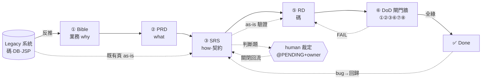

# AI Flow 上手指南（由概觀到細部） AI Flow Onboarding Guide — Overview → Detail

> **這份是什麼**：把 AI-native SDLC pipeline（Legacy→Bible→PRD→SRS→RD→DoD 閘門；**QA 產生/驗收暫拔除**，見 §L2 註）串成**一條由淺入深的閱讀線**，給新進團隊冷讀、也給單兵交接用。
> **這份不是什麼**：它**不是新權威**。flow 的權威密圖＝[`assets/ai-workflow.mmd`](assets/ai-workflow.mmd)；方法論權威＝[`spec-architecture.md`](spec-architecture.md)、[`process/orchestration-playbook.md`](process/orchestration-playbook.md)；逐頁狀態權威＝[`feature-inventory.md`](feature-inventory.md)。本檔只做**敘事＋導引**，細節一律連回原檔（守本 repo 的 single-source-of-truth 紀律）。
> 🧭 **Model A**：Bible/PRD/SRS bundle 本體在**母資料夾 local**（Codex 擁，不在本 repo）；本檔範例若指 `specs/srs|bible/...` 皆指母資料夾。coverage SSOT＝`build-tasks/refactor-audit/per-page-reinventory-matrix.md` ledger。見 `decisions.md` Model A。
> **怎麼讀**：由上往下＝由粗到細。**L0 心智模型**（5 分鐘）→ **L1 六階段總表**（10 分鐘）→ **L2 逐站詳解**（順著 flow ①→⑥）→ **L2½ 真實範例**（`EPROC00118` 走完全程）→ **橫向主題**（雙軌／規模化／狀態）→ **新人最短上手路徑** → **名詞表**。

---

## L0 — 一眼大圖 + 心智模型 · Big Picture & Mental Model

> ⚠️ 這是**精簡版**。完整版（含 QA/RD 子流程、18 條鐵律註解、強制點施測層）＝`assets/ai-workflow.mmd`，請在 GitHub 或 [mermaid.live](https://mermaid.live) render。

### 三條一定要先懂的主軸

1. **funcId 追溯骨幹**：一個 slug（例 `EPROC00118`）串起 `Bible → PRD REQ-nnn → SRS Rn → code/test`。原則：**↑可追溯、↓可驗證**。任何一段拿出來，都能往上找到「為什麼要做」、往下找到「怎麼驗它做對」。〔QA case 環節 暫拔除。〕

2. **brownfield 鐵律：結構在 ≠ 行為對等**。本專案 ~70% 是既有 migrated 碼，不是從零寫。「方法搬過來了」**不代表**「行為跟舊系統/PRD 一致」。所以：
   - **as-is 驗證出現兩次**（別混）：一次在 SRS 撰寫**前**（既有頁→產 findings 餵 as-is/to-be）；一次在 RD（SRS Approved **後**→對位 migrated 碼驗行為對等）。
   - **舊系統 ≠ 絕對正確**：差異要分 **regression（改回）** vs **刻意演進（保留，但要有依據：法規/PRD/已知需求）**。**異於舊版預設當 regression**，歸「演進」必須舉證（見 `process/legacy-parity-sop.md`）。

3. **判斷題不自裁**：PRD 的 TBD、模糊詞、既有碼行為、踩到高風險面（authN/authZ、金額/精度、刪改資料、交易一致性）——一律登記 `@PENDING + owner`，**人裁完才回流**，AI 不自行決定、也不把 legacy 當已核准需求（含 PRD 內帶的 as-is 細節）。

### 兩個貫穿全程的設計信念

- **雙層驗證**：每道把關都先**機械層**（deterministic，可信）、再**語意層**（LLM，輔助/或 blocking）。機械綠了才跑語意，不浪費語意在形式錯上。
- **終點是「等人審」，不是「上線」**：自動化省的是派工打字＋貼 prompt，**省不掉審查與裁定**。AI 自宣「done」是已知偏誤（progress bias），故「完成」只認：機械 gate 綠 **＋** 多軸驗證 PASS **＋** 狀態標「等人審」。

---

## L1 — 六階段總表 · Six-Stage Overview

| # | 階段 | 進（input） | 誰 / 工具 | 出（output） | 把關（gate） | repo 位置 |
|---|---|---|---|---|---|---|
| ① | **Bible** | Legacy 碼/DB/JSP | EPRO Expert AI（反推·證據接地） | user story·北極星·黃金旅程 | 證據接地（file:line） | `specs/bible/` ＋ `legacy/*` 原料 |
| ② | **PRD** | Bible | PM/PO + AI | what/why · `REQ-nnn` | 人審 | **repo 外**（`CDC-EPRO-*`，此處放快照） |
| ③ | **SRS** | PRD（＋既有頁 as-is findings） | SA + AI | `spec.md`(Rn·強制點)·`openapi.yaml`·`schema.sql` | **SRS 自驗**＝機械 `check-srs-bundle` ＋ N 軸語意（**blocking**） | `specs/srs/<funcId>/` |
| ④ | ~~**QA**~~ | — | — | 〔**暫拔除**：QA 產生(qa-cases)+驗收(gate④⑤) 先移除，流程收斂 SRS→RD→DoD；待主線跑順再納入〕 | — | — |
| ⑤ | **RD** | SRS（Approved） | RD-Agent（Codex，母資料夾） | 產品碼（**repo 外**） | 有 migrated 碼→as-is 驗證；無→greenfield 先盤點等審 | in-repo＝任務單 `build-tasks/*.md` |
| ⑥ | **DoD 閘門牆** | code | 6 道閘 | ✅ Done | ①契約 ②schema ③verify-c0 ⑥build ⑦LLM審(advisory) ⑧runtime conformance(有 harness 即 blocking)〔④QA驗收 ⑤覆蓋率 隨 QA 暫拔除〕 | `scripts/` ＋ `tools/phase-v-run.ps1` ＋ `verification/*` |

> 完成後**狀態回填** `feature-inventory.md`（SSOT）；bug → 新增回歸 case 回 ④。逐層「資料夾 × 工具 × 閘門」對照＝[`repo-structure.md §1`](repo-structure.md)。

---

## L2 — 逐站詳解（順著 flow 走）· Stage-by-Stage Detail

### ① Legacy → Bible — 反推業務聖經

- **做什麼**：把舊系統（碼/DB/JSP）反推成**業務知識**——user story、北極星（這功能存在的終極目的）、黃金旅程（使用者主路徑）。這是整條鏈的「為什麼」源頭。
- **怎麼做**：skill [`legacy-to-bible`](../.claude/skills/legacy-to-bible/)（Codex 對應 `docs/env/codex/prompts/legacy-to-bible.md`）。原料＝[`legacy/`](legacy/)（`page-mapping`、`migration-backlog`、`module-*`、`db-schema-catalog`）。
- **鐵律**：**證據接地**。每個業務論斷要有 legacy `file:line` 佐證，不憑空臆測業務意圖。
- **產物**：`specs/bible/bible-<domain>.md`。

### ② Bible → PRD — 產品需求（what / why）

- **做什麼**：PM/PO 把 Bible 收斂成**本期要做什麼、為什麼**，逐條 `REQ-nnn`，含 Non-Goals（明確不做什麼）。
- **位置**：**PRD 在 repo 外**（外部權威 `CDC-EPRO-*`），本 repo 只放快照／引用。流程見 [`CLAUDE.md §3`](../CLAUDE.md)。
- **接縫**：PRD 的 `REQ-nnn` 是下一站 SRS `Rn` 的 `covers-prd` 來源——追溯鏈在這裡扣上。

### ③ PRD → SRS — 系統規格（how）＋ 契約

這是**規格的核心站**，內容最厚，新人要在這裡花最多時間。

**3-a. 既有頁先做 as-is（第一次 as-is）**
頁已存在時，SRS 撰寫**前**先驗 migrated 碼 vs 舊系統/PRD，產出 **as-is findings**（結構在≠行為對等、★regression vs 刻意演進、file:line 證據），當 as-is 輸入餵進 SRS 的 as-is/to-be。

**3-b. SRS 不是一份文件，是「三軸結構」**（見 [`spec-architecture.md §1`](spec-architecture.md)）
- **A 精煉層級**（縱·funcId 追溯）：Legacy→Bible→PRD→**SRS**→Code。〔QA 環節 暫拔除。〕
- **B 規格類型**（同層分工）：**SRS**（行為＋契約）∥ **UI/UX 設計規格**（長相，走 Adobe XD，**不進 SRS**）。
- **C 層界契約**（橫·seam）：`FE —openapi— BE —schema— DB`。用契約切開實作層，防漂移。

**3-c. SRS bundle ＝ 一個 funcId 三個必要檔**（見 `spec-architecture.md §3`；**qa-cases.md 隨 QA 暫拔除**）

| 檔 | 規範 | 契約邊界 |
|---|---|---|
| `spec.md` | `Rn` 行為 ＋ **強制點 FE/BE/both** | — |
| `openapi.yaml` | FE↔BE 契約 | FE—BE |
| `schema.sql` | BE↔DB 契約 | BE—DB |
| ~~`qa-cases.md`~~ | 〔暫拔除：每條 `covers: Rn`〕 | 連回 spec |

> **規格本體只有一份**（`spec.md` 的 `Rn`），FE/BE **不拆成兩份文件**；要拆的是**契約這層**。每條 `Rn` 標**強制點**：凡完整性/安全的驗證，**BE 必須有且為權威**（永不信前端）；FE 同款只是 UX。

**3-d. 行為 vs 長相**：同一件事，「**有沒有/何時觸發/可不可測**」＝SRS（寫成 `Rn`+QA）；「**長什麼樣**」＝設計規格（XD，人審/視覺回歸，AI 不准臆測像素）。

**3-e. 多源合成 → 來源優先序**（**最重要的裁準**，見 [`spec-architecture.md §5b`](spec-architecture.md) / `ADR-0002`）
SRS 由 **PRD ＋ 舊系統 ＋ db-diff ＋ refactor-spec** 多源合成；衝突時靠優先序梯定權威：
- 業務意圖／invariant → **Bible > PRD**（refactor/DB 不可 silently 蓋）
- 需求驗收／本期範圍 → **PRD**
- API/FE 行為與契約 → **refactor(latest) > legacy**（先過 parity 三判、判為「刻意演進」才贏，留 `REF-Dn` delta）
- 物理資料結構 → **new DB snapshot > refactor doc > legacy DDL**
- 既有資料/授權現況（fact，可查）→ **new DB query**（直接撈、**不列 @PENDING**、要 provenance）
- **DB-resolvable fact 不留人工 Pending**（Rule 1）；**命中升級觸發**（與 Bible/PRD 衝突·regression·高風險面·同層無 upstream）→ C 類 `@PENDING` 待 owner 裁。

**3-f. SRS 自驗（定稿前必過）＝雙層**
1. **機械層**：`python scripts/check-srs-bundle.py <bundle>` 必 exit 0。涵蓋範圍**以腳本檔頭 canonical 清單為準**（契約/schema/covers/跨檔/Bible↔PRD/@PENDING↔register…；**勿在他處複寫**）。
2. **語意層**：**SRS N 軸驗證**（六正交軸 A–F，見 [`orchestration-playbook §4b`](process/orchestration-playbook.md)）——A 綜合完整性（＝[`spec-reviewer`](../.claude/agents/spec-reviewer.md)）、B as-is parity、C 錯誤碼承載、D 安全授權、E DB reconcile、F 金錢/精度/截斷（原 G 可測試性隨 QA 暫拔除）。**各軸 read-only、獨立 session、最好跨模型**（反 correlated-blindness）。
> **blocking vs advisory 別混**：SRS 定稿的 N 軸（含 spec-reviewer）＝**blocking**（無 Blocker 才 Approved）；flow 圖上 ⑦ LLM review＝code 階段 **advisory**。**採納修正後要再審一輪**（修正可能引入新錯）。
- **DoD 細目**：見 [`prd-to-srs`](../.claude/skills/prd-to-srs/) skill §DoD（每 REQ≥1 Rn、每 Rn 有 acceptance+強制點、每 TBD 一條 @PENDING+owner、每 Rn 有 covers-prd 追溯…）。〔QA covers / happy-error-edge / Traceability Matrix 表 隨 QA 移除;追溯 SoT=covers-prd。〕

### ④ SRS → QA〔暫拔除〕

> **QA 產生 + 驗收 暫拔除**：流程收斂為 Bible→PRD→SRS→RD→DoD。原 ④ QA-Agent（SRS→`qa-cases.md` oracle、反壓上游、Testcontainers 橋接、gate④/⑤）整段暫停；SRS bundle 不再產 qa-cases（變 3 必要檔），gate⑤ 在 `check-srs-bundle` skip。
> 待主線跑順後再決定 QA 何處介入（最可能：把 gate④ 升級成編排化測試）。完整原設計＝git history（含 `qa-to-test.md`、已刪的 14 份 qa-cases）。

### ⑤ SRS(Approved) → RD — RD-Agent：規格變成碼（brownfield 主路徑＝驗碼，非從零寫）

子流程（`RDA` subgraph）：
1. **輸入閘**：SRS Approved？N 軸無 Blocker、`@PENDING` 都有 owner。
2. **分流：頁有 migrated 碼？**
   - **有 → as-is 驗證（第二次）**：對位 `Rn ↔ method:line`（**MISSING 不臆測**＝zero-based）；契約/行為/資料三面比對 → drift；★drift 分 **regression（改回）** vs **刻意演進（留·要 `REF-Dn` 依據）**。
   - **無 → greenfield**（如撥貸 0920）：先**唯讀盤點**舊鏈路＋計畫 → **等人審**（不直接開做，見 `backend/AGENTS.md §6`）。
3. **拆工 BE / FE**（依 Rn 強制點）：`openapi.yaml` 鎖契約＝唯一真相；backend / frontend **各獨立 session**（context 衛生）。
- **產物**：產品碼在 **repo 外**（母資料夾）；in-repo 的痕跡＝任務單 `build-tasks/*.md`（live）→ 完成 `git mv` 到 `done/`。
- **鐵律**：對位 MISSING 不臆測；動手前先唯讀盤點**實際完成度**＋確認 mirror/算法來源（防「未做其實已完成」「假設錯來源」）；判斷題（算法無法 1:1 鏡像／改既有契約）→ `backend/AGENTS.md §6.6` 升級。
- **RD Agent Flow（編排化，SRS→code）**：權威迴圈＝[`orchestration-playbook §5c/§6c`](process/orchestration-playbook.md)；運行殼＝`build-tasks/rd-orchestrator-drain.md`、單頁＝`rd-codex-dispatch.md`；RD 軸＝`§4c`（contract/scope/regression/強制點落實）。終點＝`rd-done`→**進 DoD 閘門牆**（①②③⑥⑦〔+⑧ runtime conformance，有 harness 者 blocking〕 + 人審；④QA驗收⑤覆蓋率 隨 QA 暫拔除）→ owner 蓋 Done（不自宣）。

### ⑥ DoD 閘門牆 — RD 通過 SA 邊界

六道閘（`ai-workflow.mmd` 的 `GATE` subgraph；**④QA驗收 ⑤覆蓋率 隨 QA 暫拔除**）：

| 閘 | 檢查 | 性質 |
|---|---|---|
| ① Contract | OpenAPI snapshot 對齊 | deterministic |
| ② Schema | entity ↔ DB | deterministic |
| ③ verify-c0 | 結構/只新增/UTF-8·BOM（`scripts/verify-c0.py`） | deterministic |
| ~~④ QA 驗收~~ | 〔暫拔除：跑 QA cases〕 | — |
| ~~⑤ 覆蓋率~~ | 〔暫拔除：每 Rn 有 covers〕 | — |
| ⑥ Build 綠 | mvn / ng build exit 0 | deterministic |
| ⑦ LLM 語意審 | 三軸 contract/scope/regression（read-only·跨模型） | **advisory**（code 階段） |
| **⑧ runtime conformance** | 跑活 endpoint 對真 DB：API↔等價唯讀 SQL/openapi required（`tools/phase-v-run.ps1`；**有 harness manifest 的頁＝blocking**） | deterministic（runtime） |

- **①②③⑥⑧ deterministic 可信、⑦ LLM 只輔助**。⑦ 的 code 三軸＝[`orchestration-playbook §4`](process/orchestration-playbook.md)（verifier-contract / scope / regression，須**真獨立**——同模型/同 context＝correlated blindness、不算）。
- **⑧＝第四種驗證「runtime conformance」**（跑碼對真 DB、oracle＝契約＋等價 SQL）：補 ①②③⑥ 靜態盲區——①只比對 DTO 宣告，抓不到「空分支沒填必填欄」這種只有跑起來才現形的行為（RI-2 即此）。**⑧≠QA**（QA＝per-Rn acceptance、暫拔；二者正交，⑧ 不算復活 QA）。失敗三分類×自修界線見 `orchestration-playbook §4c`（assertion-conformance 自修、契約模糊/infra/auth escalate）。
- ①②③⑥（+⑧，有 harness 者）全綠 → **✅ Done**；任一 FAIL → 回 RD 修/escalate、重跑。〔QA 恢復後 ④⑤ 重新納入。〕

### 回流路徑（flow 不是直線）

- **Done → Issue → 回歸**：上線後 bug → 新增回歸 case 回到「拆 case」。〔QA 站 暫拔除，回歸暫由 Phase V runtime 自驗/手動驗承接〕
- **判斷題 → human 裁定 → 回流**：SRS 的 TBD/模糊、QA 寫不出 oracle、RD 的 escalation（算法無法 1:1 鏡像／改既有契約如 E1/E2）→ `human 裁定（PM/SA/RD/domain/DBA）` 關 `@PENDING`/TBD → 關閉後回 SRS 續做。待決全部聚合到 [`pending-register.md`](pending-register.md)（誰欠決策、卡多久、是否 blocking）。

---

## L2½ — 一個真實 funcId 走完全程：`EPROC00118` 企金 Corporate Scorecard · End-to-End Worked Example

> 把上面抽象的 ①→⑥ 接到一個**已 Approved**（規格＋實作，RD/DBA closeout 2026-06-20）的真實 bundle，新人最有感。bundle＝`specs/srs/EPROC00118/`（Model A：在母資料夾 local，本 repo 已不留；要看請於母資料夾開或查 git history）。

**全程一覽**

| 站 | 這頁實際發生什麼 | 證據 |
|---|---|---|
| ① Bible | 企金 C0 scorecard 的業務意圖（評分→風險等級→影響授信決策） | `bible-eproposal.md`（母資料夾 local；行號見母資料夾）|
| ② PRD | 收斂成 `FR-001`–`FR-008`（初始化/項目/Rate計算/Default/AO·CR控制/Save/checkpoint/精度） | `PRD-CDC-EPRO-0001-EPROC00118-v1.0.md` |
| ③ SRS | `R1`–`R8`（各標 `covers-prd` 與強制點）＋ bundle 三契約檔（spec/openapi/schema，餵 gate）＋ `README.md` 人讀 digest（非 gate）；4 個真實端點 `epl-{sele,info,calc,save}-c0-corporateScorecard` | `EPROC00118/spec.md`、`EPROC00118/README.md` |
| ④ QA〔暫拔除〕 | （原）每條 Rn 拆 happy/error/edge，covers 指回 Rn | ~~`EPROC00118/qa-cases.md`~~（隨 QA 暫拔，下為歷史示意） |
| ⑤ RD | as-is 對位 migrated 碼、修 drift（見下） | 母資料夾（碼在 repo 外） |
| ⑥ DoD | 規格 Approved＋實作 Approved | `spec.md` Metadata |

**鏡頭拉近一條鏈：`R3 Rate 計算`（強制點 BE，covers `FR-003`/`FR-008`）**——它一條就示範了 flow 的每個抽象概念：

- **③ 行為＋契約**：版本選擇用 `MAX(ST_DATE <= APP_DATE)`（`END_DATE` 只是 seed metadata，不當 runtime filter）；**calc 不得寫 DB**（`TB_CORP_SCRCARD`/summary/checkpoint 都不碰）。
- **強制點 BE ＝永不信前端**：計算與其失敗處理的**權威在後端**；FE 只是 UX。
- **來源優先序（§5b）落地**：`TB_SCORE_CARD_PARAM_DETAIL` 的 seed 列直接採 **DB snapshot 當 baseline**（DB-resolvable fact，不 hard-code、不列人工 @PENDING）。
- **判斷題→owner 裁定**：`totalScore` 要不要外露、`scoreDatetime` 時區、seed baseline——都不自裁，留待 **owner decision（2026-06-19/20）** 才定版。
- **④ QA 由契約反推**（一碼≥一 case、edge 溯 schema）〔QA 產生/驗收暫拔除；下表為**歷史示意**〕：
  | QA | 類型 | 測什麼 | 來源 |
  |---|---|---|---|
  | `QA-010` | happy | `riskLevel` 對範圍、`scoreDatetime` 用 Asia/Taipei 時鐘、calc 不寫 DB | acceptance |
  | `QA-012` | error | 一般失敗 → `COMMON_MSG_RATE_FAIL` | openapi 錯誤碼反推 |
  | `QA-011A` | error | 查詢/資料失敗 → `MSG_QUERY_FAIL` | openapi 錯誤碼反推 |
  | `QA-013` | edge | 數值落在 `LOW_RANGE`/`UP_RANGE` 邊界（`LOW<=input<UP`） | schema 約束溯出 |
  | `QA-010A` | edge | 即使 PRD/legacy 想要 `totalScore` 也不外露（內部仍算） | 契約決策 |
- **⑤ RD as-is 驗證（第二次）＋ brownfield 鐵律**：closeout 對位後修了兩個 drift——`parseScore` 改 **fail-fast**（非數字 seed 回 `MSG_QUERY_FAIL`，不靜默歸零）、`scoreDatetime` 改用**顯式 Asia/Taipei 時鐘**（不靠 JVM 預設時區）；舊系統的 `CR_TRA_LST_MON_CODE*` 區塊判為 **dead DOM-id code（不是 to-be 需求）**——這正是「舊系統≠絕對正確、差異分 regression vs 刻意演進」的活例。

> 一句話總結這條鏈：**funcId 串起 `FR-003 → R3 → QA-010/011A/012/013`**，↑每一步都追得到「為什麼」、↓每一步都有 case 驗「做對沒」，判斷題全部 owner 拍板、brownfield drift 經三判才處置。〔QA 站 暫拔除後，code 階段驗證暫由機械閘門＋`spec-reviewer`＋Phase V runtime 自驗接手〕

---

## 橫向主題（跨所有階段）· Cross-Cutting Topics

### 雙軌 Claude ↔ Codex
同一角色、兩個載具，內容等價、各自原生格式（對照表＝[`CLAUDE.md §2`](../CLAUDE.md) / [`repo-structure.md §2`](repo-structure.md)）。**內容權威＝Claude 版檔案**；Codex 範本（`docs/env/codex/`）＝**薄殼指標**（只含指標＋差異清單）。改內容只改 Claude 版。機械閘門腳本雙軌共用。

### 規模化：Orchestration（自動到 checkpoint、停交人審）
當有多個可並行任務時，用 orchestrator + sub-agent 自動化「派工＋執行＋機械閘門」，**停在等人審/等 owner 裁**（見 [`orchestration-playbook`](process/orchestration-playbook.md)）：
- **任務三類**：**A** 可自動執行→等審 / **B** 半自動（@PENDING）→等裁 / **C** 停止點（風險/架構/domain）——orchestrator **只碰 A、整理 B、不碰 C**。
- **完成定義**（防 progress bias）：機械 gate 綠 ＋ 多軸 PASS ＋ 標「等人審」；**不得自宣 done / 跳 gate / 把假綠當完成**。
- **SRS 軌 drain**：PRD→SRS 可批量，但**序列一次一頁**、每頁全 A–F 跨模型、終點 `in-review`（不自升 approved）；T1（金錢/授權/計分）頁每頁停交人審、不併批末。

### 狀態與盤點
- **回填**：任何階段狀態變動 → `feature-inventory.md`（⭐SSOT）。總覽 Dashboard＝`STATUS.md`。
- **盤點/校正回路**（非主線一站）：里程碑後用 skill [`refactor-audit`](../.claude/skills/refactor-audit/) **zero-based** 重推總量、對 SSOT 做 diff（**只報不改**），校正 drift。

### 為什麼這樣設計（給團隊的 context）
flow 裡每條鐵律幾乎都對應一次**踩過的雷**（收斂表＝[`spec-architecture.md §9`](spec-architecture.md)）：結構在≠行為對等、FE/BE split-brain、把 legacy 當需求、CJK UTF-8 壞、矩陣 prose 騙過 LLM 機械才抓到、AI progress bias 假 Approved……**讀規則前先看 §9，會懂「為什麼這麼囉嗦」**。

---

## 新人最短上手路徑（按順序讀）· Fastest Onboarding Path

1. **本檔 L0+L1**（心智模型＋六階段）← 你在這。
2. [`CLAUDE.md`](../CLAUDE.md)（憲法：flow/雙軌/生命週期/DoD/語言/安全）— 約束你怎麼做事。
3. [`spec-architecture.md`](spec-architecture.md)（規格三軸＋§5b 來源優先序＋§9 教訓）— SRS 站的深水區。
4. [`repo-structure.md`](repo-structure.md)（哪個檔在哪段 flow）— 找路用。
5. 看本檔 **L2½ 的 `EPROC00118` 全程範例**，再挑一個**已 Approved 的 SRS bundle** 親自精讀（**Model A：bundle 在母資料夾 `docs/specs/srs/<funcId>/` local**，如 `EPROC00118`/`EPROZ00100`；三契約檔＋`README.md` digest）— 把抽象變具體（**digest 先讀、再讀 spec 精確契約**）。
6. 要動手前：[`orchestration-playbook`](process/orchestration-playbook.md)（§4b N 軸、§5b/§6b drain）＋ 對應 skill（`prd-to-srs` / `legacy-to-bible` / `refactor-audit`）。
7. 隨時回看狀態：[`feature-inventory.md`](feature-inventory.md)（剩多少）、[`pending-register.md`](pending-register.md)（卡在誰）。

---

## 名詞表 · Glossary

| 詞 | 意思 |
|---|---|
| **funcId** | 追溯 slug（例 `EPROC00118`），串 Bible→PRD→SRS→code/test〔QA 暫拔除〕 |
| **Rn** | SRS `spec.md` 裡的一條系統規格（行為），標強制點 FE/BE/both |
| **強制點** | 一條 Rn 在哪層強制：完整性/安全必 BE 且為權威；FE 同款只是 UX |
| **REQ-nnn** | PRD 的需求條目；SRS Rn 以 `covers-prd` 指回它 |
| **covers** | （QA case 以 `covers: Rn` 指回它測的規格）〔QA 暫拔除休眠；現役追溯用 `covers-prd:`〕 |
| **as-is / to-be** | 既有行為 / 目標行為；既有頁 SRS 必須兩者都寫清楚 |
| **drift** | migrated 碼與規格/舊系統的偏離 |
| **regression vs 刻意演進** | drift 兩類：改回 vs 保留（後者須有依據）；異於舊版預設當 regression |
| **oracle** | QA case 的「判官」——given/when/then 可確定性判真假〔QA 暫拔除休眠〕 |
| **@PENDING** | 待人裁的判斷題，附 owner＋是否 blocking，聚合到 pending-register |
| **N 軸（A–F）** | SRS 階段六正交語意驗證軸（blocking）；A＝spec-reviewer（原 G 隨 QA 暫拔除）|
| **三軸驗證** | code 階段三正交審（contract/scope/regression，advisory） |
| **DoD 閘門牆** | RD 過 SA 邊界的閘：①②③⑥ 機械 + ⑦ LLM advisory + ⑧ runtime conformance（有 harness 即 blocking）（④⑤ QA 暫拔） |
| **雙軌** | Claude（權威）↔ Codex（薄殼指標），同角色兩載具 |
| **SSOT** | single source of truth；狀態＝feature-inventory、待決＝pending-register |

---
> 維護：本檔＝**敘事導引**，內容權威仍在各原檔；flow 結構若變動，先改 `assets/ai-workflow.mmd`（權威密圖）再回來同步本檔的 L0/L1。
