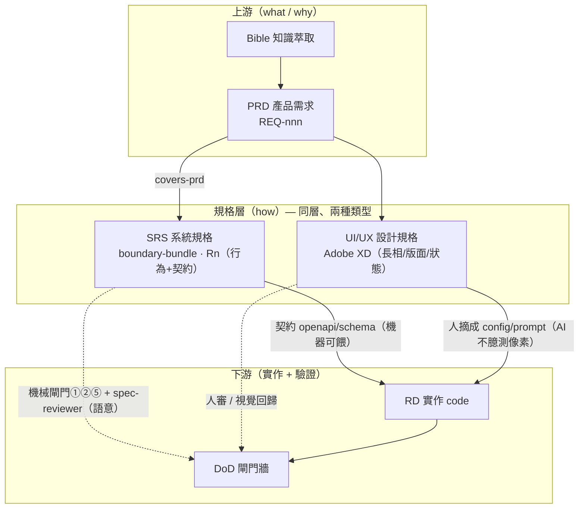
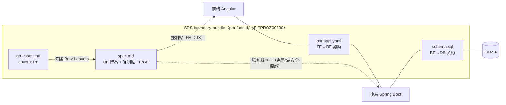

# 規格架構（Spec Architecture）

> 「規格」不是一份文件，是 **三軸結構**：**精煉層級 × 規格類型 × 層界契約**。
> 一句話：**funcId 串追溯、契約切邊界、行為留 SRS、長相留設計規格**。
> 上游流程圖見 `docs/assets/ai-workflow.mmd`；本檔聚焦「規格本身怎麼組織」。

## 1. 三條軸

| 軸 | 是什麼 | 內容 |
|---|---|---|
| **A 精煉層級**（縱，funcId 追溯） | 同一件事逐層加「how」、可上下追溯 | Legacy → Bible → **PRD** → **SRS** → QA → Code |
| **B 規格類型**（同層分工） | SRS 層其實有**兩種並行的 spec** | **SRS**（行為+契約）∥ **UI/UX 設計規格**（長相） |
| **C 層界契約**（橫，seam） | 用契約把實作層切開、不拆文件 | FE —`openapi`— BE —`schema`— DB |

## 2. 規格全景



**關鍵差異**：SRS 是**機器可驗證**的（餵 deterministic 閘門）；設計規格是**人類中介 + 人眼/視覺回歸**驗證的（AI 讀不到 XD、不准臆測視覺，見 `frontend/AGENTS.md §5`）。

## 3. SRS bundle 解剖 + 層界契約



**重點**：規格本體**只有一份**（`spec.md` 的 `Rn`），FE/BE 不拆成兩份文件；要分的是**契約這一層**（`openapi`=FE↔BE、`schema`=BE↔DB）。每條 `Rn` 標**強制點**當屬性。

## 4. 規格類型對照（taxonomy）

| 類型 | 規範什麼 | 消費者 | 怎麼驗 | 載體 |
|---|---|---|---|---|
| **PRD** | 要做什麼/為何（業務 what/why） | PM→SA | 人審 | `write-spec` |
| **SRS** | 行為 + 契約（系統 how） | RD + QA | **機械閘門①②⑤ + spec-reviewer** | `boundary-bundle/`（`Rn`/openapi/schema/qa） |
| **UI/UX 設計規格** | 長相/版面/互動/狀態/文案/RWD | FE RD | **人審 / 視覺回歸** | **Adobe XD** + `frontend/AGENTS.md §5` |

## 5. 兩個切面原則

- **行為 vs 長相**：同一件事（如 R7「`isEdit=false` 全唯讀」、或「空/載入/錯誤/disabled/無權限」狀態）——
  - **「有沒有、何時觸發、可不可測」= SRS**（可寫成 `Rn` + QA）
  - **「長什麼樣」= 設計規格**（XD，不進 SRS）
- **強制點 FE/BE/both**：每條 `Rn` 標明在哪層強制。**凡完整性/安全的驗證，BE 必須有、且為權威**；FE 同款驗證只是 UX（永不信前端）。
  - 反例＝病：`00800` 的 D5（FE maxlength 4000 / BE 沒驗）、init-query（FE POST / BE GET）——都是 FE/BE 各自為政、沒有單一契約真相。

## 6. 追溯與驗證（兩條鏈）

- **追溯鏈（縱）**：`funcId` → PRD `REQ-nnn` →（`covers-prd`）→ SRS `Rn` →（`covers`）→ QA case → code/test。↑可追溯、↓可驗證。
- **驗證鏈（DoD）**：
  - **機械層**（deterministic，`scripts/check-srs-bundle.py`）：①openapi parse/$ref/required、②schema 型別長度交叉、⑤Rn↔QA covers/懸空引用。
  - **語意層**：`spec-reviewer`（唯讀、不改檔）審完整性/一致性/可測性/把 legacy 當需求等。
  - **鏡像層**（c0）：`verify-c0` 形式硬閘門。
  - **設計層**：人審 / 視覺回歸（非機械）。

## 7. 對應實體檔案

| 概念 | 檔案 |
|---|---|
| SRS bundle（範本/實例） | `docs/golden-template/boundary-bundle/EPROZ00800/{spec,openapi,schema,qa-cases}` |
| 設計規格慣例 | `frontend/AGENTS.md §5`（Adobe XD） |
| 機械閘門 | `scripts/check-srs-bundle.py`（①②⑤）、`scripts/verify-c0.py` |
| 語意審查 | `.claude/agents/spec-reviewer.md`（Codex：`docs/env/codex/spec-reviewer.toml`） |
| PRD→SRS 產出 | `.claude/skills/prd-to-srs/`（Codex：`docs/env/codex/prompts/prd-to-srs.md`） |
| 流程圖 / 決策 | `docs/assets/ai-workflow.mmd`、`docs/adr/ADR-0001-spec-workflow-dual-stack.md` |

## 8. 一頁總結

```
規格 = 精煉層級（Bible→PRD→SRS→QA→Code，funcId 串）
     × 規格類型（SRS 行為+契約 ∥ 設計規格 長相）
     × 層界契約（FE—openapi—BE—schema—DB）

SRS 一份、以 Rn 行為為主、每條標強制點(FE/BE/both)
契約(openapi/schema)當邊界 → 防 FE/BE 漂移
長相留 XD（人審/視覺回歸）→ 不塞進 SRS
funcId 串追溯、機械+語意雙層閘門驗證
```
