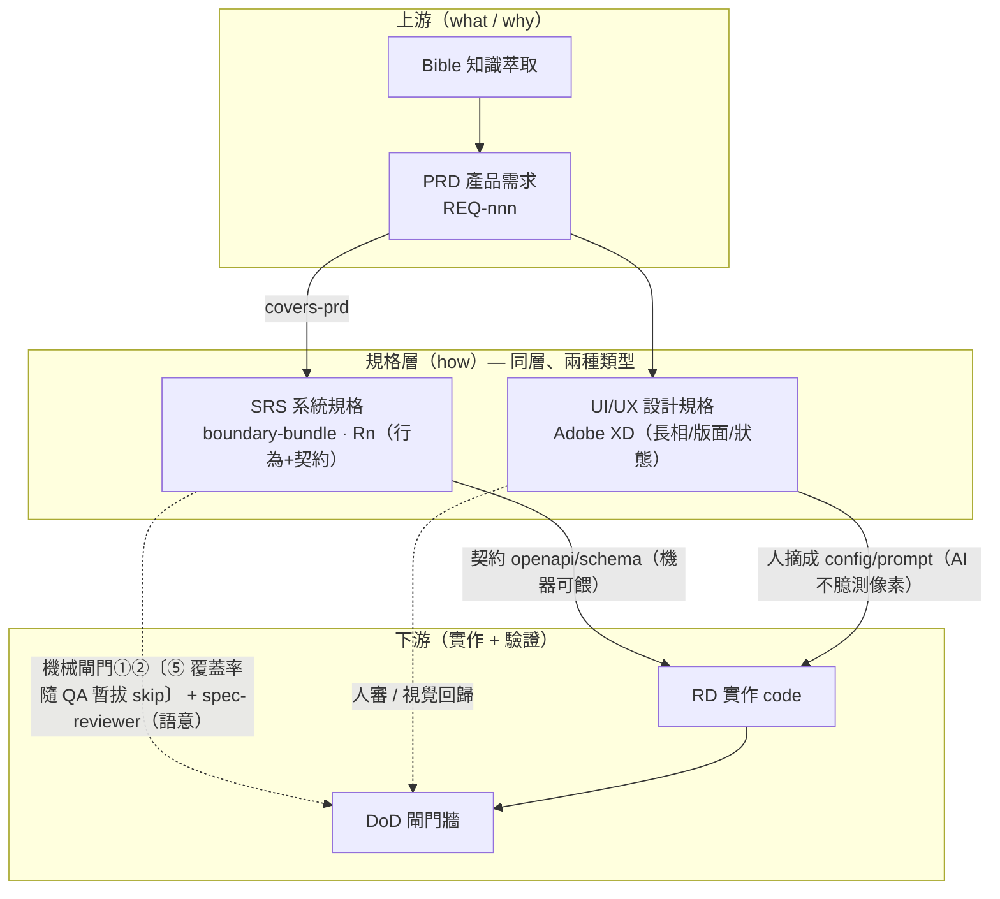
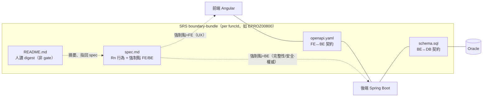

# 規格架構（Spec Architecture）

> 「規格」不是一份文件，是 **三軸結構**：**精煉層級 × 規格類型 × 層界契約**。
> 一句話：**funcId 串追溯、契約切邊界、行為留 SRS、長相留設計規格**。
> 上游流程圖見 `docs/assets/ai-workflow.mmd`；本檔聚焦「規格本身怎麼組織」。

## 1. 三條軸

| 軸 | 是什麼 | 內容 |
|---|---|---|
| **A 精煉層級**（縱，funcId 追溯） | 同一件事逐層加「how」、可上下追溯 | Legacy → Bible → **PRD** → **SRS** → Code〔QA 產生/驗收暫拔除〕 |
| **B 規格類型**（同層分工） | SRS 層其實有**兩種並行的 spec** | **SRS**（行為+契約）∥ **UI/UX 設計規格**（長相） |
| **C 層界契約**（橫，seam） | 用契約把實作層切開、不拆文件 | FE —`openapi`— BE —`schema`— DB |

## 2. 規格全景



**關鍵差異**：SRS 是**機器可驗證**的（餵 deterministic 閘門）；設計規格是**人類中介 + 人眼/視覺回歸**驗證的（AI 讀不到 XD、不准臆測視覺，見 `frontend/AGENTS.md §5`）。

## 3. SRS bundle 解剖 + 層界契約


> 〔`qa-cases.md`（covers: Rn）隨 QA 產生/驗收暫拔除；`README.md`＝人讀 digest（非 gate 餵入，範本 `specs/srs/digest-template.md`）〕

**重點**：規格本體**只有一份**（`spec.md` 的 `Rn`），FE/BE 不拆成兩份文件；要分的是**契約這一層**（`openapi`=FE↔BE、`schema`=BE↔DB）。每條 `Rn` 標**強制點**當屬性。

## 4. 規格類型對照（taxonomy）

| 類型 | 規範什麼 | 消費者 | 怎麼驗 | 載體 |
|---|---|---|---|---|
| **PRD** | 要做什麼/為何（業務 what/why） | PM→SA | 人審 | `write-spec` |
| **SRS** | 行為 + 契約（系統 how） | RD + QA | **機械閘門①②〔⑤ 覆蓋率隨 QA 暫拔 skip〕 + spec-reviewer** | `boundary-bundle/`（`Rn`/openapi/schema/qa） |
| **UI/UX 設計規格** | 長相/版面/互動/狀態/文案/RWD | FE RD | **人審 / 視覺回歸** | **Adobe XD** + `frontend/AGENTS.md §5` |

## 5. 兩個切面原則

- **行為 vs 長相**：同一件事（如 R7「`isEdit=false` 全唯讀」、或「空/載入/錯誤/disabled/無權限」狀態）——
  - **「有沒有、何時觸發、可不可測」= SRS**（可寫成 `Rn` + QA）
  - **「長什麼樣」= 設計規格**（XD，不進 SRS）
- **強制點 FE/BE/both**：每條 `Rn` 標明在哪層強制。**凡完整性/安全的驗證，BE 必須有、且為權威**；FE 同款驗證只是 UX（永不信前端）。
  - 反例＝病：`00800` 的 D5（FE maxlength 4000 / BE 沒驗）、init-query（FE POST / BE GET）——都是 FE/BE 各自為政、沒有單一契約真相。

## 5b. 來源優先序（SoT precedence）與升級觸發（延伸 §5、聚焦多來源裁準）

> SRS 現由 **PRD + 舊系統 + db-diff + refactor-spec** 多來源合成。來源**不一致**時，靠下表定「誰是該問題的權威」，不靠臆測；可由新 DB 判定的 **fact** 不再列人工 `@PENDING`。**內容權威＝本節**（`CLAUDE.md §4` / `AGENTS.md` / `prd-to-srs` DoD / `orchestration-playbook §1` 皆指回此；決策＝`docs/adr/ADR-0002-srs-sot-precedence.md`）。

### 優先序梯（依「問的是什麼」選權威）
| 問的是什麼 | 權威（高→低） | 偏離怎麼處理 |
|---|---|---|
| 業務意圖 / invariant（為什麼、該不該） | **Bible > PRD** | refactor/DB **不可** silently 蓋；衝突→升級（C 類） |
| 需求驗收（REQ acceptance、本期範圍） | **PRD** | refactor 可調整、但偏離記 delta；偏離 acceptance 本身→升級 |
| API/FE 行為與契約（長相/互動/欄位/method） | **refactor(latest) > legacy** | **先過 `legacy-parity-sop` 三判**、判為 (b) 刻意演進才 refactor 贏；非 (b)→升級。留 `REF-Dn` + legacy delta 註（不可 silent drop） |
| 物理資料結構（表/欄/型別/長度/enum domain/PK） | **new DB snapshot（`docs/db-diff/`）> refactor-spec doc > legacy DDL** | DB＝物理真相；refactor 文件講不到物理就不蓋；snapshot≠`schema.sql`＝真 drift→先校 schema |
| 既有資料/字典/授權現況（fact，可查） | **new DB query（snapshot rows）** | 直接撈、**不列 `@PENDING`**；要 provenance（見 Rule 1）；與 PRD/Bible 矛盾→升級 |

> **層界對齊**：本梯＝§3 層界契約（FE—openapi—BE—schema—DB）的「來源版」，每層各有 SoT。**跨層同名 ≠ 同欄位**（gate② 活例：openapi `role`(3) 對 `TB_ROLE_DEFINE.ROLE_ID`、**非** `TB_API_AUTH.ROLE`(100)；別把跨層差異當「對齊數字」去硬改）。

### Rule 1 — DB-resolvable fact 不留人工 Pending
- **適用**：答案是 DB 可判定的 **fact**——code→name 字典、enum domain、欄寬/型別、既有授權列（當 **legacy-state** 讀）→ 由 `docs/db-diff/` 撈出寫進 SRS，**不佔 `@PENDING`**（TBD-001 即此：`TB_ROLE_DEFINE`/`TB_API_AUTH` 可解，原不該列人工待裁）。
- **三道護欄（缺一不可）**：
  1. **只解 fact、不解 policy**。DB 只說「現況/legacy 是什麼」，不說「新系統*應該*怎樣」；「role `003` 新系統還能不能 delete」＝policy→仍升級。為省一條 Pending 把 policy 偽裝成 fact＝偷渡業務決策。
  2. **強制 provenance（非 silent fill）**：source 表 + **snapshot as-of date** + 一列 decision（`REF-Dn`/`DB-Dn` 樣板）。否則日後無法回查、擋不住 DB 漂移（drift 由 `refactor-audit` 回路抓）。
  3. **DB 值與 PRD/Bible 矛盾→不鏡像、升級**（DB 自身可能帶髒資料/legacy bug，盲鏡像＝把資料缺陷寫進規格）。
- **高風險 fact（authZ/金額/精度）特例**：`TB_API_AUTH` 授權列、金額/精度欄這類 fact **僅作 legacy-state 證據撈入**，須標明「to-be 是否沿用待 PRD/升級裁」——**不得**因「DB 查得到」就默認寫成 to-be 契約（守 §9#3/#7「既有碼行為≠新契約」；authZ/金額本身即升級觸發 #3 高風險面）。
- **DB snapshot 缺欄 ≠ 純 fact**：snapshot 少一欄可能是「漏建 vs 刻意捨棄」（policy，AUD-7 活例）→ 不自決、升級。
- **操作前提**：轉換得**讀得到** `docs/db-diff/` snapshot；讀不到（如僅母資料夾有）＝退回 `@PENDING` 標「待母資料夾撈」、不臆造。
- **定位**：目標是 **right-size** Pending（砍掉本就非人類決策的），不是 minimize——Pending 的價值正是逼出「人**必須**裁」的事。

### Rule 1c — 缺正式 refactor baseline → code-as-baseline 降級
- **適用**：某頁 `docs/refactor-spec/` 無正式 corporate baseline artifact（如 `EPROC00119` RP40、`EPROC00120` P-009；個金 i0 有、企金 c0 缺）。
- **降級方案**：用 **legacy（對應舊頁）+ current migrated code 當 as-is baseline** 做 parity 碼驗，**不等正式 artifact、不臆造 baseline**。
- **寫法**：as-is 證據標 `[CODE:<file>:<line>@<commit-SHA>]`（reference + commit 釘版、可回查）；spec 顯式 disclaim「baseline＝code-as-baseline、無正式 refactor-spec artifact、待補」。
- **不省嚴謹度**：parity 差異仍過 `legacy-parity-sop` 三判（regression/演進/結構差）；高風險面（authZ/金額）仍升級。**code-as-baseline 換的是 baseline 來源、非 parity 嚴謹度**。
- **與 Rule 1 之別**（互補非替代）：Rule 1＝**有** baseline、撈 DB fact 不留 Pending；本條＝**缺** baseline、用 legacy+current code 當 as-is 做 parity。`[CODE:<file>:<line>@<SHA>]` **即滿足 Rule 1 第 2 護欄 provenance**（可回查、釘版）。
- **owner 決策**：code-as-baseline vs 補正式 artifact ＝ owner 裁（缺料 trade-off）；owner 裁企金線 00119/00120 採 code-as-baseline。

### Rule 2 — refactor 優先（限本層）；踩線才升級
- **預設**：legacy vs refactor 在 **FE/API 行為與契約層** 衝突→**refactor 贏**（最新意圖版；承 `REF-D2` keep-latest、`DB-D6` win-by-layer）+ 留 `REF-Dn` delta 註。
- **不得越層**：refactor **不蓋** db-diff（物理真相）、**不蓋** Bible/PRD（業務意圖）。blanket「refactor 贏」會讓一份 FE 文件改物理 schema＝危險。
- **先過 `legacy-parity-sop` 三判（本梯＝其「來源版細化」，非平行制度）**：refactor-wins ⊆ 三判 **(b) 刻意演進**（須有依據）、win-by-layer ⊆ **(c)**。**refactor 移除/縮編 legacy 行為時不得預設「刻意」**——先判，**判不出 (b) 依據＝命中升級觸發 #2（regression）、升級**（不自決）。即「refactor 贏」只適用「差異已過三判、非 (a) regression」者；無論贏否都留 `REF-Dn` delta。

### 升級觸發 → C 類 `@PENDING`（不分層，命中即停交人裁）
來源衝突時**符合任一**即**不自決**、列 C 類待 owner 裁（`orchestration-playbook §1` C 類）：
1. 與 **Bible invariant 或 PRD REQ acceptance** 衝突；
2. **砍掉 PRD/Bible 仍要求的行為**（regression／破業務規則；`legacy-parity-sop` 三判：異於舊版預設 regression、歸演進須依據）；
3. 踩**高風險面**：authN/authZ、金額/計算/精度、資料刪改、安全/隱私、交易一致性；
4. **同一層**兩來源實質衝突，且該層 SoT 來源本身**缺資料/沉默**（無從裁）——**不得**以「對方沒明文反對」當 refactor 自動贏的理由。
> 其餘（純本層 contract 取捨、可由 upstream 裁的差異）＝可自決 refactor-wins，但仍留 `REF-Dn` delta。

### Rule 3 — 授權分層（雙層防禦；mutating 端點必遵）
完整性/安全的授權**不得只靠單層**；標準三層、spec 授權 Rn 須標各層強制點：
- **DB 層（SoT）**：`TB_API_AUTH`（`API_ID` + `REF_FUNCTION_ID` + `ROLE`）記權限，初期 seed/DML 落地。
- **Service 層（BE 權威）**：save/execute/authorize 等 mutation 前做 case-edit/ownership/role guard（Maker-Checker、互斥、交易一致）；**未授權角色呼叫一律拒（401 未認證 / 403 已認證但無權）**。
- **FE 層（非安全邊界）**：UI disable/隱藏＝UX，**永不信前端**。
- **鐵則**：`TB_API_AUTH` seed **單獨不足**（Bible `:332`/`:342`：權限須前後端對齊、負向角色呼叫應被拒）——**必配 service guard**。對應 N 軸軸 D、`SEC-nnn` 條目。

## 6. 追溯與驗證（兩條鏈）

- **追溯鏈（縱）**：`funcId` → PRD `REQ-nnn` →（`covers-prd`）→ SRS `Rn` → code/test。↑可追溯、↓可驗證。〔原 SRS →（`covers`）→ QA case 一跳隨 QA 暫拔除〕
- **驗證鏈（DoD）**：
  - **機械層**（deterministic）＝`scripts/check-srs-bundle.py`：**涵蓋範圍以腳本檔頭 canonical 清單為準（勿在此複寫）**——大類＝契約/schema/covers/跨檔/Bible↔PRD（治 BP-7）/@PENDING↔register 同步；編號對照見 `specs/srs/README.md`。
  - **語意層**：`spec-reviewer`（唯讀、不改檔）審完整性/一致性/可測性/把 legacy 當需求等（＝SRS **N 軸 axis A**；規模化另跑 B–G 軸〔as-is parity/錯誤碼/安全/reconcile/金錢欄/可測試性〕，見 `process/orchestration-playbook.md §4b`）。
  - **鏡像層**（c0）：`verify-c0` 形式硬閘門。
  - **設計層**：人審 / 視覺回歸（非機械）。

## 7. 對應實體檔案

| 概念 | 檔案 |
|---|---|
| SRS bundle（範本/實例） | **重產中**（00100/00118 已全清〔2026-06-18〕、待母資料夾重產）；~~`EPROZ00800/`~~ **v0.9 已封存**（`docs/archive/EPROZ00800-v0.9-superseded/srs/{spec,openapi,schema,qa-cases}`，2026-06-17，待重產）。分層資料夾＝`docs/specs/`：bible→prd→srs |
| 設計規格慣例 | `frontend/AGENTS.md §5`（Adobe XD） |
| 機械閘門 | `scripts/check-srs-bundle.py`（①②；⑤ skip）、`scripts/verify-c0.py`（Model A：在母資料夾跑） |
| 語意審查 | `.claude/agents/spec-reviewer.md`（Codex：`docs/env/codex/spec-reviewer.toml`） |
| PRD→SRS 產出 | `.claude/skills/prd-to-srs/`（Codex：`docs/env/codex/prompts/prd-to-srs.md`） |
| 流程圖 / 決策 | `docs/assets/ai-workflow.mmd`、`docs/adr/ADR-0001-spec-workflow-dual-stack.md`、**`docs/adr/ADR-0002-srs-sot-precedence.md`（來源優先序）** |

## 8. 一頁總結

```
規格 = 精煉層級（Bible→PRD→SRS→Code，funcId 串；QA 暫拔除）
     × 規格類型（SRS 行為+契約 ∥ 設計規格 長相）
     × 層界契約（FE—openapi—BE—schema—DB）

SRS 一份、以 Rn 行為為主、每條標強制點(FE/BE/both)
契約(openapi/schema)當邊界 → 防 FE/BE 漂移
長相留 XD（人審/視覺回歸）→ 不塞進 SRS
funcId 串追溯、機械+語意雙層閘門驗證
多源合成(PRD+舊系統+db-diff+refactor-spec) → 來源優先序梯裁(§5b)：fact 直解、衝突分層、踩線升級
```

## 9. 失敗教訓 → 控制點（回填狀態）

> 把 `decisions.md` 流水帳裡的失敗，對到「現在哪個控制點擋它」。**缺口**欄＝尚未變成 flow/gate/skill 控制、仍靠人記得的。

| # | 失敗 / 教訓 | 紀錄處 | 已回填控制點 | 缺口 |
|---|---|---|---|---|
| 1 | **結構在≠行為對等**（migrated 碼存在 ≠ 忠實；0921 7P/15F/5U、00800、authorize throw-stub） | decisions、findings | flow **as-is 驗證 loop**（本次補）；skill as-is/to-be + verification findings | — |
| 2 | **舊系統≠絕對正確**（KHR 在地化＝刻意演進、非 regression） | decisions（0921） | flow 標 ★regression vs 演進；skill **判準**＝異於舊版預設當 regression、歸演進須有依據（補強） | 本質需人判（已給判準縮小灰區） |
| 3 | **不把 legacy 當已核准需求**（B1：把 PRD 帶的 legacy checkpoint key 抄進契約） | spec.md、skill | skill 鐵則3、spec-reviewer 維度3；本次 skill 加「**PRD 內帶的 as-is 細節也要 reconcile**」 | — |
| 4 | **reflection/委派 i0 而非鏡像**（00116） | AGENTS §6.1 | **gate③ verify-c0** | — |
| 5 | **CJK UTF-8/BOM 壞**（00116 400+ 字串） | build-tasks | verify-c0 BOM/strict-UTF-8 | — |
| 6 | **Oracle map-key 大寫靜默 null**（M7 `LOANAMOUNT`） | decisions | sweep② prompt；本次 skill 列入 brownfield 抽查 | ⚠️ 非 gate，新碼仍可能再犯 |
| 7 | **review 放行把「既有碼行為」當新契約**（00118 gate-b FAIL5） | decisions | spec-reviewer 維度3；CLAUDE §6 審者不改 | — |
| 8 | **FE/BE split-brain**（D5 maxlength 4000/未驗、init-query POST/GET） | spec-architecture | **強制點 FE/BE**（spec.md 必填欄 + DoD + **gate 已檢查**，#8 完成）、契約單一真相、sweep① | — |
| 9 | **矩陣 prose 騙過 LLM、機械才抓到**（R15/R16 covers 漂移） | commit log | **gate⑤ check-srs-bundle**、CLAUDE §4 兩層驗證 | — |
| 10 | **假設 mirror/算法來源**（funcGetRate≠FX 換匯；我曾誤導） | a1 spec | flow **動手前鐵律**（本次補）；skill 盤點先行 | — |
| 11 | **未做其實已完成 / 已做誤判未做**（00117 BE、0920、CSU0130） | decisions | flow **動手前先唯讀盤點**（本次補）；skill | — |
| 12 | **落地紀律**（先審後推連 3 批沒守住 → master-direct + 嚴審） | decisions | 前向約定（master-direct 全程 + M10 最嚴人審） | git 紀律層，非 spec flow |
| 13 | **gate⑤「≥1 假綠」**（多分支 Rn 單 case 當覆蓋；00800 R15 僅 rollback／R16 僅 transaction，機械報全綠） | 00800 批判（2026-06-16）| **gate⑤ 分支覆蓋 partial-warn**（`check-srs-bundle` 升級：qa 自承「僅…分支／未撰寫」→warn）；skill DoD happy/error/edge 強化 | WARN 非 FAIL（機械無法判分支數）→ 仍需人補 case |
| 14 | **帶未承載 Bible 安全缺口仍 Approved**（00800 BR-014 災難情境「不該顯示卻顯示」降 BP1 seam pending、Approved subset 照發） | 00800 批判（2026-06-16）| **gateⓈ**（Status 含 Approved + `BPn-PENDING`→warn）；skill DoD「未承載 Bible 安全條件不得 Approved」 | 機械無法判 BP 是否安全條件→人確認 |
| 15 | **迭代 progress bias**（00800 v0.5→v0.9 規劃側為顯進度過度收斂：假 Approved 標籤、RP4 一證關兩事、RP1 工程論點關業務風險、as-is 不回填實作） | 00800 批判（2026-06-16）| CLAUDE §6 審者不改／@PENDING 不自行裁／採納後再審；gate⑤·gateⓈ 把部分顯化 | **AI 迭代裁定傾向收斂**＝本質需人；裁定權留 owner |
| 21 | **修正可能引入新錯**（B1 修法引入 checkPointMap 副作用、複審才抓） | commit log | spec-reviewer/CLAUDE/skill **「採納修正後必複審」**（本次補） | — |
| 22 | **throw-stub 行為驗證漏網**（funcGetExchangeRate 無條件 throw、首驗沒抓） | decisions | skill **as-is 最低驗證深度清單**（DB寫入/stub/error分支/副作用，本次補） | — |
| 16 | **原則寫了≠被執行**（skill 早有「BE-權威」「未承載安全條件不得 Approved」，00800 仍 FE-only 強制 + BP1 安全洞 Approved subset 照發） | 00800 批判輪2（2026-06-16） | 判斷題 **operationalize 成逐條 DoD check + spec-reviewer 紅旗**；可機械者進 gate（光寫原則無逐條對照＝虛設） | 轉換固有；逐條對照仍需人 |
| 17 | **契約打臉規則**（request 收『Rn 標後端為準』之決策欄：`checkPointMap`/`isNotSame` vs R11「DB 二次比對為唯一依據」） | 00800 批判輪2 | skill DoD「契約⊥後端為準」check + spec-reviewer 紅旗② | as-is DTO 抄進 to-be 未對 to-be 原則覆查 |
| 18 | **mutating 端點 FE-only 強制**（R3/R5/R6/R7 FE-only 落在 execute＝刪資料端點） | 00800 批判輪2 | skill DoD「mutating FE-only 必列 BE 強制或說明」check + 紅旗③ | 反推自 as-is FE 檢核、未問 BE 是否該擋 |
| 19 | **Status 混『規格定了』與『實作好了』**（Approved subset 高估完成度：只 D1–D5 landed、餘『可實作』未做） | 00800 批判輪2 | **gateⓈ(b) Status 雙軸 warn** + skill DoD + 00800 範本拆兩軸 | 機械查格式、語意人確認 |
| 20 | **PRD 錯誤碼漏承載進 SRS/openapi**（PRD §6.4 `MSG_OVER_COUNT_LIMIT`/`MSG_QUERY_FAIL` 未進 R15+openapi、REQ-007 未完整；R15 把「查詢失敗 500」誤併入「輸入錯誤 400」）；**機械盲區**＝既有 xfile 只查 spec→openapi，抓不到「PRD 有、spec/openapi **皆**漏」 | 00800 批判輪3（2026-06-16，spec-review SR-B1/B2） | **gateⒺ 錯誤碼承載**（PRD Error 表→spec/openapi 漏承載=warn、HTTP status 不一致=warn；解析去 `\_` 跳脫）+ skill DoD check + spec-reviewer 紅旗④ | 機械查承載/status，disclaim 是否合理（如 init-query 無分頁）仍需人 |
| 23 | **可查 fact 誤列人工 `@PENDING`**（TBD-001 role 字典/授權矩陣＝`TB_ROLE_DEFINE`/`TB_API_AUTH` 可查，卻列人裁）| spec-reviewer 跨模型審（2026-06-18）| **§5b Rule 1（DB-resolvable 不留 Pending＋三護欄＋高風險特例）+ `prd-to-srs` DoD check** | provenance/fact-policy 多靠語意審、機械僅查形式（ADR-0002 後續可補 gate）|

> 回填（2026-06-09）：#1/#2/#10/#11 進 `ai-workflow.mmd`；#3/#6/#10/#11 進 `prd-to-srs` skill「brownfield 鐵則」。
> 二輪 flow 自審補強：#2 加 **regression 判準**、#8 強制點升 **spec.md 必填欄 + DoD**、#21 **「修正後必複審」**（spec-reviewer/CLAUDE/skill）、#22 **as-is 最低驗證深度清單**、#1 釐清 **SRS-blocking vs ⑦-advisory**。
> 全數完成（依序）：✅ #8 跨檔完整性 + 強制點欄檢查（`c470264`）；✅ #5 **partial-Approved**（`Approved (subset)`）；✅ #6 **`pending-register.md`**；✅ #10 **`legacy-to-bible` skill**（雙軌）；✅ #4 **`specs/qa-to-test.md`**（QA→測試橋接約定 + skill test-ready 寫法 + gate④ 釐清）。
> 仍待議（非本批、需更大決策）：openapi 兩源（SRS 草約 vs code snapshot）reconcile 何時收斂 contract-first；#12 落地紀律屬 git 層 → 維持人控。
