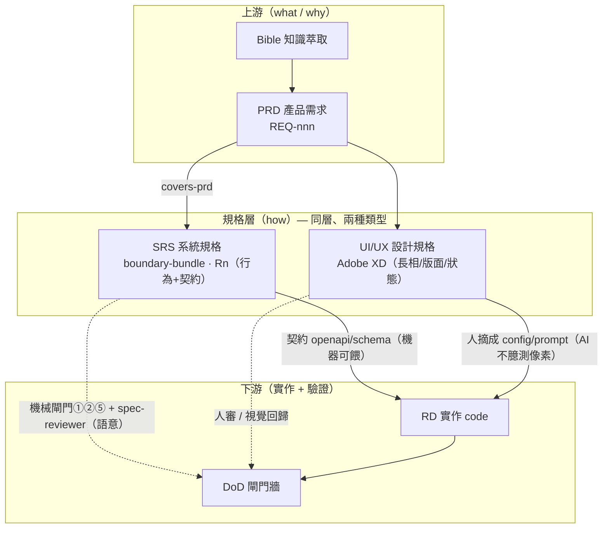
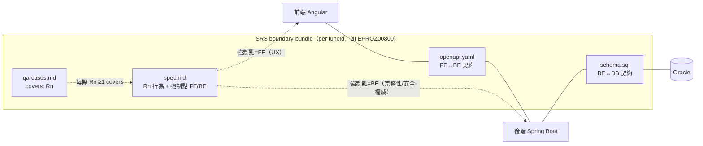

# 規格架構（Spec Architecture）

> 「規格」不是一份文件，是 **三軸結構**：**精煉層級 × 規格類型 × 層界契約**。
> 一句話：**funcId 串追溯、契約切邊界、行為留 SRS、長相留設計規格**。
> 上游流程圖見 `docs/assets/ai-workflow.mmd`；本檔聚焦「規格本身怎麼組織」。

## 1. 三條軸

| 軸 | 是什麼 | 內容 |
|---|---|---|
| **A 精煉層級**（縱，funcId 追溯） | 同一件事逐層加「how」、可上下追溯 | Legacy → Bible → **PRD** → **SRS** → QA → Code |
| **B 規格類型**（同層分工） | SRS 層其實有**兩種並行的 spec** | **SRS**（行為+契約）∥ **UI/UX 設計規格**（長相） |
| **C 層界契約**（橫，seam） | 用契約把實作層切開、不拆文件 | FE —`openapi`— BE —`schema`— DB |

## 2. 規格全景



**關鍵差異**：SRS 是**機器可驗證**的（餵 deterministic 閘門）；設計規格是**人類中介 + 人眼/視覺回歸**驗證的（AI 讀不到 XD、不准臆測視覺，見 `frontend/AGENTS.md §5`）。

## 3. SRS bundle 解剖 + 層界契約



**重點**：規格本體**只有一份**（`spec.md` 的 `Rn`），FE/BE 不拆成兩份文件；要分的是**契約這一層**（`openapi`=FE↔BE、`schema`=BE↔DB）。每條 `Rn` 標**強制點**當屬性。

## 4. 規格類型對照（taxonomy）

| 類型 | 規範什麼 | 消費者 | 怎麼驗 | 載體 |
|---|---|---|---|---|
| **PRD** | 要做什麼/為何（業務 what/why） | PM→SA | 人審 | `write-spec` |
| **SRS** | 行為 + 契約（系統 how） | RD + QA | **機械閘門①②⑤ + spec-reviewer** | `boundary-bundle/`（`Rn`/openapi/schema/qa） |
| **UI/UX 設計規格** | 長相/版面/互動/狀態/文案/RWD | FE RD | **人審 / 視覺回歸** | **Adobe XD** + `frontend/AGENTS.md §5` |

## 5. 兩個切面原則

- **行為 vs 長相**：同一件事（如 R7「`isEdit=false` 全唯讀」、或「空/載入/錯誤/disabled/無權限」狀態）——
  - **「有沒有、何時觸發、可不可測」= SRS**（可寫成 `Rn` + QA）
  - **「長什麼樣」= 設計規格**（XD，不進 SRS）
- **強制點 FE/BE/both**：每條 `Rn` 標明在哪層強制。**凡完整性/安全的驗證，BE 必須有、且為權威**；FE 同款驗證只是 UX（永不信前端）。
  - 反例＝病：`00800` 的 D5（FE maxlength 4000 / BE 沒驗）、init-query（FE POST / BE GET）——都是 FE/BE 各自為政、沒有單一契約真相。

## 6. 追溯與驗證（兩條鏈）

- **追溯鏈（縱）**：`funcId` → PRD `REQ-nnn` →（`covers-prd`）→ SRS `Rn` →（`covers`）→ QA case → code/test。↑可追溯、↓可驗證。
- **驗證鏈（DoD）**：
  - **機械層**（deterministic）＝`scripts/check-srs-bundle.py`：**涵蓋範圍以腳本檔頭 canonical 清單為準（勿在此複寫）**——大類＝契約/schema/covers/跨檔/Bible↔PRD（治 BP-7）/@PENDING↔register 同步；編號對照見 `specs/srs/README.md`。
  - **語意層**：`spec-reviewer`（唯讀、不改檔）審完整性/一致性/可測性/把 legacy 當需求等。
  - **鏡像層**（c0）：`verify-c0` 形式硬閘門。
  - **設計層**：人審 / 視覺回歸（非機械）。

## 7. 對應實體檔案

| 概念 | 檔案 |
|---|---|
| SRS bundle（範本/實例） | `docs/specs/srs/EPROZ00800/{spec,openapi,schema,qa-cases}`（分層資料夾＝`docs/specs/`：bible→prd→srs） |
| 設計規格慣例 | `frontend/AGENTS.md §5`（Adobe XD） |
| 機械閘門 | `scripts/check-srs-bundle.py`（①②⑤）、`scripts/verify-c0.py` |
| 語意審查 | `.claude/agents/spec-reviewer.md`（Codex：`docs/env/codex/spec-reviewer.toml`） |
| PRD→SRS 產出 | `.claude/skills/prd-to-srs/`（Codex：`docs/env/codex/prompts/prd-to-srs.md`） |
| 流程圖 / 決策 | `docs/assets/ai-workflow.mmd`、`docs/adr/ADR-0001-spec-workflow-dual-stack.md` |

## 8. 一頁總結

```
規格 = 精煉層級（Bible→PRD→SRS→QA→Code，funcId 串）
     × 規格類型（SRS 行為+契約 ∥ 設計規格 長相）
     × 層界契約（FE—openapi—BE—schema—DB）

SRS 一份、以 Rn 行為為主、每條標強制點(FE/BE/both)
契約(openapi/schema)當邊界 → 防 FE/BE 漂移
長相留 XD（人審/視覺回歸）→ 不塞進 SRS
funcId 串追溯、機械+語意雙層閘門驗證
```

## 9. 失敗教訓 → 控制點（回填狀態）

> 把 `decisions.md` 流水帳裡的失敗，對到「現在哪個控制點擋它」。**缺口**欄＝尚未變成 flow/gate/skill 控制、仍靠人記得的。

| # | 失敗 / 教訓 | 紀錄處 | 已回填控制點 | 缺口 |
|---|---|---|---|---|
| 1 | **結構在≠行為對等**（migrated 碼存在 ≠ 忠實；0921 7P/15F/5U、00800、authorize throw-stub） | decisions、findings | flow **as-is 驗證 loop**（本次補）；skill as-is/to-be + verification findings | — |
| 2 | **舊系統≠絕對正確**（KHR 在地化＝刻意演進、非 regression） | decisions（0921） | flow 標 ★regression vs 演進；skill **判準**＝異於舊版預設當 regression、歸演進須有依據（補強） | 本質需人判（已給判準縮小灰區） |
| 3 | **不把 legacy 當已核准需求**（B1：把 PRD 帶的 legacy checkpoint key 抄進契約） | spec.md、skill | skill 鐵則3、spec-reviewer 維度3；本次 skill 加「**PRD 內帶的 as-is 細節也要 reconcile**」 | — |
| 4 | **reflection/委派 i0 而非鏡像**（00116） | AGENTS §6.1 | **gate③ verify-c0** | — |
| 5 | **CJK UTF-8/BOM 壞**（00116 400+ 字串） | build-tasks | verify-c0 BOM/strict-UTF-8 | — |
| 6 | **Oracle map-key 大寫靜默 null**（M7 `LOANAMOUNT`） | decisions | sweep② prompt；本次 skill 列入 brownfield 抽查 | ⚠️ 非 gate，新碼仍可能再犯 |
| 7 | **review 放行把「既有碼行為」當新契約**（00118 gate-b FAIL5） | decisions | spec-reviewer 維度3；CLAUDE §6 審者不改 | — |
| 8 | **FE/BE split-brain**（D5 maxlength 4000/未驗、init-query POST/GET） | spec-architecture | **強制點 FE/BE**（spec.md 必填欄 + DoD + **gate 已檢查**，#8 完成）、契約單一真相、sweep① | — |
| 9 | **矩陣 prose 騙過 LLM、機械才抓到**（R15/R16 covers 漂移） | commit log | **gate⑤ check-srs-bundle**、CLAUDE §4 兩層驗證 | — |
| 10 | **假設 mirror/算法來源**（funcGetRate≠FX 換匯；我曾誤導） | a1 spec | flow **動手前鐵律**（本次補）；skill 盤點先行 | — |
| 11 | **未做其實已完成 / 已做誤判未做**（00117 BE、0920、CSU0130） | decisions | flow **動手前先唯讀盤點**（本次補）；skill | — |
| 12 | **落地紀律**（先審後推連 3 批沒守住 → master-direct + 嚴審） | decisions | 前向約定（master-direct 全程 + M10 最嚴人審） | git 紀律層，非 spec flow |
| 13 | **gate⑤「≥1 假綠」**（多分支 Rn 單 case 當覆蓋；00800 R15 僅 rollback／R16 僅 transaction，機械報全綠） | 00800 批判（2026-06-16）| **gate⑤ 分支覆蓋 partial-warn**（`check-srs-bundle` 升級：qa 自承「僅…分支／未撰寫」→warn）；skill DoD happy/error/edge 強化 | WARN 非 FAIL（機械無法判分支數）→ 仍需人補 case |
| 14 | **帶未承載 Bible 安全缺口仍 Approved**（00800 BR-014 災難情境「不該顯示卻顯示」降 BP1 seam pending、Approved subset 照發） | 00800 批判（2026-06-16）| **gateⓈ**（Status 含 Approved + `BPn-PENDING`→warn）；skill DoD「未承載 Bible 安全條件不得 Approved」 | 機械無法判 BP 是否安全條件→人確認 |
| 15 | **迭代 progress bias**（00800 v0.5→v0.9 規劃側為顯進度過度收斂：假 Approved 標籤、RP4 一證關兩事、RP1 工程論點關業務風險、as-is 不回填實作） | 00800 批判（2026-06-16）| CLAUDE §6 審者不改／@PENDING 不自行裁／採納後再審；gate⑤·gateⓈ 把部分顯化 | **AI 迭代裁定傾向收斂**＝本質需人；裁定權留 owner |
| 13 | **修正可能引入新錯**（B1 修法引入 checkPointMap 副作用、複審才抓） | commit log | spec-reviewer/CLAUDE/skill **「採納修正後必複審」**（本次補） | — |
| 14 | **throw-stub 行為驗證漏網**（funcGetExchangeRate 無條件 throw、首驗沒抓） | decisions | skill **as-is 最低驗證深度清單**（DB寫入/stub/error分支/副作用，本次補） | — |
| 16 | **原則寫了≠被執行**（skill 早有「BE-權威」「未承載安全條件不得 Approved」，00800 仍 FE-only 強制 + BP1 安全洞 Approved subset 照發） | 00800 批判輪2（2026-06-16） | 判斷題 **operationalize 成逐條 DoD check + spec-reviewer 紅旗**；可機械者進 gate（光寫原則無逐條對照＝虛設） | 轉換固有；逐條對照仍需人 |
| 17 | **契約打臉規則**（request 收『Rn 標後端為準』之決策欄：`checkPointMap`/`isNotSame` vs R11「DB 二次比對為唯一依據」） | 00800 批判輪2 | skill DoD「契約⊥後端為準」check + spec-reviewer 紅旗② | as-is DTO 抄進 to-be 未對 to-be 原則覆查 |
| 18 | **mutating 端點 FE-only 強制**（R3/R5/R6/R7 FE-only 落在 execute＝刪資料端點） | 00800 批判輪2 | skill DoD「mutating FE-only 必列 BE 強制或說明」check + 紅旗③ | 反推自 as-is FE 檢核、未問 BE 是否該擋 |
| 19 | **Status 混『規格定了』與『實作好了』**（Approved subset 高估完成度：只 D1–D5 landed、餘『可實作』未做） | 00800 批判輪2 | **gateⓈ(b) Status 雙軸 warn** + skill DoD + 00800 範本拆兩軸 | 機械查格式、語意人確認 |

> 回填（2026-06-09）：#1/#2/#10/#11 進 `ai-workflow.mmd`；#3/#6/#10/#11 進 `prd-to-srs` skill「brownfield 鐵則」。
> 二輪 flow 自審補強：#2 加 **regression 判準**、#8 強制點升 **spec.md 必填欄 + DoD**、#13 **「修正後必複審」**（spec-reviewer/CLAUDE/skill）、#14 **as-is 最低驗證深度清單**、#1 釐清 **SRS-blocking vs ⑦-advisory**。
> 全數完成（依序）：✅ #8 跨檔完整性 + 強制點欄檢查（`c470264`）；✅ #5 **partial-Approved**（`Approved (subset)`）；✅ #6 **`pending-register.md`**；✅ #10 **`legacy-to-bible` skill**（雙軌）；✅ #4 **`specs/qa-to-test.md`**（QA→測試橋接約定 + skill test-ready 寫法 + gate④ 釐清）。
> 仍待議（非本批、需更大決策）：openapi 兩源（SRS 草約 vs code snapshot）reconcile 何時收斂 contract-first；#12 落地紀律屬 git 層 → 維持人控。
