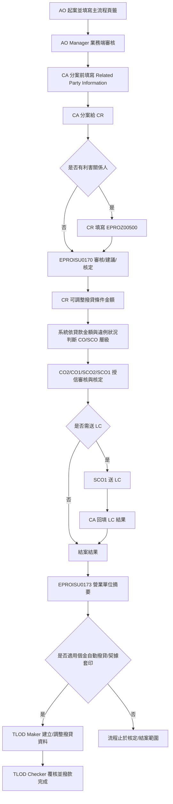
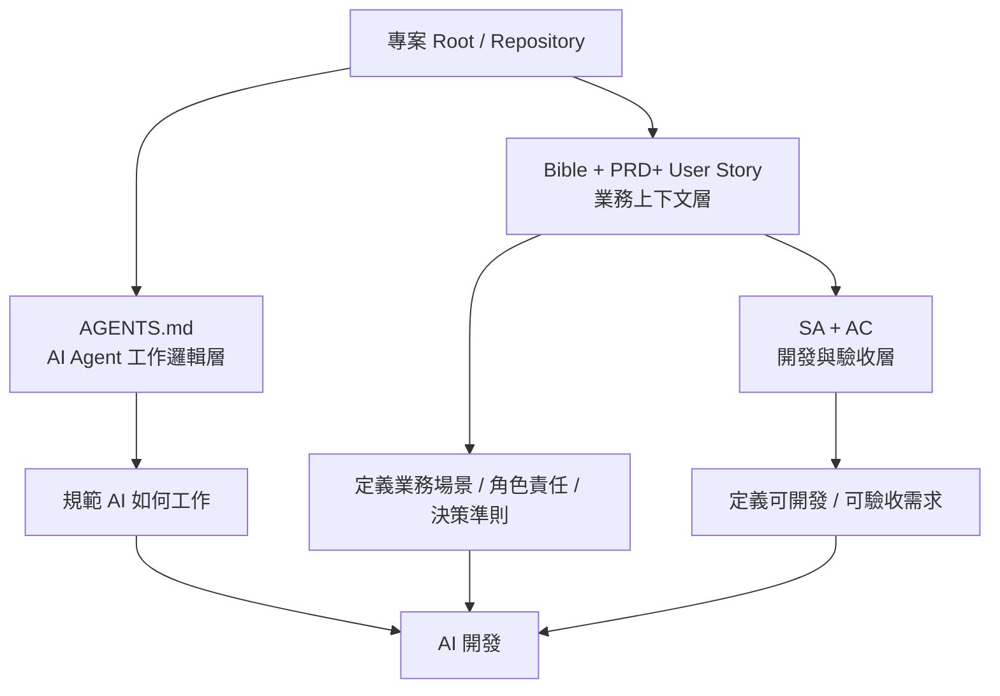

> **倉內快照（repo snapshot）** — flow 第 ① 層 Bible（見 [`README.md`](README.md)、[`../../spec-architecture.md`](../../spec-architecture.md)）。
> 來源：使用者提供之 `E-Proposal Project Bible v1.0`（2026-06-10）。**權威版以外部/業務 owner 為準**；此處為工作快照，供 PRD/SRS、`spec-reviewer`、追溯檢查在 repo 內讀得到。
> 範圍：**專案級**（全端到端旅程，含撥貸尾段）；域級深掘（如 disbursement）日後再拆 `bible-<domain>.md`。
> ⚠️ 證據接地：本版主以 `[HUMAN]`/`[CODE-TBD]` 標記，尚未補 legacy `file:line`（待 source 驗證階段回填）。
> 🔗 **Bible→PRD→SRS 邊界落差**（案件類型 gating / type 軸 / 展期·展變 / 0173 映射等）已登錄 [`../../pending-register.md`](../../pending-register.md) §Bible→PRD seam。

# E-Proposal Project Bible

## 本頁用途

用業務語言定義 E-Proposal 專案方向，包含業務北極星、決策準則、黃金旅程、端到端情境、角色責任與 source code 反推驗證重點。

本頁不是完整 PRD，不取代 SRS、User Story、API Spec、DB Spec 或 Decision Log。
本頁的目的，是先把 E-Proposal 現行業務邏輯、流程邊界與重構原則講清楚，讓後續可以透過 source code 逐一驗證、補足 Business Bible，並讓 AI Agent 依據可驗證規範進行開發與測試。

### 標記說明

| 標記 | 意義 |
| --- | --- |
| `[HUMAN]` | 已由業務／系統知識持有人於討論中確認 |
| `[INFERRED]` | 依目前資訊推論，仍需後續確認 |
| `[CODE-TBD]` | 需透過 legacy source code 驗證 |
| `[HUMAN-TBD]` | 需再向業務、主管或系統 Owner 確認 |
| `TBD` | 尚未確認，不得寫成固定承諾 |

---

## 專案方向

E-Proposal 是柬埔寨子行所使用的徵授信放款管理系統，建置目的為將原本紙本作業電子化。[HUMAN]

E-Proposal 的業務範圍涵蓋案件申請、徵信、授信審核、核定、放款、自動撥貸與契據套印等流程；目前不包含貸後管理。[HUMAN]

系統演進順序如下：[HUMAN]

1. 個金有擔保
2. 個金無擔保
3. 企金有擔保
4. 企金無擔保
5. 個金有擔自動撥貸
6. 個金有擔契據套印

E-Proposal 重構的核心精神不是讓 AI 直接依照舊系統自由重寫程式，而是先從現有 source code、畫面流程與業務確認中反推出可被驗證的 Business Bible。AI Agent 後續應依照 Bible 中的角色、流程、邊界、規則與測試案例進行開發，不得自行幻想未確認的業務規則。[HUMAN][INFERRED]

---

## 業務北極星

讓柬埔寨子行的業務、審查、授信核定與撥款作業，不再依賴紙本往返與人工追蹤，而是在同一套 E-Proposal 系統中，將客戶申請、徵信資料、授信條件、違例判斷、授權層級、LC 受審會結果、結案結果、撥貸資料與契據文件完整電子化，並確保每個案件在申請、審核、核定、放款與文件產製過程中可控、可追蹤、可驗證。[HUMAN][INFERRED]

E-Proposal 的邊界明確到放款、自動撥貸與契據套印，不延伸至貸後管理。[HUMAN]

---

## 決策準則

| 準則 | 判斷方向 | 來源 |
| --- | --- | --- |
| 業務語意優先於直接重寫 code | 不應直接把舊程式翻成新程式，而應先反推出業務意圖、流程責任與邊界。 | [HUMAN][INFERRED] |
| Source code 是驗證證據，不是唯一業務真理 | Source code 可確認欄位、狀態、驗證、顯示條件與資料流，但若發現歷史補丁、疑似 bug 或技術債，需回到業務確認。 | [HUMAN][INFERRED] |
| 角色責任不可混淆 | AO、AO Manager、CA、CR、CO/SCO、LC、TLOD Maker、TLOD Checker 的職責需清楚切分，不得因畫面共用而混淆決策權限。 | [HUMAN] |
| 授權層級與違例判斷優先於操作便利性 | CO2、CO1、SCO2、SCO1 的差異主要取決於貸款金額與是否違例；系統應依條件自動帶入預設核定層級。 | [HUMAN] |
| Maker-Checker 控制不可被簡化 | TLOD Maker 與 TLOD Checker 應維持撥款階段的登打與覆核分工，不應由同一角色單獨完成撥貸資料建立、覆核與撥款完成。 | [HUMAN][INFERRED] |
| 條件式頁籤不得寫成所有案件必走 | 例如 EPROZ00800 僅適用展期／展變案件；EPROZ00500 僅於有利害關係人時由 CR 填寫。 | [HUMAN] |
| 案件類型、客戶類型、擔保別不可硬編碼 | 新案／展期／展變、個人戶／公司戶、有擔／無擔等判斷需透過資料模型或規則支持，細節需由 source code 驗證。 | [HUMAN][CODE-TBD] |
| 未確認規則不得寫成承諾 | 畫面欄位、必填條件、狀態碼、資料表、API、授權門檻、LC 觸發條件等，未確認前需標記為 `TBD` 或 `CODE-TBD`。 | [HUMAN] |
| 系統邊界不得外擴到貸後管理 | 還款、催收、展延後追蹤、逾放管理等貸後管理不屬於目前 E-Proposal 範圍。 | [HUMAN] |

---

## 已確認角色定義

| 角色 | 中文名稱 | 業務定位 | 已確認責任 |
| --- | --- | --- | --- |
| AO | 業務助理／業務人員 | 案件發起與資料登打者 | 新增案件，登打案件資料，填寫 AO 主流程頁籤。[HUMAN] |
| AO Manager | 業務主管 | 業務端主管審核者 | 位於 AO 起案後、CA 分案前，負責業務端審核。[HUMAN] |
| CA | 審查秘書 | 審查行政、案件分派、LC 結果登錄者 | 分案前填寫 Related Party Information；分案給 CR；案件進入 LC 時，回到系統填寫 LC 審核結果。[HUMAN] |
| CR | 審查人員 | 信用評分與審查者 | 可調整撥貸條件金額，但不是最終核定人；調整後案件送 CO 或 SCO。[HUMAN] |
| CO2 | 授信有權核定人 | 授信核定角色之一 | 依授權層級審核案件，可調整撥貸條件金額。[HUMAN] |
| CO1 | 授信經理人 | 授信核定角色之一 | 依授權層級審核案件，可調整撥貸條件金額。[HUMAN] |
| SCO2 | 資深授信經理人 | 高層級授信核定角色 | 依授權層級審核案件，可調整撥貸條件金額。[HUMAN] |
| SCO1 | 高階授信經理人 | 高階授信核定與送 LC 角色 | 可審核案件、調整撥貸條件金額，並可將案件送交 LC 受審會。[HUMAN] |
| LC | Loan Committee／受審會 | 授信審議節點 | 不是一般單一系統使用者角色；LC 結果由 CA 回填系統。[HUMAN] |
| TLOD Maker | 撥款經辦 | 撥款資料建立與成案條件確認者 | 確認成案條件，自動化撥貸資料登打及調整。[HUMAN] |
| TLOD Checker | 撥款覆核主管 | 撥款覆核與自動撥貸執行控管者 | 案件分案、覆核並進行自動撥貸作業。[HUMAN] |

---

## 黃金旅程

以下是一個代表性 E-Proposal 使用者故事。實際欄位、狀態碼、資料表、API、畫面顯示條件、必填驗證與授權層級門檻，需透過 legacy source code 逐一驗證。[HUMAN][CODE-TBD]

> 柬埔寨子行的 AO 收到一件貸款申請，先在 E-Proposal 起案。若案件為展期或展變，系統依案件類型啟用 EPROZ00800，讓 AO 記錄展期／展變修訂資料；若為一般新案，則不適用該頁籤。
>
> AO 依序填寫主流程頁籤，包含申請人／客戶資料、財務資料、徵信／評等資料、擔保品資料、授信條件、其他約定事項與簽報書相關資料。個人戶使用 EPROISU0110，公司戶使用 EPROCSU0110；舊案件可先查詢帶入既有資料，不足部分由 AO 補登，新案件則由 AO 手動登打。
>
> AO 完成起案送出後，案件先由 AO Manager 進行業務端審核。AO Manager 通過後，案件才進入 CA 分案。CA 在分案前填寫 Related Party Information，並將案件分派給 CR。
>
> 若案件有利害關係人，CR 需要先填寫 EPROZ00500 相關頁籤；完成後進入 EPROISU0170 進行審核／建議／核定作業。CR 可依信用審查結果調整撥貸條件金額，但不是最終核定人。
>
> 系統依貸款金額與是否違例，自動判斷案件預設應送交 CO2、CO1、SCO2 或 SCO1 的授權層級。CO／SCO 進行審核與核定，必要時由 SCO1 將案件送交 LC 受審會。
>
> 若案件進入 LC，LC 審核結果由 CA 回填至 E-Proposal。核定完成後，系統產生結案結果，並將 AO 主流程填寫的資料彙整顯示於 EPROISU0173 營業單位摘要。
>
> 若案件屬於適用自動撥貸與契據套印的個金案件，案件成立後進入 TLOD Maker／TLOD Checker 的後段撥貸流程。TLOD Maker 確認成案條件並登打或調整撥貸資料；TLOD Checker 覆核並執行自動撥貸作業。流程終點到放款、自動撥貸與契據套印，不延伸至貸後管理。

---

## 主流程摘要

---

## 情境原型地圖

| 原型 | 代表情境 | 驗測用途 |
| --- | --- | --- |
| 典型情境 | AO 建立一般貸款案件，完成主流程頁籤，經 AO Manager、CA、CR、CO/SCO 核定，無 LC，完成結案；若為適用個金案件，進入 TLOD Maker／TLOD Checker 撥貸。 | 驗證主流程是否能從起案一路跑到核定、摘要與撥貸。 |
| 邊界情境 | 展期／展變案件、舊案件資料帶入、個人戶／公司戶、有擔／無擔、利害關係人、違例案件、貸款金額跨授權層級、SCO1 送 LC。 | 驗證條件式頁籤、授權層級、資料帶入與角色責任是否正確。 |
| 災難情境 | 案件類型判斷錯誤、EPROZ00800 不該顯示卻顯示、EPROZ00500 漏填、CO/SCO 層級判斷錯誤、LC 結果未回填、173 摘要與來源頁籤不一致、TLOD Maker/Checker 控制失效、重複撥貸。 | 驗證失敗時是否可追蹤、可阻擋、可回復、可稽核。 |

---

## E2E Business Scenarios

### 01-AO 起案：從紙本申請到電子案件建立

**場景敘事**

AO 需將紙本貸款申請轉為 E-Proposal 系統案件。案件可能是新案、舊案、展期或展變；可能是個人戶或公司戶；也可能是有擔保或無擔保。系統需讓 AO 依案件類型與客戶類型填寫正確頁籤，完成起案後送 AO Manager 審核。[HUMAN]

**業務閉環**

案件類型確認 -> 客戶類型確認 -> AO 主流程頁籤填寫 -> 資料檢核 -> 案件送出 -> AO Manager 審核。[HUMAN][CODE-TBD]

**必守邊界**

- EPROZ00800 僅適用展期／展變案件，一般新案不適用。[HUMAN]
- EPROISU0110 適用個人戶；EPROCSU0110 適用公司戶。[HUMAN]
- 舊案件可查詢帶入既有資料，不足部分由 AO 補登；新案件由 AO 手動登打。[HUMAN]
- 案件類型欄位、顯示條件、必填規則與欄位驗證需由 source code 驗證。[CODE-TBD]

**回驗重點**

- 系統是否正確判斷新案、展期、展變。
- 個人戶與公司戶是否進入正確畫面。
- 舊案件帶入資料後，哪些欄位可覆寫、哪些不可覆寫。
- AO 主流程資料是否正確顯示於 EPROISU0173。

### 02-展期／展變案件：既有案件條件修訂

**場景敘事**

當案件屬於展期或展變時，AO 需於 EPROZ00800 記錄既有案件的修訂資料。展期與展變是不同案件類型，但目前使用同一套欄位驗證規則。[HUMAN]

**業務閉環**

案件類型=展期／展變 -> 啟用 EPROZ00800 -> 記錄原案件與修訂資訊 -> 影響 EPROISU0150 授信條件 -> 顯示於 EPROISU0173。[HUMAN][CODE-TBD]

**必守邊界**

- EPROZ00800 不應成為一般新案必填頁籤。[HUMAN]
- 展期與展變雖為不同案件類型，但目前共用驗證規則。[HUMAN]
- EPROZ00800 與 EPROISU0150、EPROISU0173 的欄位對應需由 source code 驗證。[CODE-TBD]

**回驗重點**

- 案件類型欄位是哪一個。
- EPROZ00800 顯示條件在哪裡控制。
- 哪些欄位會帶入 EPROISU0150。
- 哪些欄位會顯示到 EPROISU0173。
- 展期與展變共用驗證規則的實際內容。

### 03-AO Manager 審核與 CA 分案

**場景敘事**

AO 完成起案後，案件先由 AO Manager 進行業務端審核。AO Manager 通過後，案件進入 CA 分案。CA 在分案前填寫 Related Party Information，並將案件分派給 CR。[HUMAN]

**業務閉環**

AO 送出案件 -> AO Manager 審核 -> CA 填寫 Related Party Information -> CA 分案給 CR。[HUMAN]

**必守邊界**

- AO Manager 位於 AO 起案後、CA 分案前。[HUMAN]
- CA 不參與信用評分與授信核定。[HUMAN]
- CA 可影響流程流轉與 LC 結果登錄，但不應作為授信決策者。[HUMAN]
- AO Manager 審核畫面、可退回／可修改規則需由 source code 驗證。[CODE-TBD]

**回驗重點**

- AO Manager 的審核畫面代號與狀態轉換。
- AO Manager 可執行哪些動作：通過、退回、修改、取消等。
- CA 分案前 Related Party Information 的欄位與必填條件。
- CA 分案後案件如何指派給 CR。

### 04-CR 審查與 CO/SCO 授權層級核定

**場景敘事**

CA 分案後，CR 進行信用審查。若案件有利害關係人，CR 需填寫 EPROZ00500 相關頁籤，再進入 EPROISU0170。CR 可調整撥貸條件金額，但不是最終核定人。調整後案件會送交 CO 或 SCO 核定。[HUMAN]

**業務閉環**

CA 分案 -> 是否有利害關係人 -> CR 填寫 EPROZ00500 或直接進 EPROISU0170 -> CR 審查與調整條件 -> 系統判斷 CO/SCO 層級 -> CO/SCO 核定。[HUMAN][CODE-TBD]

**必守邊界**

- EPROZ00500 不是所有案件必走，僅於有利害關係人時由 CR 填寫。[HUMAN]
- CR 可以調整撥貸條件金額，但不是最終核定人。[HUMAN]
- CO2、CO1、SCO2、SCO1 的差異主要來自授權層級，判斷因素包含貸款金額與是否違例。[HUMAN]
- 系統應自動依條件帶入預設核定層級。[HUMAN]
- 實際授權門檻、違例條件、狀態轉換與角色動作需由 source code 驗證。[CODE-TBD]

**回驗重點**

- 利害關係人判斷條件。
- EPROZ00500 完成條件。
- EPROISU0170 在 CR、CO、SCO 不同角色下的可見欄位與可執行動作。
- 貸款金額與違例如何影響 CO/SCO 層級。
- CR 調整金額後是否重新判斷授權層級。

### 05-LC 受審會與 CA 結果回填

**場景敘事**

當案件需要進入 LC 受審會時，由 SCO1 將案件送交 LC。LC 是 Loan Committee／受審會，不是一般單一系統使用者角色。LC 審核完成後，由 CA 回到系統填寫 LC 審核結果。[HUMAN]

**業務閉環**

SCO1 判斷或觸發送 LC -> LC 受審會審核 -> CA 回填 LC 結果 -> 回到核定／結案流程。[HUMAN][CODE-TBD]

**必守邊界**

- 目前已確認 SCO1 可將案件送交 LC。[HUMAN]
- CA 負責回填 LC 結果，但不參與信用評分與核定。[HUMAN]
- LC 觸發條件、結果類型、回填畫面與後續狀態轉換需由 source code 與業務確認。[CODE-TBD][HUMAN-TBD]

**回驗重點**

- 哪些案件必須送 LC。
- 是否只有 SCO1 可以送 LC。
- LC 結果有哪些類型：核准、駁回、附條件核准、退回等。
- CA 回填 LC 結果後，案件狀態如何變化。
- LC 會議紀錄與核定結果如何保存與顯示。

### 06-結案結果與營業單位摘要

**場景敘事**

案件完成審核與核定後，系統產生結案結果。EPROISU0173 營業單位摘要不是 AO 結案後另行填寫的頁籤，而是 AO 在主流程頁籤填寫資料後，系統彙整顯示的摘要頁籤。[HUMAN]

**業務閉環**

AO 主流程資料 -> CR/CO/SCO/LC 審核結果 -> 結案結果 -> EPROISU0173 營業單位摘要顯示。[HUMAN][CODE-TBD]

**必守邊界**

- EPROISU0173 是摘要顯示頁，不是 AO 結案後新增填寫頁。[HUMAN]
- EPROZ00800、EPROISU0110／EPROCSU0110 等主流程資料會顯示於 EPROISU0173。[HUMAN]
- 實際欄位來源與 mapping 需由 source code 驗證。[CODE-TBD]

**回驗重點**

- 哪些 AO 主流程欄位會顯示到 EPROISU0173。
- 173 顯示資料是否來自即時計算、DB view、暫存表或報表查詢。
- 結案結果與營業單位摘要是否存在資料不一致風險。
- 修改來源頁籤後，173 是否同步更新。

### 07-個金案件成立後：自動撥貸與契據套印

**場景敘事**

個金案件成立後，若屬於適用範圍，案件會進入產製契據與撥貸流程。TLOD Maker 負責成案條件確認、自動化撥貸資料登打與調整；TLOD Checker 負責案件分案、覆核並進行自動撥貸作業。[HUMAN]

**業務閉環**

案件成立 -> TLOD Maker 確認成案條件與撥貸資料 -> 產製契據 -> TLOD Checker 審核／覆核 -> 撥款完成。[HUMAN][CODE-TBD]

**必守邊界**

- 撥貸流程目前已知是個金案件成立後的後段延伸；企金是否適用需確認。[HUMAN-TBD]
- TLOD Maker 與 TLOD Checker 應維持 Maker-Checker 控制。[HUMAN][INFERRED]
- 自動撥貸與契據套印的適用案件條件需由 source code 驗證。[CODE-TBD]
- E-Proposal 流程終點到放款、自動撥貸與契據套印，不包含貸後管理。[HUMAN]

**回驗重點**

- 哪些案件會進入 EPROISU0910～EPROISU0922 撥貸流程。
- TLOD Maker 與 TLOD Checker 的權限分工。
- 成案條件未滿足時是否能阻擋撥貸。
- 是否可避免重複撥貸或未覆核撥貸。
- 契據產製資料來源與核定條件是否一致。

### 08-報表查詢：從案件結果到營運／審查追蹤

**場景敘事**

報表查詢的目的，是支援案件追蹤、營運檢視、審查回顧、撥貸結果確認與稽核，而不是推動案件狀態流轉。[HUMAN][CODE-TBD]

目前流程圖中已標示的報表查詢入口與報表類型包含：[HUMAN][CODE-TBD]

| 畫面／報表代號 | 報表名稱 | 初步定位 |
| --- | --- | --- |
| EPROZ00670 | 共用報表查詢 | 共用報表查詢入口，已知可查詢 TLOD 報表。 |
| EPROISU0180 | Credit Proposal 報表 | 個金／企金案件簽報或授信提案相關報表。 |
| EPROISU0181 | TLOD Report 報表 | TLOD 相關報表，需與共用報表查詢及 TLOD Maker / Checker 流程對齊。 |
| EPROISU0182 | Summary Report 報表 | 案件摘要或彙整型報表。 |
| EPROISU0183 | Transaction Result 報表 | 交易或撥貸結果相關報表。 |
| EPROISU0184 | Message Code Record 報表 | 訊息代碼、錯誤代碼或系統回應紀錄相關報表。 |

**業務閉環**

案件／核定／撥貸／TLOD／交易結果資料產生 -> 使用者依角色與查詢條件進入報表查詢 -> 系統套用權限、案件範圍與查詢條件 -> 產出報表結果 -> 支援案件追蹤、審查回顧、撥貸結果確認、異常追查與稽核。[HUMAN][CODE-TBD]

**必守邊界**

- 報表查詢應屬於查詢與追蹤用途，不應直接修改案件資料、審核結果、核定條件或撥貸狀態。[INFERRED][CODE-TBD]
- 報表可查詢範圍應受角色、權限、部門、案件歸屬或資料範圍限制，不應因查詢便利而繞過權限控管。[INFERRED][CODE-TBD]
- 報表指標與欄位語意需與來源流程一致，例如起案資料、核定結果、EPROISU0173 營業單位摘要、CAD 撥貸結果與 TLOD 流程資料不可混用或誤解。[INFERRED][CODE-TBD]
- EPROZ00670 共用報表查詢、EPROISU0181 TLOD Report、EPROZ00660 權限設定中的 TLOD Maker / Checker 關係需釐清，避免把 TLOD 查詢、建立、審核與權限控管混為同一件事。[HUMAN][CODE-TBD]
- 報表是否支援匯出、列印、批次產生、查詢期間限制、保存期限與資料更新頻率，目前皆需由 source code 或業務確認，不得寫成固定承諾。[CODE-TBD][HUMAN-TBD]

**回驗重點**

- 各報表的資料來源是資料表、SQL、View、API、暫存表、批次產製結果，或即時計算。[CODE-TBD]
- 各報表可被哪些角色查詢；不同角色看到的案件範圍、欄位與功能是否不同。[CODE-TBD]
- 各報表查詢條件包含哪些欄位，例如案件編號、客戶、產品、案件狀態、核定結果、撥貸狀態、日期區間、部門或承辦人。[CODE-TBD]
- Credit Proposal、Summary Report 與 EPROISU0173 營業單位摘要之間的資料欄位是否一致，若不一致需標示差異與原因。[CODE-TBD]
- Transaction Result 報表是否與 EPROISU0910～EPROISU0922 撥貸流程結果一致，且能辨識成功、失敗、待處理或異常狀態。[CODE-TBD]
- Message Code Record 是否可支援錯誤追蹤、系統回應查詢與異常處理，不應只停留在工程 log 層級。[INFERRED][CODE-TBD]
- 報表查詢與匯出是否留下操作紀錄，以支援稽核追蹤。[CODE-TBD]

---

## 測試標準驗證 AO 主流程頁籤盤點

目前已確認 AO 主流程頁籤順序如下：[HUMAN]

| 順序 | 畫面／頁籤 | 初步定位 | 目前狀態 |
| --- | --- | --- | --- |
| 1 | EPROZ00800 | 展期／展變修訂資料 | 已初步定義；細節待 code 驗證 |
| 2 | EPROISU0110 | 個人戶申請人／客戶資料 | 已初步定義；細節待 code 驗證 |
| 2a | EPROCSU0110 | 公司戶申請人／客戶資料 | 已初步定義；細節待 code 驗證 |
| 3 | EPROISU0120 | 財務資料 | 尚未核對 |
| 4 | EPROISU0130 | 徵信／評等資料 | 尚未核對 |
| 5 | EPROISU0140 | 擔保品資料 | 尚未核對 |
| 6 | EPROISU0150 | 授信條件 | 尚未核對 |
| 7 | EPROISU0160 | 其他約定事項 | 尚未核對 |
| 8 | EPROI00110 | 簽報書輸入首頁 | 尚未核對 |
| 9 | EPROI00120 | 簽報書子頁籤 | 尚未核對 |
| 10 | EPROZ00300 | 案件送出／起案完成 | 尚未核對 |
| 摘要 | EPROISU0173 | 營業單位摘要顯示 | 已確認為摘要顯示，不是結案後另填 |

---

## 已確認 Business Rules

| Rule ID | 模組 | 規則 | 狀態 |
| --- | --- | --- | --- |
| BR-001 | 系統範圍 | E-Proposal 是柬埔寨子行徵授信放款管理系統，目的為紙本作業電子化。 | [HUMAN] |
| BR-002 | 系統範圍 | E-Proposal 目前不包含貸後管理。 | [HUMAN] |
| BR-003 | 系統演進 | 系統演進順序為個金有擔保、個金無擔保、企金有擔保、企金無擔保、個金有擔自動撥貸、個金有擔契據套印。 | [HUMAN] |
| BR-004 | 角色 | AO 與 AO Manager 屬於業務單位。 | [HUMAN] |
| BR-005 | 角色 | CA 只做行政、分案與 LC 結果回填，不參與信用評分與核定。 | [HUMAN] |
| BR-006 | 角色 | CR 可調整撥貸條件金額，但不是最終核定人。 | [HUMAN] |
| BR-007 | 授權層級 | CO2、CO1、SCO2、SCO1 的差異主要取決於貸款金額與是否違例。 | [HUMAN] |
| BR-008 | 授權層級 | 系統會自動依條件帶入預設要給哪一層級人員。 | [HUMAN] |
| BR-009 | LC | LC 是 Loan Committee／受審會。 | [HUMAN] |
| BR-010 | 主流程 | AO Manager 位於 AO 起案後、CA 分案前。 | [HUMAN] |
| BR-011 | Related Party | CA 在分案前填寫 Related Party Information。 | [HUMAN] |
| BR-012 | Related Party | 若案件有利害關係人，CR 才需填寫 EPROZ00500；填完後接續 EPROISU0170。 | [HUMAN] |
| BR-013 | EPROISU0173 | EPROISU0173 是 AO 主流程資料彙整顯示，不是 AO 結案後另填。 | [HUMAN] |
| BR-014 | EPROZ00800 | EPROZ00800 只適用展期／展變案件。 | [HUMAN] |
| BR-015 | EPROZ00800 | 展期與展變是不同案件類型，起案時會由案件類型欄位確認。 | [HUMAN][CODE-TBD] |
| BR-016 | EPROZ00800 | 展期與展變目前使用同一套欄位驗證規則。 | [HUMAN][CODE-TBD] |
| BR-017 | EPROZ00800 | EPROZ00800 會影響 EPROISU0150，並顯示於 EPROISU0173。 | [HUMAN][CODE-TBD] |
| BR-018 | EPROISU0110 | EPROISU0110／EPROCSU0110 所有案件都必填。 | [HUMAN] |
| BR-019 | EPROISU0110 | EPROISU0110 是個人戶；EPROCSU0110 是公司戶。 | [HUMAN] |
| BR-020 | EPROISU0110 | 舊案件先查詢帶入，不足由 AO 補登；新案件由 AO 手動登打。 | [HUMAN] |
| BR-021 | EPROISU0110 | EPROISU0110／EPROCSU0110 會顯示於 EPROISU0173。 | [HUMAN] |

---

## Source Code 驗證清單

| Check ID | 模組 | 要驗證的問題 | 目前理解 | 狀態 |
| --- | --- | --- | --- | --- |
| SC-001 | 案件類型 | 案件類型欄位是哪一個？如何區分新案、展期、展變？ | 起案時有欄位判斷案件類型。 | CODE-TBD |
| SC-002 | EPROZ00800 | 顯示條件在哪裡控制？前端、後端或兩者都有？ | 僅展期／展變顯示。 | CODE-TBD |
| SC-003 | EPROZ00800 | 哪些欄位會帶入 EPROISU0150？ | 會影響授信條件。 | CODE-TBD |
| SC-004 | EPROZ00800 | 哪些欄位會顯示到 EPROISU0173？ | 會顯示於營業單位摘要。 | CODE-TBD |
| SC-005 | EPROZ00800 | 展期與展變共用驗證規則的實際內容是什麼？ | 目前確認共用一套規則。 | CODE-TBD |
| SC-006 | EPROISU0110/EPROCSU0110 | 系統如何判斷個人戶或公司戶？ | 個人戶走 EPROISU0110，公司戶走 EPROCSU0110。 | CODE-TBD |
| SC-007 | EPROISU0110/EPROCSU0110 | 個人戶與公司戶欄位差異為何？ | 大部分資料相同，部分不同。 | CODE-TBD |
| SC-008 | EPROISU0110/EPROCSU0110 | 有擔／無擔與不同身分別如何影響欄位？ | 有不同身分與擔保別差異。 | CODE-TBD |
| SC-009 | EPROISU0110/EPROCSU0110 | 舊案件資料從哪裡帶入？哪些欄位可覆寫？ | 舊案件查詢帶入，不足補登。 | CODE-TBD |
| SC-010 | EPROISU0173 | 173 的資料來源與欄位 mapping 為何？ | 彙整 AO 主流程資料。 | CODE-TBD |
| SC-011 | AO Manager | AO Manager 審核畫面、狀態與動作為何？ | 位於 AO 起案後、CA 前。 | CODE-TBD |
| SC-012 | CA 分案 | Related Party Information 欄位與分案邏輯為何？ | CA 分案前填寫。 | CODE-TBD |
| SC-013 | EPROZ00500 | 有利害關係人時，CR 填寫頁籤的顯示與完成條件為何？ | 有利害關係人時才填。 | CODE-TBD |
| SC-014 | EPROISU0170 | CR／CO／SCO 在同一畫面的可執行動作差異為何？ | 依角色、狀態、授權層級不同。 | CODE-TBD |
| SC-015 | 授權層級 | 系統如何依貸款金額與違例判斷 CO2／CO1／SCO2／SCO1？ | 系統自動帶入預設層級。 | CODE-TBD |
| SC-016 | LC | 哪些條件觸發 LC？LC 結果類型與回填流程為何？ | SCO1 可送 LC，CA 回填結果。 | CODE-TBD |
| SC-017 | 撥貸 | 哪些案件進入 EPROISU0910～EPROISU0922？ | 個金案件成立後可能進入。 | CODE-TBD |
| SC-018 | TLOD | TLOD Maker／TLOD Checker 權限與 Maker-Checker 控制如何實作？ | Maker 登打，Checker 覆核撥款。 | CODE-TBD |

---

## 待驗測關鍵指標與要求數據

下列指標會影響重構設計、流程驗證、角色權限、AI Agent 開發與測試案例。未確認前，不應寫成固定承諾。

| 面向 | 需確認／驗測的關鍵項目 | 為什麼重要 | 目前狀態 |
| --- | --- | --- | --- |
| 案件類型 | 新案、展期、展變等案件類型代碼與判斷欄位 | 影響頁籤顯示、驗證規則與流程分支 | CODE-TBD |
| 客戶類型 | 個人戶／公司戶判斷欄位與畫面路徑 | 影響 EPROISU0110／EPROCSU0110 選擇 | CODE-TBD |
| 擔保別 | 有擔／無擔對欄位、流程與授權層級的影響 | 影響個金、企金與授信條件 | CODE-TBD |
| 角色權限 | 各角色可新增、修改、審核、退回、送下一關的動作 | 影響權限矩陣與流程控管 | CODE-TBD |
| 狀態流 | 案件從起案到結案、撥貸完成的狀態碼 | 影響 workflow、查詢、報表與測試 | CODE-TBD |
| 授權層級 | 貸款金額、違例、產品或其他條件如何決定 CO/SCO | 影響核定正確性與風控 | CODE-TBD |
| 利害關係人 | Related Party Information 與 EPROZ00500 的關聯與觸發條件 | 影響 CR 審查前置條件 | CODE-TBD |
| LC | LC 觸發條件、結果類型、回填欄位與會議紀錄 | 影響高階審議流程與結案結果 | CODE-TBD |
| 173 摘要 | EPROISU0173 欄位來源與 mapping | 影響審核閱讀與結案資料一致性 | CODE-TBD |
| 自動撥貸 | 個金案件進入自動撥貸的條件 | 影響 TLOD 流程與放款風險 | CODE-TBD |
| 契據套印 | 契據產製資料來源、模板與適用案件 | 影響文件正確性與法遵 | CODE-TBD |
| 稽核追蹤 | 各角色操作、退回、核定、LC 回填、撥款動作是否可追蹤 | 影響可驗證與內控 | CODE-TBD |

---

## 待確認問題

| 問題 ID | 問題 | 需要誰確認 | 狀態 |
| --- | --- | --- | --- |
| Q-001 | 例如：畫面有誤操作方式與規格書不一致 | Source code / PM / SA | CODE-TBD |

---

## 文件分層說明

E-Proposal 後續若要進入 AI 開發，建議採三層文件架構：

一句話說明：

> `AGENTS.md` 管 AI 怎麼工作；`Bible / SRS` 管業務場景與決策原則；`PRD / User Story / AC` 管開發範圍與驗收條件。

---

## 文件入口

> [!info] 細節規格入口
> 本頁描述 E-Proposal Project Bible 的北極星、決策準則、黃金旅程與端到端業務情境；細節規格請回到下列文件維護。

- 提供於 C_Drive 的共用資料夾（公司內網 LDY 連結，需內網存取）。
