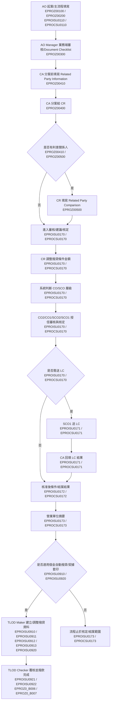
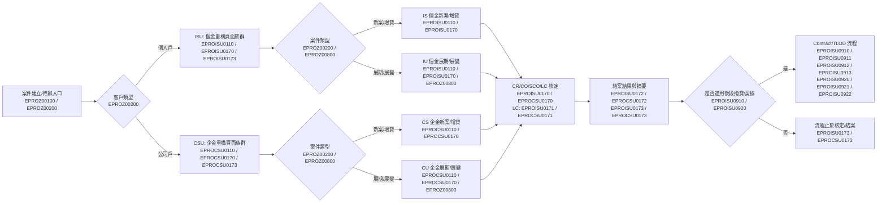
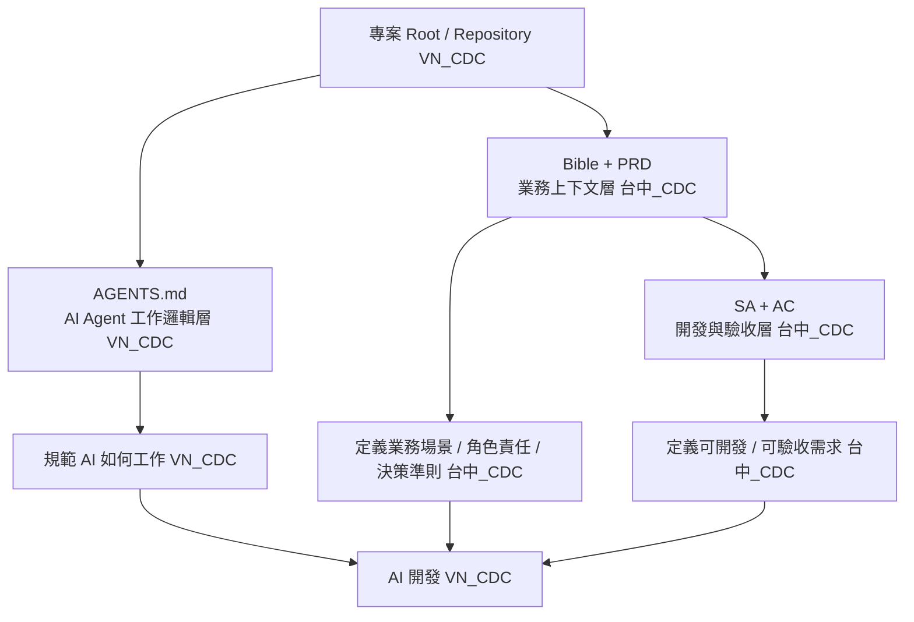

> **倉內快照（repo snapshot）** — flow 第 ① 層 Bible。**v1.1-draft 取代 v1.0**（2026-06-17 ingest；v1.0 見 git history）。來源：使用者提供之新版 Bible；**權威版以業務 owner 為準**，此為 repo 工作快照供 PRD/SRS、`spec-reviewer`、追溯讀取。
> **v1.1 大幅補強**：DB 驗收錨點（UT `OCHUBKH`/`OVSLXLON02` 實查欄位、狀態碼字典 `TB_PROCESS_CODE`、角色字典 `TB_ROLE_DEFINE`、`TB_API_AUTH`）、E2E 情境、BR-001~030、SC-001~031 驗證清單 → **BP-1~5 seam 之 Bible 側已承載**（BR-014~017 / SC-002~005、災難情境），待 PRD/SRS 下推。撥貸/契據確認為**個金 only**（企金待確認 Q-002）。

# E-Proposal Project Bible

## 本頁用途

用業務語言定義 E-Proposal 專案方向，包含業務北極星、決策準則、黃金旅程、端到端情境、角色責任與 source code 反推驗證重點。

本頁不是完整 PRD，不取代 SRS、User Story、API Spec、DB Spec 或 Decision Log。  
本頁的目的，是先把 E-Proposal 現行業務邏輯、流程邊界與重構原則講清楚，讓後續可以透過 source code 逐一驗證、補足 Business Bible，並讓 AI Agent 依據可驗證規範進行開發與測試。

---

## 目前完成度評估

本評估用來判斷 Bible 是否足以作為後續 PRD、SRS、API、DB Spec 與測試案例的上游依據；分數不是驗收結果，會隨 source code 驗證與業務確認更新。

整體評分：**88/100**。目前已接近可作為開發與測試共同上游文件，但仍不能取代各功能 PRD、SRS、API Spec 與正式 SIT/UAT 測試案例。

| 評估面向 | 分數 | 判斷 |
| --- | --- | --- |
| 業務共同語言 | 92/100 | 已具備北極星、角色、主流程、四泳道、名詞字典、案件分類、里程碑對照、完整功能代號口徑、`EPROISU`／`EPROCSU` 重構頁面族群與 DB 驗收錨點，可支撐跨 PM/SA/RD/QA 討論。剩餘缺口主要是業務名詞簽核。 |
| 開發可落地程度 | 88/100 | 已補 legacy function 對照、頁面分類、資料來源 mapping、DB 欄位錨點、狀態碼字典、角色/API 權限來源、TLOD 批次/SFTP source 證據與 source 驗證清單；仍需逐 action 驗證狀態轉換、逐頁欄位 mapping、授權層級與 LC/LLC 公式。 |
| 測試可驗收程度 | 86/100 | 已有 E2E 情境、災難情境、Given/When/Then 範例、DB 驗收錨點、SIT/UAT 測試矩陣骨架、待驗測指標與 QA 驗收方式；仍需補實際測試資料、完整操作步驟、可重跑 SQL 腳本與 API 正負向案例。 |
| Source/DB 證據成熟度 | 84/100 | DB 主要欄位、案件狀態碼、角色、API auth、Related Party、TLOD batch、SFTP 已有可追證據；部分頁面仍停在 source inventory 或部分確認，尚未逐 action / method 完成 trace。 |
| PRD 拆解準備度 | 89/100 | 已足以開始拆 `EPROZ00800`、`EPROISU0110`、`EPROCSU0110`、`EPROISU0170`、`EPROCSU0170`、`EPROISU0173`、`EPROCSU0173`、TLOD 等 PRD；但每份 PRD 仍需補 source mapping、欄位規則、error handling 與測試案例。 |

優先補強順序：逐 action 驗證 `CASE_PROGRESS` 轉換、補齊 `EPROISU0173` / `EPROCSU0173` 逐欄位 source of truth、建立 `EPROISU0170` / `EPROCSU0170` 的 CR/CO/SCO 權限與狀態矩陣、確認授權層級與 LC/LLC 觸發公式、確認企金是否適用契據/自動撥貸、補正式 SIT/UAT 測試資料與 SQL 查核腳本。

---

## 專案方向

E-Proposal 是柬埔寨子行所使用的徵授信放款管理系統，建置目的為將原本紙本作業電子化。

E-Proposal 的業務範圍涵蓋案件申請、徵信、授信審核、核定、放款、自動撥貸與契據套印等流程；目前不包含貸後管理。

系統演進順序如下：

1. 個金有擔保
2. 個金無擔保
3. 企金有擔保
4. 企金無擔保
5. 個金有擔自動撥貸
6. 個金有擔契據套印

E-Proposal 重構的核心精神不是讓 AI 直接依照舊系統自由重寫程式，而是先從現有 source code、畫面流程與業務確認中反推出可被驗證的 Business Bible。AI Agent 後續應依照 Bible 中的角色、流程、邊界、規則與測試案例進行開發，不得自行幻想未確認的業務規則。

---

## 業務北極星

讓柬埔寨子行的業務、審查、授信核定與撥款作業，不再依賴紙本往返與人工追蹤，而是在同一套 E-Proposal 系統中，將客戶申請、徵信資料、授信條件、違例判斷、授權層級、LC 受審會結果、結案結果、撥貸資料與契據文件完整電子化，並確保每個案件在申請、審核、核定、放款與文件產製過程中可控、可追蹤、可驗證。

E-Proposal 的邊界明確到放款、自動撥貸與契據套印，不延伸至貸後管理。

---

## 決策準則

| 準則 | 判斷方向 |
| --- | --- |
| 業務語意優先於直接重寫 code | 不應直接把舊程式翻成新程式，而應先反推出業務意圖、流程責任與邊界。 |
| Source code 是驗證證據，不是唯一業務真理 | Source code 可確認欄位、狀態、驗證、顯示條件與資料流，但若發現歷史補丁、疑似 bug 或技術債，需回到業務確認。 |
| 角色責任不可混淆 | AO、AO Manager、CA、CR、CO/SCO、LC、TLOD Maker、TLOD Checker 的職責需清楚切分，不得因畫面共用而混淆決策權限。 |
| 授權層級與違例判斷優先於操作便利性 | CO2、CO1、SCO2、SCO1 的差異主要取決於貸款金額與是否違例；系統應依條件自動帶入預設核定層級。 |
| Maker-Checker 控制不可被簡化 | TLOD Maker 與 TLOD Checker 應維持撥款階段的登打與覆核分工，不應由同一角色單獨完成撥貸資料建立、覆核與撥款完成。 |
| 條件式頁籤不得寫成所有案件必走 | 例如 EPROZ00800 僅適用展期／展變案件；EPROZ00500 僅於有利害關係人時由 CR 填寫。 |
| 案件類型、客戶類型、擔保別不可硬編碼 | 新案／展期／展變、個人戶／公司戶、有擔／無擔等判斷需透過資料模型或規則支持，細節需由 source code 驗證。 |
| 未確認規則不得寫成承諾 | 畫面欄位、必填條件、狀態碼、資料表、API、授權門檻、LC 觸發條件等，未確認前需以待確認描述。 |
| 系統邊界不得外擴到貸後管理 | 還款、催收、展延後追蹤、逾放管理等貸後管理不屬於目前 E-Proposal 範圍。 |

---

## 已確認角色定義

| 角色 | 中文名稱 | 業務定位 | 已確認責任 |
| --- | --- | --- | --- |
| AO | 業務助理／業務人員 | 案件發起與資料登打者 | 新增案件，登打案件資料，填寫 AO 主流程頁籤。 |
| AO Manager | 業務主管 | 業務端主管審核者 | 位於 AO 起案後、CA 分案前，負責業務端審核。 |
| CA | 審查秘書 | 審查行政、案件分派、LC 結果登錄者 | 分案前填寫 Related Party Information；分案給 CR；案件進入 LC 時，回到系統填寫 LC 審核結果。 |
| CR | 審查人員 | 信用評分與審查者 | 可調整撥貸條件金額，但不是最終核定人；調整後案件送 CO 或 SCO。 |
| CO2 | 授信有權核定人 | 授信核定角色之一 | 依授權層級審核案件，可調整撥貸條件金額。 |
| CO1 | 授信經理人 | 授信核定角色之一 | 依授權層級審核案件，可調整撥貸條件金額。 |
| SCO2 | 資深授信經理人 | 高層級授信核定角色 | 依授權層級審核案件，可調整撥貸條件金額。 |
| SCO1 | 高階授信經理人 | 高階授信核定與送 LC 角色 | 可審核案件、調整撥貸條件金額，並可將案件送交 LC 受審會。 |
| LC | Loan Committee／受審會 | 授信審議節點 | 不是一般單一系統使用者角色；LC 結果由 CA 回填系統。 |
| TLOD Maker | 撥款經辦 | 撥款資料建立與成案條件確認者 | 確認成案條件，自動化撥貸資料登打及調整。 |
| TLOD Checker | 撥款覆核主管 | 撥款覆核與自動撥貸執行控管者 | 案件分案、覆核並進行自動撥貸作業。 |

---

## 黃金旅程

以下是一個代表性 E-Proposal 使用者故事。實際欄位、狀態碼、資料表、API、畫面顯示條件、必填驗證與授權層級門檻，需透過 legacy source code 逐一驗證。

> 柬埔寨子行的 AO 收到一件貸款申請，先在 E-Proposal 起案。若案件為展期或展變，系統依案件類型啟用 EPROZ00800，讓 AO 記錄展期／展變修訂資料；若為一般新案，則不適用該頁籤。
>
> AO 依序填寫主流程頁籤，包含申請人／客戶資料、財務資料、徵信／評等資料、擔保品資料、授信條件、其他約定事項與簽報書相關資料。重構後個人戶以 EPROISU0110／ISU 頁面族群判斷，公司戶以 EPROCSU0110／CSU 頁面族群判斷；舊案件可先查詢帶入既有資料，不足部分由 AO 補登，新案件則由 AO 手動登打。
>
> AO 完成起案送出後，案件先由 AO Manager 進行業務端審核。AO Manager 通過後，案件才進入 CA 分案。CA 在分案前填寫 Related Party Information，並將案件分派給 CR。
>
> 若案件有利害關係人，CR 需要先填寫 EPROZ00500 相關頁籤；完成後依客戶類型進入 EPROISU0170／EPROCSU0170 進行審核／建議／核定作業。CR 可依信用審查結果調整撥貸條件金額，但不是最終核定人。
>
> 系統依貸款金額與是否違例，自動判斷案件預設應送交 CO2、CO1、SCO2 或 SCO1 的授權層級。CO／SCO 進行審核與核定，必要時由 SCO1 將案件送交 LC 受審會。
>
> 若案件進入 LC，LC 審核結果由 CA 回填至 E-Proposal。核定完成後，系統產生結案結果，並將 AO 主流程填寫的資料依客戶類型彙整顯示於 EPROISU0173／EPROCSU0173 營業單位摘要。
>
> 若案件屬於適用自動撥貸與契據套印的個金案件，案件成立後進入 TLOD Maker／TLOD Checker 的後段撥貸流程。TLOD Maker 確認成案條件並登打或調整撥貸資料；TLOD Checker 覆核並執行自動撥貸作業。流程終點到放款、自動撥貸與契據套印，不延伸至貸後管理。

---

## 主流程摘要

---

## 個金與企金重構頁面族群與四泳道流程補充

舊系統 source inventory 顯示，legacy traceability 仍需保留 `IS`、`IU`、`CS`、`CU` 四條 function scope；但重構後頁面入口應依客戶類型收斂為 `ISU` 與 `CSU` 兩個頁面族群。

| 重構頁面族群 | 涵蓋 legacy 泳道 | 業務範圍 | 重構判斷方式 | 目前證據狀態 |
| --- | --- | --- | --- | --- |
| ISU | `IS` 個金新案／增貸、`IU` 個金展期／展變 | 個金新案／增貸、展期／展變主流程。 | 先以客戶類型判斷進入 `ISU` 頁面族群，再由案件類型分流內部規則、驗證、資料來源與 legacy 對照。 | 業務口徑已確認；legacy source inventory high-confidence；細部欄位與狀態仍待逐頁驗證 |
| CSU | `CS` 企金新案／增貸、`CU` 企金展期／展變 | 企金新案／增貸、展期／展變主流程。 | 先以客戶類型判斷進入 `CSU` 頁面族群，再由案件類型分流內部規則、驗證、資料來源與 legacy 對照。 | 業務口徑已確認；legacy source inventory high-confidence；企金欄位與文件流仍待逐頁驗證 |

因此重構後流程圖與頁面設計應以 `ISU`／`CSU` 作為頁面族群，不應把 `IS`、`IU`、`CS`、`CU` 設計成四組獨立現代頁面；但 source traceability、資料 mapping、測試證據與差異規則仍需保留 legacy `IS/IU/CS/CU`。

兩個重構頁面族群共用同一個高階治理邏輯：AO 起案與填寫頁籤、AO Manager 審核、CA 分案、CR 審查、CO/SCO 核定、必要時送 LC、CA 回填 LC 結果、結案與摘要。差異點應落在案件類型、客戶類型、頁籤集合、資料欄位、授信條件、報表與後段撥貸／契據適用條件。

### Legacy Function ID 對照原則

Bible 內出現的 `EPROISU0110`、`EPROISU0170`、`EPROISU0173`、`EPROCSU0110`、`EPROCSU0170`、`EPROCSU0173` 應視為重構後頁面族群或業務合併口徑，不等同於舊系統實際 function id。進入 PRD、SRS、API 或程式設計時，需同時標明「重構頁面族群」與「source-confirmed legacy function id」，避免把頁面族群代號誤當 source id。

| 重構頁面族群／業務口徑 | 實際 legacy 對照 | 說明 | 目前狀態 |
| --- | --- | --- | --- |
| `EPROISU0110` | `EPROIS_0110` / `EPROIU_0110` | 個金 `ISU` 主借人資料頁面族群；重構後以 `ISU` 判斷頁面入口，內部再依新案/增貸或展期/展變對照 `IS` / `IU`。 | 業務口徑 confirmed；Source inventory confirmed |
| `EPROCSU0110` | `EPROCS_0110` / `EPROCU_0110` | 企金 `CSU` 主借戶資料頁面族群；重構後以 `CSU` 判斷頁面入口，內部再依新案/增貸或展期/展變對照 `CS` / `CU`。 | 業務口徑 confirmed；Source inventory confirmed |
| `EPROISU0170` / `EPROCSU0170` | `EPROIS_0170` / `EPROIU_0170` / `EPROCS_0170` / `EPROCU_0170` | 審核、建議、核定主畫面族群；個金以 `ISU` 判斷、企金以 `CSU` 判斷，但角色、狀態、案件類型與 source mapping 不可混用。 | Source inventory confirmed |
| `EPROISU0173` / `EPROCSU0173` | `EPROIS_0173` / `EPROIU_0173` / `EPROCS_0173` / `EPROCU_0173` | 營業單位摘要／彙整顯示族群；個金以 `ISU` 摘要族群、企金以 `CSU` 摘要族群，欄位來源需依 `IS/IU/CS/CU` 逐泳道驗證。 | Source inventory confirmed |
| `EPROISU0910`、`EPROISU0911`、`EPROISU0912`、`EPROISU0913`、`EPROISU0920`、`EPROISU0921`、`EPROISU0922` | `EPROIS_0910`、`EPROIS_0911`、`EPROIS_0912`、`EPROIS_0913`、`EPROIS_0920`、`EPROIS_0921`、`EPROIS_0922` | source inventory 目前明確看到個人戶契據／撥貸流程在 IS 範圍；IU/CS/CU 是否有同等流程需另證。 | 待 source 驗證 |
| `EPROZ00800` | `EPROZ0_0800` | 展期／展變修訂資料；是否適用所有 IU/CU 或部分案件需驗證。 | Source inventory confirmed |

---

## 開發與業務共同語言補強

本節是 PM、SA、RD、QA 共用的名詞與落地對照。業務討論可保留自然語言，但進入 PRD、SRS、API、DB Spec、測試案例與程式命名時，應以本節表格為準，避免同一詞在不同文件中代表不同流程或畫面。

### 業務名詞字典

| 業務名詞 | 業務定義 | Legacy / 開發對照 | 使用限制 |
| --- | --- | --- | --- |
| 起案 | AO 將紙本或既有貸款需求建立為 E-Proposal 案件，並開始主流程資料登打。 | 初步對照 `EPROZ0_0200` New Case Application、`EPROZ0_0100` TO DO LIST；實際 action 待驗證。 | 不等同於案件已送審或已核定。 |
| 送審 | AO 完成必要頁籤與檢核後，將案件送往下一流程節點。 | 需由 workflow/action code 驗證。 | 不可直接假設為 `EPROZ0_0300`。 |
| 分案 | CA 將案件指派給 CR 或相關審查角色。 | 初步對照 `EPROZ0_0400` Case Distribution。 | 分案前 Related Party Information 是否必填需驗證。 |
| 審查 | CR 進行信用審查、建議與必要條件調整。 | 初步對照個金 `EPROISU0170`、企金 `EPROCSU0170` Credit Evaluation and Credit Decision。 | CR 不是最終核定人。 |
| 核定 | CO/SCO 依授權層級審核並決定案件結果。 | 初步對照個金 `EPROISU0170`、`EPROISU0171`、`EPROISU0172`；企金 `EPROCSU0170`、`EPROCSU0171`、`EPROCSU0172`。 | CO/SCO 角色動作需依狀態與權限驗證。 |
| LC | Loan Committee／受審會，高階授信審議節點。 | 初步對照個金 `EPROISU0171`、企金 `EPROCSU0171` Loan Committee Conclusion。 | LC 不是一般單一系統使用者；結果由 CA 回填。 |
| 結案 | 授信流程完成並產生結果或結案狀態。 | 狀態碼、歷程與批次更新需驗證。 | 不等同於已撥款或貸後管理。 |
| 撥貸 | 成案後的放款資料建立、覆核、檔案/訊息處理與結果回寫。 | 初步對照個金 `EPROISU0920`、`EPROISU0921`、`EPROISU0922`、`EPROZ0_B006`、`EPROZ0_B007`；企金適用代號待確認。 | 不得只用畫面操作代表撥貸完成。 |
| 契據套印 | 依核定條件產製契約或放款文件。 | 初步對照個金 `EPROISU0910`、`EPROISU0911`、`EPROISU0912`、`EPROISU0913`；企金適用代號待確認。 | 模板、欄位來源與適用案件需驗證。 |
| 展期 | 既有案件期限延展。 | 初步對照 `IU` / `CU` 與 `EPROZ0_0800`。 | 與展變共用規則的部分需驗證。 |
| 展變 | 既有案件條件變更。 | 初步對照 `IU` / `CU` 與 `EPROZ0_0800`。 | 不可寫成一般新案。 |
| 利害關係人 | 需進行 Related Party 檢核或揭露的案件關係。 | 初步對照 `EPROZ0_0410`、`EPROZ0_0500`。 | 觸發條件、完成條件與 CR 前置關係需驗證。 |
| 違例 | 影響授權層級或審核路徑的例外/偏離條件。 | 初步對照授權層級、Deviation Case Report `EPROZ0_0630`。 | 門檻與計算規則需 source + 業務確認。 |

### 案件分類規則表

| 分類維度 | 允許值 | 決定什麼 | 待驗證來源 |
| --- | --- | --- | --- |
| 客戶類型 | 個人戶、公司戶 | 決定重構頁面族群：個人戶進 `ISU`，公司戶進 `CSU`。 | `TB_LON_SUMMARY_INFO`、起案頁、workflow code |
| 案件類型 | 新案、增貸、展期、展變 | 決定 `ISU` 內部對照 `IS/IU`，或 `CSU` 內部對照 `CS/CU`；同時決定是否啟用 `EPROZ0_0800`。 | `EPROZ0_0200`、`EPROZ0_0800` |
| 擔保別 | 有擔、無擔 | 影響擔保品頁籤、授信條件、授權層級與報表查詢。 | `SECURE_ATTRIBUTE`、個金 `EPROISU0150` / `EPROISU0160`、企金 `EPROCSU0150` / `EPROCSU0160` |
| 重構頁面族群 | ISU、CSU | 決定新系統頁面入口、UI route 與前端頁面族群命名。 | 業務口徑 confirmed；技術落點 |
| Legacy source scope | IS、IU、CS、CU | 決定 source traceability、function family、頁籤集合與後續摘要/報表 mapping。 | Source inventory confirmed；細節 |
| 後段撥貸適用 | 適用、不適用、TBD | 決定是否進入契據、TLOD Maker/Checker、批次回饋與 SFTP。 | 個金 `EPROISU0910`、`EPROISU0911`、`EPROISU0912`、`EPROISU0913`、`EPROISU0920`、`EPROISU0921`、`EPROISU0922`、`EPROZ0_B006`、`EPROZ0_B007`；企金適用代號待確認 |

### 狀態與角色動作矩陣

| 流程里程碑 | 主要角色 | 典型動作 | 下一節點 | 待驗證重點 |
| --- | --- | --- | --- | --- |
| 案件建立中 | AO | 新增、查詢舊案、登打、暫存、送出 | AO Manager | 必填檢核、可覆寫欄位、送出 action、狀態碼 |
| 業務端審核 | AO Manager | 通過、退回、要求補件、取消 | CA | AO Manager 具體畫面與退回規則 |
| 分案前處理 | CA | 填寫 Related Party Information、分案 | CR | `EPROZ0_0410` 必填條件、分案 action |
| 信用審查 | CR | 查詢、審查、調整條件、送核定 | CO/SCO | 個金 `EPROISU0170`、企金 `EPROCSU0170` 角色可見欄位與可編輯欄位 |
| 授信核定 | CO/SCO | 核准、退回、駁回、調整條件、送 LC | 結案或 LC | 授權層級、違例、金額門檻、狀態轉換 |
| LC 審議 | SCO1 / LC / CA | 送 LC、記錄會議結果、回填結果 | 結案或核定流程 | 個金 `EPROISU0171`、企金 `EPROCSU0171` 結果類型、CA 回填權限 |
| 結案摘要 | 系統 / 相關角色 | 顯示摘要、產生報表、查詢結果 | TLOD 或流程止點 | 個金 `EPROISU0173`、企金 `EPROCSU0173` source of truth 與同步時機 |
| 契據與撥貸 | TLOD Maker / Checker | 條件確認、契據產製、資料登打、覆核、撥款 | 批次/結果回寫 | Maker-Checker、重複撥貸防護、結果檔回寫 |

### 業務里程碑對 Legacy Function 對照

| 業務里程碑 | 初步 Legacy 對照 | 開發/測試應驗證 |
| --- | --- | --- |
| 待辦與案件入口 | `EPROZ0_0100` TO DO LIST | 使用者可看到哪些案件、權限與案件狀態範圍。 |
| 新案建立 | `EPROZ0_0200` New Case Application | 案件分類欄位、初始狀態、主流程分流。 |
| 文件檢核 | `EPROZ0_0300` Document Checklist | 是否為送出前檢核、附件/文件規則、與案件送出關係。 |
| CA 分案 | `EPROZ0_0400` Case Distribution | 分案前置、可分派人員、改派與歷程。 |
| Related Party | `EPROZ0_0410` Related Party Information、`EPROZ0_0500` related party comparison | 欄位、必填、CR 前置條件與有利害關係人判定。 |
| AO 主流程登打 | 重構頁面族群 `EPROISU0110` / `EPROCSU0110`；legacy source scope `IS/IU/CS/CU` 詳見下方頁籤盤點表 | 新系統頁面入口、四泳道頁籤集合、欄位、檢核、資料流。 |
| 徵信/評分 | 個金徵信評分族群與企金徵信評分族群完整代號待 source 盤點 | CBC、Scorecard、Financial Evaluation、GI/FI 等資料用途。 |
| 審查與核定 | 個金 `EPROISU0170` / `EPROISU0171` / `EPROISU0172`；企金 `EPROCSU0170` / `EPROCSU0171` / `EPROCSU0172` | 角色權限、授權層級、LC、核准後條件。 |
| 摘要與結案顯示 | 個金 `EPROISU0173`；企金 `EPROCSU0173` | 摘要來源、同步時機、是否只讀。 |
| 報表查詢 | 已知共用查詢入口 `EPROZ00600` / `EPROZ0_0600`；個金與企金報表頁完整代號需另驗證 | 報表資料來源、查詢範圍、匯出與稽核。 |
| 契據/撥貸 | 個金 `EPROISU0910`、`EPROISU0911`、`EPROISU0912`、`EPROISU0913`、`EPROISU0920`、`EPROISU0921`、`EPROISU0922`、`EPROZ0_B006`、`EPROZ0_B007`；企金適用代號待確認 | 契據資料來源、撥貸結果回寫、SFTP、錯誤重送。 |

### 頁面類型分類

| 頁面類型 | 判斷標準 | 例子 | 文件寫法 |
| --- | --- | --- | --- |
| 資料登打頁 | 使用者輸入或維護案件資料。 | 個金 `EPROISU0110` / `EPROISU0120` / `EPROISU0130` / `EPROISU0150` / `EPROISU0160`；企金 `EPROCSU0110` / `EPROCSU0120` / `EPROCSU0130` / `EPROCSU0150` / `EPROCSU0160` | 寫欄位、必填、驗證、儲存與資料表影響。 |
| 審核/核定頁 | 依角色與狀態執行審查、建議、核定。 | 個金 `EPROISU0170` / `EPROISU0171` / `EPROISU0172`；企金 `EPROCSU0170` / `EPROCSU0171` / `EPROCSU0172` | 寫角色動作、授權層級、狀態轉換與 audit。 |
| 摘要頁 | 彙整顯示其他頁籤或結果資料。 | 個金 `EPROISU0173`；企金 `EPROCSU0173` | 寫資料來源、只讀/可編輯、同步規則。 |
| 報表頁 | 查詢、列印、匯出或檢視歷程資料。 | 已知共用查詢入口 `EPROZ00600` / `EPROZ0_0600`；個金與企金報表頁完整功能代號待 source 驗證 | 寫查詢條件、資料範圍、輸出格式、稽核。 |
| Popup/Fragment | 被主頁引用或作為局部操作。 | 個金候選 `EPROISU0174` / `EPROISU0175` / `EPROISU0176`；企金候選 `EPROCSU0174` / `EPROCSU0175`；0261 相關完整代號待驗證 | 先標示用途 TBD，不可直接視為主流程頁。 |
| 批次/後台支援 | 非使用者畫面，處理匯入、檔案、結果或清理。 | `EPROZ0_B001`、`EPROZ0_B002`、`EPROZ0_B003`、`EPROZ0_B004`、`EPROZ0_B005`、`EPROZ0_B006`、`EPROZ0_B007`、`EPROZ0_B008` | 寫觸發、輸入/輸出、錯誤處理、重跑與監控。 |

### 資料來源與摘要/報表 Mapping

| 資料或輸出 | 誰輸入/產生 | 顯示或輸出位置 | Source of truth 待確認 |
| --- | --- | --- | --- |
| 主借人/主借戶資料 | AO | 個金 `EPROISU0110` / `EPROISU0173`；企金 `EPROCSU0110` / `EPROCSU0173`；Credit Proposal | 對應 DAO/table 與 0173 mapping |
| 共同借款人/保證人 | AO | 個金 `EPROISU0120` / `EPROISU0130`；企金 `EPROCSU0120` / `EPROCSU0130`；摘要/報表 | 個人戶/公司戶欄位差異 |
| 擔保品/物件資料 | AO | 個金 `EPROISU0140` / `EPROISU0150`；企金 `EPROCSU0150`；授信條件、報表 | 擔保別與 collateral tables |
| 授信條件 | AO/CR/CO/SCO 依階段維護 | 個金 `EPROISU0160` / `EPROISU0170` / `EPROISU0172`；企金 `EPROCSU0160` / `EPROCSU0170` / `EPROCSU0172`；契據 | 最終核准條件來源 |
| 審核/核定結果 | CR/CO/SCO/CA | 個金 `EPROISU0170` / `EPROISU0171` / `EPROISU0172` / `EPROISU0173`；企金 `EPROCSU0170` / `EPROCSU0171` / `EPROCSU0172` / `EPROCSU0173`；Credit Proposal | 狀態碼、歷程與核准條件 |
| LC 結果 | CA 回填 | 個金 `EPROISU0171`；企金 `EPROCSU0171`；摘要/報表 | LC 結果類型與會議紀錄 |
| 契據文件 | 系統依核定條件產製 | 個金 `EPROISU0910`、`EPROISU0911`、`EPROISU0912`、`EPROISU0913`；企金適用代號待確認 | 模板、欄位來源、版本控管 |
| 撥貸結果 | TLOD/批次/外部回饋 | 個金 `EPROISU0920`、`EPROISU0921`、`EPROISU0922`、`EPROZ0_B006`、報表；企金適用代號待確認 | result/message 檔與案件狀態 |

### 開發命名規範

- 新系統 UI route、頁面族群或 API boundary 可使用 `ISU` / `CSU` 作為重構後頁面判斷口徑；PRD、SRS、API、DB Spec 與測試案例需另列 source-confirmed legacy id，例如 `EPROIS_0110`、`EPROIU_0110`。
- `EPROISU0110`、`EPROISU0170`、`EPROISU0173`、`EPROCSU0110`、`EPROCSU0170`、`EPROCSU0173` 不得被寫成 legacy source id；它們應標示為重構頁面族群／業務合併口徑，並在同段落或對照表列出實際 `IS/IU/CS/CU`。
- 新系統 domain naming 應保留頁面族群與案件類型兩層語意，例如 `ISU` / `CSU` page family 加上 new / increase / renewal / change case type，避免只用 `caseInfo` 造成語意不清。
- `0173` 類摘要頁不得命名成 `edit` 或 `maintain`，除非 source code 確認它可編輯。
- 批次、報表、畫面 action 必須分開命名，不得把查詢報表 action 寫成 workflow action。

### Given / When / Then 共同驗收範例

| AC ID | Given | When | Then |
| --- | --- | --- | --- |
| AC-BIBLE-001 | 案件為個人戶新案 | AO 建立案件並進入主流程 | 系統應進入 `ISU` 頁面族群，完整頁面代號以 `EPROISU0110`、`EPROISU0170`、`EPROISU0173` 等個金頁面族群判斷，legacy source 對照 `IS`。 |
| AC-BIBLE-002 | 案件為個人戶展期或展變 | AO 開啟主流程 | 系統應進入 `ISU` 頁面族群，完整頁面代號以 `EPROISU0110`、`EPROISU0170`、`EPROISU0173` 等個金頁面族群判斷，legacy source 對照 `IU`，並依規則啟用 `EPROZ0_0800` 修訂資料頁。 |
| AC-BIBLE-003 | 案件為公司戶新案 | AO 建立案件並進入主流程 | 系統應進入 `CSU` 頁面族群，完整頁面代號以 `EPROCSU0110`、`EPROCSU0170`、`EPROCSU0173` 等企金頁面族群判斷，legacy source 對照 `CS`。 |
| AC-BIBLE-004 | 案件為公司戶展期或展變 | AO 開啟主流程 | 系統應進入 `CSU` 頁面族群，完整頁面代號以 `EPROCSU0110`、`EPROCSU0170`、`EPROCSU0173` 等企金頁面族群判斷，legacy source 對照 `CU`，展期/展變修訂資料不得被寫成一般新案資料。 |
| AC-BIBLE-005 | CA 分案前需確認利害關係人 | CA 執行分案 | 系統應驗證 Related Party Information 是否已依規則完成。 |
| AC-BIBLE-006 | 案件需要 LC | SCO1 送出 LC 審議 | LC 結果應由 CA 回填，不應由 LC 當作一般登入角色直接核定。 |
| AC-BIBLE-007 | 個金案件適用自動撥貸 | TLOD Maker 完成資料建立 | TLOD Checker 應覆核後才可進入撥款完成，不得同一角色單獨完成整段流程。 |
| AC-BIBLE-008 | 撥貸結果檔回來 | 批次處理 message/result 檔 | 系統應更新通知、歷程、結案或案件狀態，並保留可追蹤紀錄。 |

---

## 開發落地與驗收補強藍圖

本章用來銜接「業務流程圖」與後續 PRD、SRS、API Spec、DB Spec、SIT/UAT 測試案例。流程圖維持業務可讀；實作與驗收需要的功能代號、DB 欄位、角色、狀態碼與測試錨點，集中放在本章。

本輪 DB 驗證基準：以 eProposal UT 現行 DB `OCHUBKH`、schema `OVSLXLON02` 進行唯讀查詢。已確認 `TB_LON_SUMMARY_INFO`、`TB_PROCESS_CODE`、`TB_APP_HISTORY`、`TB_API_AUTH`、`TB_ROLE_DEFINE`、`TB_LON_TYPE`、`TB_RELATED_PARTY_INFO` 等表可作為落地與驗收錨點。DB 能確認「資料長相」與「目前狀態」，但不能單獨證明每個按鈕 action 的合法狀態轉換；狀態轉換仍需搭配 source code 的 transaction / module / JSP action 驗證。

### 核心 DB 驗收錨點

| 驗收錨點 | DB / 代碼來源 | 用途 | 開發落地要求 | QA 驗收方式 |
| --- | --- | --- | --- | --- |
| 案件主鍵 | `TB_LON_SUMMARY_INFO.APPLICATION_NO` | 串接主流程、歷程、報表、契據與撥貸資料。 | 所有主流程 API 與批次結果都必須可追溯到同一 `APPLICATION_NO`。 | 每個 E2E case 以同一案件號查主檔、歷程、摘要、契據/撥貸資料是否一致。 |
| 客戶類型 | `TB_LON_SUMMARY_INFO.LON_ATTRIBUTE`；UT 現有值含 `I`、`C` | 判斷重構後進入 `EPROISU` 或 `EPROCSU` 頁面族群。 | route / API boundary 以 `I -> EPROISU`、`C -> EPROCSU` 作為主要分流口徑。 | 建立個人戶與公司戶各一筆案件，驗證頁面族群、API、報表與摘要不可混用。 |
| 案件類型 | `TB_LON_SUMMARY_INFO.LON_TYPE_CODE`；`TB_LON_TYPE` 定義 `01 New`、`02 Additional`、`03 Renew`、`04 Change Condition`、`05 Restructure` | 判斷新案、增貸、展期、展變、重整案件。 | 新系統保留 `ISU/CSU` 頁面族群，同時保留案件類型作為內部分流與檢核條件。 | 各案件類型至少一筆正向案例；展期/展變需驗證是否啟用舊案資料與修訂資料邏輯。 |
| 案件狀態 | `TB_LON_SUMMARY_INFO.CASE_PROGRESS`；字典 `TB_PROCESS_CODE.APP_PROCESS_CODE` | 表示案件目前 workflow 狀態。 | 每個送出、退回、核准、撤件、結案、撥貸 action 都要明確定義前後狀態。 | action 後查 `TB_LON_SUMMARY_INFO.CASE_PROGRESS`，並比對 `TB_PROCESS_CODE` 顯示名稱。 |
| 案件歷程 | `TB_APP_HISTORY.APPLICATION_NO`、`TB_APP_HISTORY.APP_PROCESS_CODE`、`TB_APP_HISTORY.PROCESS_DATE` | 稽核每次狀態處理。 | 會改變 workflow 的 action 必須寫入歷程或明確說明例外。 | 每次狀態變更後查 `TB_APP_HISTORY` 是否新增對應 process code 與時間。 |
| 擔保別 | `TB_LON_SUMMARY_INFO.SECURE_ATTRIBUTE`；UT 現有值含 `S`、`U` | 判斷有擔/無擔、擔保品頁籤與授權層級。 | 頁籤顯示、授信條件、報表、授權層級不可只依前端選項判斷。 | 建立有擔/無擔案例，查 DB 欄位、頁籤可見性、報表輸出一致。 |
| 授權層級 | `TB_LON_SUMMARY_INFO.AO_PROPOS_APPR_LEVEL`、`FIN_APPR_LEVEL`、`SYS_APPR_LEVEL`、`CR_APPR_LEVEL`；`TB_GROUP_EXPOSURE.LCC_AMOUNT` | 判斷 CO/SCO/LC/LLC 路徑。 | `EPROISU0170`、`EPROCSU0170` 必須定義系統建議層級、CR 建議層級、最終核定層級的優先序。 | 金額與條件跨層級的 boundary case，驗證畫面顯示、下一關角色與 DB 欄位一致。 |
| LC / LLC | `TB_LON_SUMMARY_INFO.IS_LC`、`IS_LLC`、`CASE_PROGRESS` 對應 `95 Submit to LC`、`97 Submit to LLC`、`14 Conditional Approval` | 判斷是否進入審議與回填。 | `EPROISU0171`、`EPROCSU0171` 必須明確定義送審、回填、條件核准後回主流程的狀態。 | 送 LC/LLC、回填、退回各一筆案例，驗證主檔狀態與歷程。 |
| 核准後條件 | `TB_LON_SUMMARY_INFO.APP_CON_TYPE`；UT 現有值含 `AO`、`LC`、`SG`、`1`、空值 | 判斷 `EPROISU0172`、`EPROCSU0172` 的條件來源或類型。 | 不得先把 `AO/LC/SG/1` 直接翻成業務結論；需由 source/UI label 補正式語意。 | 建立不同核准條件來源案例，驗證 0172、0173、報表與契據來源一致。 |
| 利害關係人 | `TB_RELATED_PARTY_INFO.IS_CUB_RELATED`、`IS_CUBC_RELATED`、`IS_TCP`；`TB_RELATED_PARTY_DETAIL`；`TB_CR_RELATED_PARTY_DETAIL`；`TB_LON_SUMMARY_INFO.CA_RELATED_PARTY_COMPLETED`、`CR_RELATED_PARTY_COMPLETED` | 判斷 Related Party Information 與比較表是否完成。 | `EPROZ00410`、`EPROZ00500` 要分清 CA 填寫、CR 檢視/確認、完成旗標與分案前置條件。 | 有/無 CUB、CUBC、TCP 關係各一筆；驗證分案阻擋、完成旗標、比較表資料。 |
| 契據/撥貸適用 | `TB_LON_SUMMARY_INFO.IS_CONTR`；TLOD 狀態 `20` 到 `27`；角色 `404`、`405` | 判斷是否進入契據與 TLOD Maker/Checker。 | `EPROISU0910` 到 `EPROISU0922` 必須區分契據準備、條件確認、契據產製、資料輸入、覆核、撥貸完成。 | 驗證 Maker/Checker 不可同人單獨完成、狀態可追蹤、結果檔回寫可重跑。 |
| API 權限 | `TB_API_AUTH.API_ID`、`REF_FUNCTION_ID`、`ROLE`；角色字典 `TB_ROLE_DEFINE` | 定義頁面/API 可被哪些角色使用。 | 前後端權限需以 `REF_FUNCTION_ID + API_ID + ROLE` 對齊，不可只靠 UI 隱藏按鈕。 | 正向驗證可用角色；負向驗證未授權角色呼叫 API 應被拒絕。 |

### 決策點落地表

| 決策點 | 功能代號 | 判斷資料 / 來源 | 開發落地契約 | QA 驗收點 | 狀態 |
| --- | --- | --- | --- | --- | --- |
| 個金 / 企金頁面族群 | `EPROZ00200`、`EPROISU0110`、`EPROCSU0110` | `TB_LON_SUMMARY_INFO.LON_ATTRIBUTE` | `I` 進 `EPROISU`；`C` 進 `EPROCSU`；`IS/IU/CS/CU` 僅作 legacy source scope。 | 個人戶不可進 `EPROCSU`；公司戶不可進 `EPROISU`；API 權限與頁面族群一致。 | DB 已確認欄位；分流 action 待 source 驗證 |
| 新案 / 增貸 / 展期 / 展變 | `EPROZ00200`、`EPROZ00800`、`EPROISU0110`、`EPROCSU0110` | `TB_LON_SUMMARY_INFO.LON_TYPE_CODE`、`TB_LON_TYPE` | `01/02/03/04/05` 作為案件類型判斷；展期/展變不得覆蓋成一般新案邏輯。 | 每種案件類型建立測試資料，驗證頁籤、舊案帶入、修訂資料與摘要。 | DB 已確認代碼表 |
| 有擔 / 無擔 | `EPROISU0150`、`EPROISU0160`、`EPROCSU0150`、`EPROCSU0160` | `TB_LON_SUMMARY_INFO.SECURE_ATTRIBUTE`、collateral 相關 tables | 擔保品、授信條件、授權層級、報表輸出需共用同一判斷來源。 | 有擔顯示擔保品流程；無擔不得要求不適用欄位；報表一致。 | DB 已確認欄位；細部 collateral mapping 待 source 驗證 |
| 利害關係人完成 | `EPROZ00410`、`EPROZ00500` | `TB_RELATED_PARTY_INFO`、`TB_RELATED_PARTY_DETAIL`、`TB_CR_RELATED_PARTY_DETAIL`、完成旗標 | CA/CR 相關動作要分清填寫、比較、確認與分案阻擋。 | 未完成不得進入下一指定節點；完成後旗標與歷程一致。 | DB 已確認欄位 |
| CR 審查送核定 | `EPROISU0170`、`EPROCSU0170` | `CASE_PROGRESS`、`APP_CON_TYPE`、授權層級欄位、`TB_API_AUTH` | CR/CO/SCO 可執行 action 與可編輯欄位要依角色與狀態控管。 | CR 可送出；未授權角色不可送出；送出後狀態與歷程一致。 | DB 已確認權限來源；逐 action 待 source 驗證 |
| LC / LLC 送審與回填 | `EPROISU0171`、`EPROCSU0171` | `IS_LC`、`IS_LLC`、`CASE_PROGRESS`、`TB_APP_HISTORY` | 送 LC/LLC、會議結果、條件核准、退回需拆成明確狀態轉換。 | `95`、`97`、`14` 等狀態流與歷程需可重現。 | DB 已確認狀態字典 |
| 核准後條件 | `EPROISU0172`、`EPROCSU0172` | `APP_CON_TYPE`、核准條件 tables、0170/0173 source | 條件來源、最終版條件、契據資料來源需一致。 | 0172 變更後，0173、報表、契據取值一致。 | 代碼值已確認；語意待 source/UI label 驗證 |
| 摘要與結案顯示 | `EPROISU0173`、`EPROCSU0173` | `TB_LON_SUMMARY_INFO`、審查/核定/LC/條件 tables | 摘要頁應標明 read-only、資料來源、同步時機。 | 來源頁改值後，摘要顯示不可殘留舊值；結案後不可被不當修改。 | 待 source 驗證 |
| 契據與 TLOD | `EPROISU0910`、`EPROISU0911`、`EPROISU0912`、`EPROISU0913`、`EPROISU0921`、`EPROISU0922` | `IS_CONTR`、`CASE_PROGRESS`、`TB_API_AUTH`、角色 `404/405` | Maker/Checker、契據產製、撥貸輸入、覆核、結果回寫要分層。 | Maker 與 Checker 權限分離；狀態 `20` 到 `27` 可追蹤；批次重跑不重複撥貸。 | DB 已確認狀態與角色；批次檔規格待 source 驗證 |
| 報表查詢 | `EPROZ00600`、個金/企金報表頁族群 | `TB_LON_SUMMARY_INFO`、各主流程 tables、Jasper reports | 報表查詢條件、資料範圍、匯出與稽核需另列 spec。 | 同一案件在摘要、Credit Proposal、報表、TLOD report 顯示一致。 | 待 source 驗證 |

### 案件狀態碼驗收表

`TB_PROCESS_CODE` 是目前 DB 可確認的案件狀態字典；QA 寫案例時應以 code 作為驗收基準，畫面文字可作為輔助檢查。

| 狀態碼 | DB 名稱 | DB 說明 | 流程分群 | 驗收重點 |
| --- | --- | --- | --- | --- |
| `00` | new case Application | 新建案 | 起案 | 建案後初始狀態需與起案 action 一致。 |
| `01` | In Application | 進件中 | AO 登打 | AO 暫存、補登、送出前應停留於可編輯狀態。 |
| `02` | Manager Reviewing | 單位主管審查中 | AO Manager | AO 送出後應進主管審核，並寫入歷程。 |
| `03` | CA Reviewing | 審查秘書處理中 | CA | 主管通過後是否進 CA，需由 source action 驗證。 |
| `05` | Reviewing by Credit reviewer | Credit reviewer 進行審查中 | CR | CA 分案後 CR 可審查；未分案不可處理。 |
| `06` | Submitted and Under Deciding | 呈核給有權核決的人員 | CO/SCO | CR 送核定後依授權層級送 CO/SCO。 |
| `07` | Decided | 有權人員-核准或拒絕 | 核定 | 核准/拒絕後需確認是否進結案、LC 或 TLOD。 |
| `08` | Agreed with Proposed | 同意AO Proposed | 結案/核准 | 需確認是否代表同意 AO 提案與後續條件來源。 |
| `09` | Agreed with Suggestion | 同意審查意見 | 結案/核准 | 需確認是否代表同意 CR 建議與後續條件來源。 |
| `11` | Incompleted Application | 補件中 | 退補 | 退補後 AO 可編輯範圍與再次送出狀態需驗證。 |
| `12` | Manager Re-review Application | 補件送至單位主管審查中 | 退補後主管 | 補件送回主管需寫入歷程。 |
| `13` | Credit reviewer Re-review Application | 補件送至Credit reviewer 審查中 | 退補後 CR | 補件送回 CR 需保留前次審查紀錄。 |
| `14` | Conditional Approval | 同意LC意見 | LC 後條件核准 | LC 回填後進條件核准的規則需驗證。 |
| `19` | Manual Disbursement | 手動付款 | 撥貸例外 | 手動付款權限、理由與稽核需另列測試。 |
| `20` | TLOD Distribution | CAD分案 | TLOD | 核准後進 TLOD 分案的條件需驗證。 |
| `21` | Contract Preparation | Maker合約準備 | 契據 | Maker 開始合約準備。 |
| `22` | Contract Preparation | Maker準備契據中 | 契據 | 是否為內部隱藏狀態需 source 驗證。 |
| `23` | Approve Contract | Checker覆核契據中 | 契據覆核 | Checker 才可覆核契據。 |
| `24` | Disbursing | Maker撥款作業中 | 撥款 | Maker 資料輸入與送覆核。 |
| `25` | Approve Disbursement | Checker覆核撥款中 | 撥款覆核 | Checker 才可覆核撥款。 |
| `26` | Approve Disbursement | 案件撥款中 | 批次/外部回饋 | 等待外部或批次結果，不得重複撥貸。 |
| `27` | Completed | 撥款成功案件 | 完成 | 撥貸成功後應鎖定必要資料並可報表查詢。 |
| `94` | To be Discussion | 持續討論 | 例外/審議 | 需確認是否為 LC/LLC 或人工例外狀態。 |
| `95` | Submit to LC | 送至LC | LC | 送 LC 後角色可處理範圍需驗證。 |
| `96` | Reject | 拒絕 | 結案 | 拒絕後資料鎖定、通知、報表需一致。 |
| `97` | Submit to LLC | 送至LLC | LLC | LLC 規則與 LC 差異需另列。 |
| `98` | Return | 退回案件 | 退回 | 退回目的地、可編輯欄位、歷程需驗證。 |
| `99` | Canceled | 撤件 | 結案 | 撤件後不可再進主流程，需保留歷程。 |
| `C1` | Closed | 人工/自動結案 | 結案 | 自動/人工結案來源、報表與摘要一致。 |
| `D1` | Delete | 刪除 | 刪除 | 刪除是否為軟刪除、誰可執行需驗證。 |
| `R03` / `R0305` / `R0313` / `R0397` | CA Redistributing | CA重新分案 | 重新分案 | 不同來源狀態退回 CA 後，必須可追蹤原狀態。 |
| `R05` / `R13` / `R97` | Agent re-review / LLC agent | 重新派件後處理 | 代理/重派 | 權限、代理人、歷程需驗證。 |

### 角色與 API 權限落地表

`TB_ROLE_DEFINE` 是目前 DB 可確認的角色字典；`TB_API_AUTH` 是 API 與功能代號的權限來源。後續 SRS/API Spec 應把角色 id 與業務角色名稱並列，避免只寫 AO、CR、SCO 造成實作歧義。

| 角色 id | DB 角色名稱 | Bible 業務角色 | 驗收用途 |
| --- | --- | --- | --- |
| `001` | AO Assistant | AO Assistant | 可協助起案/登打的權限需與 AO 分開驗證。 |
| `002` | AO | AO | 起案、登打、送主管、補件處理。 |
| `003` | Manager | AO Manager / Unit Manager | 主管審核、退回、送 CA。 |
| `101` | Credit Risk Admin | CA / Credit Risk Admin | 分案、LC 相關處理、部分上傳/回填。 |
| `102` | Credit Reviewer | CR | 審查、送核定、退回。 |
| `103` | Credit Reviewer + Scorecard | CR + Scorecard | 審查與評分相關權限。 |
| `201` | Head of Unit | CO3 | 授權核定。 |
| `202` | Head of Credit Department | CO2 | 授權核定。 |
| `203` | Vice President | CO1 | 授權核定。 |
| `301` | First Vice President | SCO2 | 高層授權核定。 |
| `302` | Presedent | SCO1 | 高層授權核定 / LC 相關。 |
| `401` | General User(For enquiry only) | 查詢角色 | 只讀查詢，不可執行 workflow action。 |
| `402` | CAD | CAD | TLOD 分案或後段作業相關，需 source 驗證。 |
| `403` | System Supervisor (IT) | IT / 系統管理 | 系統支援權限，測試時需避免誤當一般業務角色。 |
| `404` | TLOD Maker | TLOD Maker | 契據/撥貸資料準備、送覆核。 |
| `405` | TLOD Checker | TLOD Checker | 契據/撥貸覆核、授權。 |

| 功能代號 | DB 已見 API | 授權角色 | 開發 / QA 用途 |
| --- | --- | --- | --- |
| `EPROISU0110` | `epl-info-isu-main-borrower`、`epl-save-isu-main-borrower-info` | 查詢含多角色；儲存含 `001`、`002`、`102`、`103`、`403` | 個金主借人資料查詢/儲存需拆正向與負向權限測試。 |
| `EPROCSU0110` | `epl-info-csu-main-borrower`、`epl-save-csu-main-borrower` | 儲存含 `001`、`002`；部分資訊儲存含 `102`、`103` | 企金主借戶資料需驗證 AO 與審查角色可維護範圍。 |
| `EPROISU0170` / `EPROCSU0170` | `epl-case-*-cr-dec-submit`、`epl-save-*-cr-dec`、`epl-sele-*-cr-dec` | `102`、`103`、`201`、`202`、`203`、`301`、`302` | CR/CO/SCO 審查與核定 API 權限需逐 action 驗證。 |
| `EPROISU0171` / `EPROCSU0171` | `epl-save-*-loan-committee` | `101` | LC 結果維護與回填主要由 CA/Credit Risk Admin 權限驗證。 |
| `EPROISU0172` / `EPROCSU0172` | `epl-info-*-app-loan-cond` | 多角色查詢 | 核准後條件至少先驗查詢權限；若有維護 action 需再補。 |
| `EPROISU0173` / `EPROCSU0173` | `epl-info-*-cr-eval-old` | 多角色查詢 | 摘要/舊審查資料多為查詢；是否可維護需 source 驗證。 |
| `EPROZ00410` | `epl-info-related-party`、`epl-save-related-party` | `101`、`102`、`103`、`403` | Related Party 填寫/儲存權限。 |
| `EPROZ00500` | `epl-case-comparison-table-of-loans-to-related-party-in-CUBC-*` | `102`、`103`、`201`、`202`、`203`、`301`、`302`、`401` | 利害關係人比較表查詢與下一步權限。 |
| `EPROISU0911` | `epl-save-isu-cond-conf` | `404` | TLOD Maker 條件確認。 |
| `EPROISU0912` | `epl-case-isu-contr-prod-submit`、`epl-case-isu-contr-prod-auth` | submit `404`；auth `405` | 契據產製 Maker/Checker 權限分離。 |
| `EPROISU0921` | `epl-save-isu-data-input` | `404` | 撥貸資料輸入由 Maker 維護。 |
| `EPROISU0922` | `epl-case-isu-summary-submit`、`epl-case-isu-summary-auth` | submit `404/405`；auth `405` | 撥貸 summary / 覆核需驗證 Checker 最終授權。 |

### SIT / UAT 測試矩陣骨架

| Test Case ID | 對應流程 | Given | When | Then | DB / 權限驗收點 | 優先度 |
| --- | --- | --- | --- | --- | --- | --- |
| `SIT-BIBLE-001` | 個金路由 | 案件 `LON_ATTRIBUTE = I` | 使用者開啟主流程 | 系統進入 `EPROISU` 頁面族群 | 查 `TB_LON_SUMMARY_INFO.LON_ATTRIBUTE`；API 使用 `EPROISU0110` / `EPROISU0170` / `EPROISU0173` | P0 |
| `SIT-BIBLE-002` | 企金路由 | 案件 `LON_ATTRIBUTE = C` | 使用者開啟主流程 | 系統進入 `EPROCSU` 頁面族群 | 查 `TB_LON_SUMMARY_INFO.LON_ATTRIBUTE`；API 使用 `EPROCSU0110` / `EPROCSU0170` / `EPROCSU0173` | P0 |
| `SIT-BIBLE-003` | 案件類型 | 案件 `LON_TYPE_CODE = 03` 或 `04` | AO 開啟展期/展變案件 | 系統套用修訂資料邏輯，不當作一般新案 | 查 `TB_LON_TYPE` label；驗證 `EPROZ00800` 與摘要資料 | P0 |
| `SIT-BIBLE-004` | AO 送主管 | AO 完成必要資料 | AO 送出案件 | 案件進主管審核狀態，並寫歷程 | 查 `CASE_PROGRESS` 是否轉為主管審核對應 code；查 `TB_APP_HISTORY` | P0 |
| `SIT-BIBLE-005` | Related Party 阻擋 | CA/CR 前置資料未完成 | 執行分案或送審 | 系統阻擋並提示需完成利害關係人資料 | 查 `CA_RELATED_PARTY_COMPLETED` / `CR_RELATED_PARTY_COMPLETED` 與 `TB_RELATED_PARTY_INFO` | P0 |
| `SIT-BIBLE-006` | CR 送 CO/SCO | CR 完成審查 | CR 送核定 | 系統依授權層級送至 CO/SCO | 查 `CR_APPR_LEVEL`、`SYS_APPR_LEVEL`、`CASE_PROGRESS`、`TB_APP_HISTORY` | P0 |
| `SIT-BIBLE-007` | LC / LLC | 案件符合送 LC/LLC 條件 | SCO1 或指定角色送審 | 案件狀態進 `95` 或 `97`，回填後進後續核准/退回 | 查 `IS_LC` / `IS_LLC`、`CASE_PROGRESS`、`TB_APP_HISTORY` | P0 |
| `SIT-BIBLE-008` | 核准後條件 | 案件已核准且有條件 | 開啟 `EPROISU0172` / `EPROCSU0172` | 條件顯示與摘要、契據來源一致 | 查 `APP_CON_TYPE` 與核准條件 tables；比對 `EPROISU0173` / `EPROCSU0173` | P1 |
| `SIT-BIBLE-009` | TLOD Maker/Checker | 個金案件適用契據/撥貸 | Maker 送出、Checker 覆核 | 狀態依 `20` 到 `27` 推進，且權限分離 | 查 `IS_CONTR`、`CASE_PROGRESS`、`TB_API_AUTH` 角色 `404/405` | P0 |
| `SIT-BIBLE-010` | 權限負向測試 | 未授權角色呼叫儲存或送出 API | 直接呼叫 API 或透過 UI 操作 | 系統拒絕操作，不應只靠前端隱藏按鈕 | 查 `TB_API_AUTH` 對應 `API_ID` / `ROLE`；驗證 API 回應 | P0 |
| `SIT-BIBLE-011` | 摘要/報表一致性 | 案件完成核定或結案 | 查 `EPROISU0173` / `EPROCSU0173` 與報表 | 摘要、Credit Proposal、報表欄位一致 | 以 `APPLICATION_NO` 交叉查主檔、條件、歷程、報表來源 | P1 |
| `SIT-BIBLE-012` | 批次結果回寫 | 撥貸結果檔回來 | 批次處理成功或失敗 | 成功更新狀態；失敗可重跑且不重複撥貸 | 查 `CASE_PROGRESS`、通知/歷程、批次結果表；批次表名待 source 驗證 | P1 |

### Source 驗證優先級

| 優先級 | 驗證目標 | 為何影響落地 / 驗收 | 建議 source |
| --- | --- | --- | --- |
| P0 | 每個 workflow action 的前後 `CASE_PROGRESS` | DB 只知道狀態字典與目前狀態，不知道按鈕可否合法轉換。 | `EPROISU0170`、`EPROCSU0170`、`EPROISU0171`、`EPROCSU0171`、`EPROISU0912`、`EPROISU0922` transaction/module/JSP |
| P0 | API 權限與 UI 按鈕可見性是否一致 | 只隱藏按鈕但 API 可呼叫會造成權限缺口。 | `TB_API_AUTH`、Spring API / legacy action mapping、前端 route guard |
| P0 | TLOD Maker/Checker 狀態與批次回寫 | 影響撥貸正確性、重複撥貸防護與可稽核性。 | `EPROISU0910` 到 `EPROISU0922`、`EPROZ0_B006`、`EPROZ0_B007`、SFTP/batch source |
| P1 | `APP_CON_TYPE`、`ASSESSMENT_TYPE`、授權層級欄位正式語意 | 目前 DB 可見代碼值，但正式業務 label 與判斷規則仍需確認。 | 0170/0172/0173 JSP label、module 常數、code table、畫面選單 |
| P1 | LC / LLC 條件與回填規則 | 影響核定流程與條件核准後資料來源。 | `EPROISU0171`、`EPROCSU0171`、loan committee tables |
| P1 | 摘要、Credit Proposal、報表資料來源 | 影響業務看見的最終結果是否與 DB source of truth 一致。 | `EPROISU0173`、`EPROCSU0173`、`EPROZ00600`、`EPROISU0180/0181`、`EPROCSU0180/0181`、Jasper report |
| P2 | 舊案帶入與展期/展變差異 | 影響 `EPROZ00800` 與 `ISU/CSU` 內部案件類型規則。 | `EPROZ00800`、`EPROIU`、`EPROCU` 相關 module |

---

## 情境原型地圖

| 原型 | 代表情境 | 驗測用途 |
| --- | --- | --- |
| 典型情境 | AO 建立一般貸款案件，完成主流程頁籤，經 AO Manager、CA、CR、CO/SCO 核定，無 LC，完成結案；若為適用個金案件，進入 TLOD Maker／TLOD Checker 撥貸。 | 驗證主流程是否能從起案一路跑到核定、摘要與撥貸。 |
| 邊界情境 | 展期／展變案件、舊案件資料帶入、個人戶／公司戶、有擔／無擔、利害關係人、違例案件、貸款金額跨授權層級、SCO1 送 LC。 | 驗證條件式頁籤、授權層級、資料帶入與角色責任是否正確。 |
| 災難情境 | 案件類型判斷錯誤、EPROZ00800 不該顯示卻顯示、EPROZ00500 漏填、CO/SCO 層級判斷錯誤、LC 結果未回填、173 摘要與來源頁籤不一致、TLOD Maker/Checker 控制失效、重複撥貸。 | 驗證失敗時是否可追蹤、可阻擋、可回復、可稽核。 |

---

## E2E Business Scenarios

### 01-AO 起案：從紙本申請到電子案件建立

**場景敘事**

AO 需將紙本貸款申請轉為 E-Proposal 系統案件。案件可能是新案、舊案、展期或展變；可能是個人戶或公司戶；也可能是有擔保或無擔保。系統需讓 AO 依案件類型與客戶類型填寫正確頁籤，完成起案後送 AO Manager 審核。

**業務閉環**

案件類型確認 -> 客戶類型確認 -> AO 主流程頁籤填寫 -> 資料檢核 -> 案件送出 -> AO Manager 審核。

**必守邊界**

- EPROZ00800 僅適用展期／展變案件，一般新案不適用。
- EPROISU0110／ISU 頁面族群適用個人戶；EPROCSU0110／CSU 頁面族群適用公司戶。
- 舊案件可查詢帶入既有資料，不足部分由 AO 補登；新案件由 AO 手動登打。
- 案件類型欄位、顯示條件、必填規則與欄位驗證需由 source code 驗證。

**回驗重點**

- 系統是否正確判斷新案、展期、展變。
- 個人戶與公司戶是否進入正確畫面。
- 舊案件帶入資料後，哪些欄位可覆寫、哪些不可覆寫。
- AO 主流程資料是否正確顯示於 EPROISU0173／EPROCSU0173。

### 02-展期／展變案件：既有案件條件修訂

**場景敘事**

當案件屬於展期或展變時，AO 需於 EPROZ00800 記錄既有案件的修訂資料。展期與展變是不同案件類型，但目前使用同一套欄位驗證規則。

**業務閉環**

案件類型=展期／展變 -> 啟用 EPROZ00800 -> 記錄原案件與修訂資訊 -> 影響 EPROISU0150／EPROCSU0150 授信條件 -> 顯示於 EPROISU0173／EPROCSU0173。

**必守邊界**

- EPROZ00800 不應成為一般新案必填頁籤。
- 展期與展變雖為不同案件類型，但目前共用驗證規則。
- EPROZ00800 與 EPROISU0150／EPROCSU0150、EPROISU0173／EPROCSU0173 的欄位對應需由 source code 驗證。

**回驗重點**

- 案件類型欄位是哪一個。
- EPROZ00800 顯示條件在哪裡控制。
- 哪些欄位會帶入 EPROISU0150／EPROCSU0150。
- 哪些欄位會顯示到 EPROISU0173／EPROCSU0173。
- 展期與展變共用驗證規則的實際內容。

### 03-AO Manager 審核與 CA 分案

**場景敘事**

AO 完成起案後，案件先由 AO Manager 進行業務端審核。AO Manager 通過後，案件進入 CA 分案。CA 在分案前填寫 Related Party Information，並將案件分派給 CR。

**業務閉環**

AO 送出案件 -> AO Manager 審核 -> CA 填寫 Related Party Information -> CA 分案給 CR。

**必守邊界**

- AO Manager 位於 AO 起案後、CA 分案前。
- CA 不參與信用評分與授信核定。
- CA 可影響流程流轉與 LC 結果登錄，但不應作為授信決策者。
- AO Manager 審核畫面、可退回／可修改規則需由 source code 驗證。

**回驗重點**

- AO Manager 的審核畫面代號與狀態轉換。
- AO Manager 可執行哪些動作：通過、退回、修改、取消等。
- CA 分案前 Related Party Information 的欄位與必填條件。
- CA 分案後案件如何指派給 CR。

### 04-CR 審查與 CO/SCO 授權層級核定

**場景敘事**

CA 分案後，CR 進行信用審查。若案件有利害關係人，CR 需填寫 EPROZ00500 相關頁籤，再依客戶類型進入 EPROISU0170／EPROCSU0170。CR 可調整撥貸條件金額，但不是最終核定人。調整後案件會送交 CO 或 SCO 核定。

**業務閉環**

CA 分案 -> 是否有利害關係人 -> CR 填寫 EPROZ00500 或直接進 EPROISU0170／EPROCSU0170 -> CR 審查與調整條件 -> 系統判斷 CO/SCO 層級 -> CO/SCO 核定。

**必守邊界**

- EPROZ00500 不是所有案件必走，僅於有利害關係人時由 CR 填寫。
- CR 可以調整撥貸條件金額，但不是最終核定人。
- CO2、CO1、SCO2、SCO1 的差異主要來自授權層級，判斷因素包含貸款金額與是否違例。
- 系統應自動依條件帶入預設核定層級。
- 實際授權門檻、違例條件、狀態轉換與角色動作需由 source code 驗證。

**回驗重點**

- 利害關係人判斷條件。
- EPROZ00500 完成條件。
- EPROISU0170／EPROCSU0170 在 CR、CO、SCO 不同角色下的可見欄位與可執行動作。
- 貸款金額與違例如何影響 CO/SCO 層級。
- CR 調整金額後是否重新判斷授權層級。

### 05-LC 受審會與 CA 結果回填

**場景敘事**

當案件需要進入 LC 受審會時，由 SCO1 將案件送交 LC。LC 是 Loan Committee／受審會，不是一般單一系統使用者角色。LC 審核完成後，由 CA 回到系統填寫 LC 審核結果。

**業務閉環**

SCO1 判斷或觸發送 LC -> LC 受審會審核 -> CA 回填 LC 結果 -> 回到核定／結案流程。

**必守邊界**

- 目前已確認 SCO1 可將案件送交 LC。
- CA 負責回填 LC 結果，但不參與信用評分與核定。
- LC 觸發條件、結果類型、回填畫面與後續狀態轉換需由 source code 與業務確認。

**回驗重點**

- 哪些案件必須送 LC。
- 是否只有 SCO1 可以送 LC。
- LC 結果有哪些類型：核准、駁回、附條件核准、退回等。
- CA 回填 LC 結果後，案件狀態如何變化。
- LC 會議紀錄與核定結果如何保存與顯示。

### 06-結案結果與營業單位摘要

**場景敘事**

案件完成審核與核定後，系統產生結案結果。EPROISU0173／EPROCSU0173 營業單位摘要不是 AO 結案後另行填寫的頁籤，而是 AO 在主流程頁籤填寫資料後，系統依客戶類型彙整顯示的摘要頁籤。

**業務閉環**

AO 主流程資料 -> CR/CO/SCO/LC 審核結果 -> 結案結果 -> EPROISU0173／EPROCSU0173 營業單位摘要顯示。

**必守邊界**

- EPROISU0173／EPROCSU0173 是摘要顯示頁，不是 AO 結案後新增填寫頁。
- EPROZ00800、EPROISU0110／EPROCSU0110 等主流程資料會依客戶類型顯示於 EPROISU0173／EPROCSU0173。
- 實際欄位來源與 mapping 需由 source code 驗證。

**回驗重點**

- 哪些 AO 主流程欄位會顯示到 EPROISU0173／EPROCSU0173。
- 173 顯示資料是否來自即時計算、DB view、暫存表或報表查詢。
- 結案結果與營業單位摘要是否存在資料不一致風險。
- 修改來源頁籤後，173 是否同步更新。

### 07-個金案件成立後：自動撥貸與契據套印

**場景敘事**

個金案件成立後，若屬於適用範圍，案件會進入產製契據與撥貸流程。TLOD Maker 負責成案條件確認、自動化撥貸資料登打與調整；TLOD Checker 負責案件分案、覆核並進行自動撥貸作業。

**業務閉環**

案件成立 -> TLOD Maker 確認成案條件與撥貸資料 -> 產製契據 -> TLOD Checker 審核／覆核 -> 撥款完成。

**必守邊界**

- 撥貸流程目前已知是個金案件成立後的後段延伸；source inventory 明確列出 `EPROIS_0910`、`EPROIS_0911`、`EPROIS_0912`、`EPROIS_0913`、`EPROIS_0920`、`EPROIS_0921`、`EPROIS_0922` 作為個人戶契據／撥貸流程證據，企金是否適用需確認。
- TLOD Maker 與 TLOD Checker 應維持 Maker-Checker 控制。
- 自動撥貸與契據套印的適用案件條件需由 source code 驗證。
- 放款／訊息結果檔與 SFTP 傳送在 inventory 中對應 `EPROZ0_B006`、`EPROZ0_B007`，需納入 TLOD 後段流程驗證，避免只驗畫面、不驗批次回饋。
- E-Proposal 流程終點到放款、自動撥貸與契據套印，不包含貸後管理。

**回驗重點**

- 哪些案件會進入 `EPROISU0910`、`EPROISU0911`、`EPROISU0912`、`EPROISU0913`、`EPROISU0920`、`EPROISU0921`、`EPROISU0922` 撥貸流程。
- TLOD Maker 與 TLOD Checker 的權限分工。
- 成案條件未滿足時是否能阻擋撥貸。
- 是否可避免重複撥貸或未覆核撥貸。
- 契據產製資料來源與核定條件是否一致。
- `EPROZ0_B006` 如何處理 message/result 檔並更新案件狀態、通知與歷程。
- `EPROZ0_B007` 的 SFTP 傳送範圍、失敗重送與稽核紀錄。

### 08-報表查詢：從案件結果到營運／審查追蹤

**場景敘事**

報表查詢的目的，是支援案件追蹤、營運檢視、審查回顧、撥貸結果確認與稽核，而不是推動案件狀態流轉。

目前流程圖中已標示的報表查詢入口與報表類型包含：

| 畫面／報表代號 | 報表名稱 | 初步定位 |
| --- | --- | --- |
| `EPROZ0_0600` / `EPROZ00600` | Search | 共用案件查詢入口，source inventory 顯示具查詢、下載、歷程查詢等 action。 |
| `EPROZ0_0660` / `EPROZ00660` | CAD On Hand Status | source inventory 與 JSP 顯示為 CAD on-hand 查詢；可依 CR staff 與有擔／無擔查詢件數。 |
| `EPROZ00670` | TLOD Report 查詢 | DB/API auth 已確認為 TLOD report list/select API；legacy source inventory 尚未找到 `EPROZ0_0670` Java/JSP，legacy TLOD Report 目前看到 `EPROIS_0181`。 |
| `EPROIS_0180` / `EPROIU_0180` / `EPROCS_0180` / `EPROCU_0180` | Credit Proposal 報表 | 個金／企金案件簽報或授信提案相關報表族群。 |
| `EPROIS_0181` / `EPROIU_0181` / `EPROCS_0181` / `EPROCU_0181` | TLOD/CAD Report 報表 | TLOD 或 CAD 相關報表，需與 TLOD Maker / Checker 流程對齊。 |
| `EPROIS_0182` / `EPROIS_0183` / `EPROIS_0184` | Summary / Transaction Result / Message Code Record | source inventory 目前明確列在 IS 報表族群；其他泳道是否有同等報表需驗證。 |

**業務閉環**

案件／核定／撥貸／TLOD／交易結果資料產生 -> 使用者依角色與查詢條件進入報表查詢 -> 系統套用權限、案件範圍與查詢條件 -> 產出報表結果 -> 支援案件追蹤、審查回顧、撥貸結果確認、異常追查與稽核。

**必守邊界**

- 報表查詢應屬於查詢與追蹤用途，不應直接修改案件資料、審核結果、核定條件或撥貸狀態。
- 報表可查詢範圍應受角色、權限、部門、案件歸屬或資料範圍限制，不應因查詢便利而繞過權限控管。
- 報表指標與欄位語意需與來源流程一致，例如起案資料、核定結果、EPROISU0173／EPROCSU0173 營業單位摘要、CAD 撥貸結果與 TLOD 流程資料不可混用或誤解。
- `EPROZ00670` 已由 DB/API auth 確認為 TLOD report list/select API；仍需釐清它與 legacy `EPROIS_0181` TLOD Report、`EPROZ00660` CAD On Hand Status、TLOD Maker / Checker 權限控管的界線，避免把查詢、建立、審核與權限控管混為同一件事。
- 報表是否支援匯出、列印、批次產生、查詢期間限制、保存期限與資料更新頻率，目前皆需由 source code 或業務確認，不得寫成固定承諾。

**回驗重點**

- 各報表的資料來源是資料表、SQL、View、API、暫存表、批次產製結果，或即時計算。
- 各報表可被哪些角色查詢；不同角色看到的案件範圍、欄位與功能是否不同。
- 各報表查詢條件包含哪些欄位，例如案件編號、客戶、產品、案件狀態、核定結果、撥貸狀態、日期區間、部門或承辦人。
- Credit Proposal、Summary Report 與 EPROISU0173／EPROCSU0173 營業單位摘要之間的資料欄位是否一致，若不一致需標示差異與原因。
- Transaction Result 報表是否與 `EPROISU0910`、`EPROISU0911`、`EPROISU0912`、`EPROISU0913`、`EPROISU0920`、`EPROISU0921`、`EPROISU0922` 撥貸流程結果一致，且能辨識成功、失敗、待處理或異常狀態。
- Message Code Record 是否可支援錯誤追蹤、系統回應查詢與異常處理，不應只停留在工程 log 層級。
- 報表查詢與匯出是否留下操作紀錄，以支援稽核追蹤。

---

## 測試標準驗證 AO 主流程頁籤盤點

本節用來把原先業務討論中的合併頁籤名稱，轉成「重構頁面族群優先、legacy source scope 可追蹤」的盤點表。下表不是最終畫面順序，實際頁籤順序、顯示條件、必填規則與角色可編輯狀態仍需逐頁 code 驗證。

| 流程段 | 個金重構功能代號 | 個金 legacy source scope | 企金重構功能代號 | 企金 legacy source scope | 初步定位與校正 |
| --- | --- | --- | --- | --- | --- |
| 展期／展變修訂 | `EPROZ00800` | `EPROZ0_0800` | `EPROZ00800` | `EPROZ0_0800` | 共享修訂資料頁；是否所有展期/展變或特定案件才顯示需驗證。 |
| 主借人／主借戶資料 | `EPROISU0110` | `EPROIS_0110` / `EPROIU_0110` | `EPROCSU0110` | `EPROCS_0110` / `EPROCU_0110` | 重構後以 `EPROISU0110`、`EPROCSU0110` 作為業務與測試共同語言。 |
| 共同借款人資料 | `EPROISU0120` | `EPROIS_0120` / `EPROIU_0120` | `EPROCSU0120` | `EPROCS_0120` / `EPROCU_0120` | Co-Borrower Info，不是財務資料。 |
| 保證人資料 | `EPROISU0130` | `EPROIS_0130` / `EPROIU_0130` | `EPROCSU0130` | `EPROCS_0130` / `EPROCU_0130` | Guarantor Info；個人戶/公司戶欄位差異需驗證。 |
| 物件／擔保品資料 | `EPROISU0140` / `EPROISU0150` | `EPROIS_0140` / `EPROIS_0150`；IU 細部分布待驗證 | `EPROCSU0150` | `EPROCS_0150`；CU 細部分布待驗證 | IS inventory 區分 Property Info 與 Collateral；IU/CU 有 mention-only 項目，需 code 深讀。 |
| 授信條件 | `EPROISU0160` | `EPROIS_0160` / `EPROIU_0160` | `EPROCSU0160` | `EPROCS_0160` / `EPROCU_0160` | Loan Condition；與 `EPROZ00800` 修訂資料的關聯需驗證。 |
| 審核／建議／核定 | `EPROISU0170` | `EPROIS_0170` / `EPROIU_0170` | `EPROCSU0170` | `EPROCS_0170` / `EPROCU_0170` | CR/CO/SCO 共用核心審核族群；角色差異需拆權限矩陣。 |
| LC 結論 | `EPROISU0171` | `EPROIS_0171` / `EPROIU_0171` | `EPROCSU0171` | `EPROCS_0171` / `EPROCU_0171` | Loan Committee Conclusion；CA 回填與狀態轉換待驗證。 |
| 核准後授信條件 | `EPROISU0172` | `EPROIS_0172` / `EPROIU_0172` | `EPROCSU0172` | `EPROCS_0172` / `EPROCU_0172` | Approved Loan Condition；需確認與 `EPROISU0170`、`EPROISU0173`、`EPROCSU0170`、`EPROCSU0173`、契據資料來源關係。 |
| 營業單位摘要 | `EPROISU0173` | `EPROIS_0173` / `EPROIU_0173` | `EPROCSU0173` | `EPROCS_0173` / `EPROCU_0173` | 摘要/彙整顯示族群；不是 AO 結案後另填。 |
| 其他片段頁 | `EPROISU0174` / `EPROISU0175` / `EPROISU0176` | `EPROIS_0174`、`EPROIS_0175`、`EPROIS_0176`；IU scope 待驗證 | `EPROCSU0174` / `EPROCSU0175` | `EPROCS_0174`、`EPROCS_0175`；CU scope 待驗證 | JSP/frontend fragment，需確認是頁籤、popup、include 或內部支援畫面。 |
| 徵信／評分資料 | `EPROI0_0110`、`EPROI0_0120`、`EPROI0_0210`、`EPROI0_0220` | I0 徵信／評分／財務資料族群 | `EPROC0_0110`、`EPROC0_0120`、`EPROC0_0210`、`EPROC0_0220` | C0 徵信／評分／財務資料族群 | 個人戶/公司戶徵信評分是 I0/C0 族群，不能直接寫成 `EPROISU0120` 財務資料。 |
| 契據／自動撥貸 | `EPROISU0910`、`EPROISU0911`、`EPROISU0912`、`EPROISU0913`、`EPROISU0920`、`EPROISU0921`、`EPROISU0922` | `EPROIS_0910`、`EPROIS_0911`、`EPROIS_0912`、`EPROIS_0913`、`EPROIS_0920`、`EPROIS_0921`、`EPROIS_0922` | 企金契據／撥貸完整功能代號待 source 驗證 | 企金 source scope 待盤點 | 目前 source inventory 明確看到 IS；其他泳道是否適用需確認。 |

待校正重點：

- 原 v1.0 表格中的 `EPROISU0120 = 財務資料` 需修正為「`EPROIS_0120` / `EPROIU_0120` = 共同借款人資料」。財務評估、信用評分與 CBC 等資料應回到個金 I0、企金 C0 徵信／評分族群；本次已先補上代表功能代號 `EPROI0_0110`、`EPROI0_0120`、`EPROI0_0210`、`EPROI0_0220`、`EPROC0_0110`、`EPROC0_0120`、`EPROC0_0210`、`EPROC0_0220`。
- `EPROISU0150`、`EPROISU0160` 在業務語言中常被合併描述為擔保品與授信條件，但 source inventory 對 IS/IU/CS/CU 的 function 分布不完全一致，後續 PRD 需逐泳道寫清楚。
- `EPROZ00300` 在原表被寫作案件送出／起案完成，但 source inventory 顯示 `EPROZ0_0300` 是 Document Checklist；案件送出、待辦與狀態流應另從 `EPROZ0_0100`、`EPROZ0_0200`、workflow/action code 驗證。

---

## 已確認 Business Rules

| Rule ID | 模組 | 規則 |
| --- | --- | --- |
| BR-001 | 系統範圍 | E-Proposal 是柬埔寨子行徵授信放款管理系統，目的為紙本作業電子化。 |
| BR-002 | 系統範圍 | E-Proposal 目前不包含貸後管理。 |
| BR-003 | 系統演進 | 系統演進順序為個金有擔保、個金無擔保、企金有擔保、企金無擔保、個金有擔自動撥貸、個金有擔契據套印。 |
| BR-004 | 角色 | AO 與 AO Manager 屬於業務單位。 |
| BR-005 | 角色 | CA 只做行政、分案與 LC 結果回填，不參與信用評分與核定。 |
| BR-006 | 角色 | CR 可調整撥貸條件金額，但不是最終核定人。 |
| BR-007 | 授權層級 | CO2、CO1、SCO2、SCO1 的差異主要取決於貸款金額與是否違例。 |
| BR-008 | 授權層級 | 系統會自動依條件帶入預設要給哪一層級人員。 |
| BR-009 | LC | LC 是 Loan Committee／受審會。 |
| BR-010 | 主流程 | AO Manager 位於 AO 起案後、CA 分案前。 |
| BR-011 | Related Party | CA 在分案前填寫 Related Party Information。 |
| BR-012 | Related Party | 若案件有利害關係人，CR 才需填寫 EPROZ00500；填完後依客戶類型接續 EPROISU0170／EPROCSU0170。 |
| BR-013 | EPROISU0173/EPROCSU0173 | EPROISU0173／EPROCSU0173 是 AO 主流程資料彙整顯示，不是 AO 結案後另填。 |
| BR-014 | EPROZ00800 | EPROZ00800 只適用展期／展變案件。 |
| BR-015 | EPROZ00800 | 展期與展變是不同案件類型，起案時會由案件類型欄位確認。 |
| BR-016 | EPROZ00800 | 展期與展變目前使用同一套欄位驗證規則。 |
| BR-017 | EPROZ00800 | EPROZ00800 會依客戶類型影響 EPROISU0150／EPROCSU0150，並顯示於 EPROISU0173／EPROCSU0173。 |
| BR-018 | 主借人/主借戶資料 | 重構頁面族群 `EPROISU0110`／`EPROCSU0110` 所代表的主借人/主借戶資料頁，原則上屬所有案件核心資料；實際 legacy function id 仍需依 IS/IU/CS/CU 對照。 |
| BR-019 | 主借人/主借戶資料 | `EPROISU0110` 表示個金 `ISU` 主借人資料頁面族群；`EPROCSU0110` 表示企金 `CSU` 主借戶資料頁面族群。 |
| BR-020 | EPROISU0110 | 舊案件先查詢帶入，不足由 AO 補登；新案件由 AO 手動登打。 |
| BR-021 | 摘要顯示 | 主借人/主借戶資料會顯示於 `EPROISU0173` / `EPROCSU0173` 摘要族群；實際 mapping 需再對照個金 `EPROIS_0173` / `EPROIU_0173` 與企金 `EPROCS_0173` / `EPROCU_0173` legacy source scope 驗證。 |
| BR-022 | 重構頁面族群 | 重構後個金頁面判斷應以 `ISU` 為頁面族群，企金頁面判斷應以 `CSU` 為頁面族群；案件類型只在頁面族群內部再分流。 |
| BR-023 | Legacy source 對照 | `IS`、`IU`、`CS`、`CU` 仍是 legacy function scope 與 source traceability 維度，不應被消失或混寫成單一 source id。 |
| BR-024 | AO 頁籤 | `EPROIS_0120` / `EPROIU_0120` 在 source inventory 初步定位為 Co-Borrower Info，不應直接寫成財務資料。 |
| BR-025 | 徵信／評分 | 個人戶／公司戶的財務評估、信用評分、CBC 等徵信資料應由個金 I0、企金 C0 徵信／評分族群表示，不應混入 AO 主流程 `EPROISU0120`／`EPROCSU0120`。 |
| BR-026 | TLOD/批次 | 自動撥貸驗證範圍需包含畫面、契據、結果檔處理與 SFTP 傳送，不應只驗 TLOD Maker/Checker 畫面。 |
| BR-027 | 共同語言 | PRD、SRS、API、DB Spec、測試案例與程式命名需分開標示重構頁面族群 `ISU/CSU` 與 source-confirmed legacy id `IS/IU/CS/CU`。 |
| BR-028 | 案件分類 | 所有流程需求應至少標明客戶類型、案件類型、擔保別、重構頁面族群、legacy source scope 與後段撥貸適用性。 |
| BR-029 | 頁面類型 | 資料登打頁、審核/核定頁、摘要頁、報表頁、popup/fragment、批次支援需分開描述，不得互相替代。 |
| BR-030 | 資料來源 | 摘要、報表、契據與撥貸結果必須標明 source of truth，不得只依畫面顯示推定資料來源。 |

---

## Source Code 驗證清單

| Check ID | 模組 | 要驗證的問題 | 目前理解 | 狀態 |
| --- | --- | --- | --- | --- |
| SC-001 | 案件類型 | 案件類型欄位是哪一個？如何區分新案、展期、展變？ | DB 已確認 `TB_LON_SUMMARY_INFO.LON_TYPE_CODE`；`TB_LON_TYPE` 定義 `01 New`、`02 Additional`、`03 Renew`、`04 Change Condition`、`05 Restructure`。 | 已 DB/source 確認核心代碼 |
| SC-002 | EPROZ00800 | 顯示條件在哪裡控制？前端、後端或兩者都有？ | 僅展期／展變顯示。 | 待 source 驗證 |
| SC-003 | EPROZ00800 | 哪些欄位會帶入 EPROISU0150／EPROCSU0150？ | 會影響授信條件。 | 待 source 驗證 |
| SC-004 | EPROZ00800 | 哪些欄位會顯示到 EPROISU0173／EPROCSU0173？ | 會顯示於營業單位摘要。 | 待 source 驗證 |
| SC-005 | EPROZ00800 | 展期與展變共用驗證規則的實際內容是什麼？ | 目前確認共用一套規則。 | 待 source 驗證 |
| SC-006 | EPROISU0110/EPROCSU0110 | 系統如何判斷個人戶或公司戶？ | DB 已確認 `LON_ATTRIBUTE`；重構口徑為個人戶走 `EPROISU0110`／`EPROISU`，公司戶走 `EPROCSU0110`／`EPROCSU`。 | DB 已確認；重構 route 實作待驗證 |
| SC-007 | EPROISU0110/EPROCSU0110 | 個人戶與公司戶欄位差異為何？ | 大部分資料相同，部分不同。 | 待 source 驗證 |
| SC-008 | EPROISU0110/EPROCSU0110 | 有擔／無擔與不同身分別如何影響欄位？ | 有不同身分與擔保別差異。 | 待 source 驗證 |
| SC-009 | EPROISU0110/EPROCSU0110 | 舊案件資料從哪裡帶入？哪些欄位可覆寫？ | 舊案件查詢帶入，不足補登。 | 待 source 驗證 |
| SC-010 | EPROISU0173/EPROCSU0173 | 173 的資料來源與欄位 mapping 為何？ | 依客戶類型彙整 AO 主流程資料。 | 待 source 驗證 |
| SC-011 | AO Manager | AO Manager 審核畫面、狀態與動作為何？ | 位於 AO 起案後、CA 前。 | 待 source 驗證 |
| SC-012 | CA 分案 | Related Party Information 欄位與分案邏輯為何？ | CA 分案前填寫。 | 待 source 驗證 |
| SC-013 | EPROZ00500 | 有利害關係人時，CR 填寫頁籤的顯示與完成條件為何？ | 有利害關係人時才填。 | 待 source 驗證 |
| SC-014 | EPROISU0170/EPROCSU0170 | CR／CO／SCO 在同一畫面的可執行動作差異為何？ | 依客戶類型、角色、狀態、授權層級不同。 | 待 source 驗證 |
| SC-015 | 授權層級 | 系統如何依貸款金額與違例判斷 CO2／CO1／SCO2／SCO1？ | 系統自動帶入預設層級。 | 待 source 驗證 |
| SC-016 | LC | 哪些條件觸發 LC？LC 結果類型與回填流程為何？ | SCO1 可送 LC，CA 回填結果。 | 待 source 驗證 |
| SC-017 | 撥貸 | 哪些案件進入 `EPROISU0910`、`EPROISU0911`、`EPROISU0912`、`EPROISU0913`、`EPROISU0920`、`EPROISU0921`、`EPROISU0922`？ | 個金案件成立後可能進入。 | 待 source 驗證 |
| SC-018 | TLOD | TLOD Maker／TLOD Checker 權限與 Maker-Checker 控制如何實作？ | Maker 登打，Checker 覆核撥款。 | 待 source 驗證 |
| SC-019 | 重構頁面族群 | `ISU` 是否完整涵蓋 `IS/IU`，`CSU` 是否完整涵蓋 `CS/CU`？案件類型分流在哪一層實作？ | 文件口徑已確認：重構頁面入口應為 `EPROISU` / `EPROCSU`，內部保留 legacy source 分流。 | 文件口徑已確認；實作 route 待驗證 |
| SC-020 | Function ID | 重構頁面族群代號與 legacy function id 是否已建立正式對照？是否有把 `EPROISU0110`、`EPROISU0170`、`EPROCSU0110`、`EPROCSU0170` 誤寫成 source id？ | 需建立 page family to legacy source mapping。 | 待 source 驗證 |
| SC-021 | AO 頁籤校正 | `EPROIS_0120`、`EPROIU_0120`、`EPROCS_0120`、`EPROCU_0120` 實際是否為共同借款人資料？財務資料應落在哪些 I0/C0 完整功能代號？ | inventory 顯示四個 0120 legacy source 是 Co-Borrower Info；I0/C0 代表功能已補為 `EPROI0_0110`、`EPROI0_0120`、`EPROI0_0210`、`EPROI0_0220`、`EPROC0_0110`、`EPROC0_0120`、`EPROC0_0210`、`EPROC0_0220`。 | 已 source 確認 |
| SC-022 | 案件送出 | `EPROZ0_0300` 是否真為案件送出？若不是，案件送出與狀態推進 action 在哪裡？ | inventory 初步顯示 `EPROZ0_0300` 是 Document Checklist。 | 待 source 驗證 |
| SC-023 | TLOD 批次 | `EPROZ0_B006` 如何處理放款 message/result 檔並更新通知、歷程、結案與案件狀態？ | Source 已確認僅處理目前 `CASE_PROGRESS = 26` 的案件；成功更新 `27`，錯誤更新 `C1`，並寫入 message、batch、history 與 summary 相關表。 | 已 source 確認核心規則 |
| SC-024 | SFTP | `EPROZ0_B007` 的檔案傳送來源、目的地、錯誤處理與重送機制為何？ | Source 已確認 SFTP 下載至本機處理目錄並刪除遠端檔；檔名、重送、告警與人工補償仍需營運規則。 | 部分確認 |
| SC-025 | 報表代號 | `EPROZ00670` 是否存在於 source、是否為口語代號或誤植？`EPROZ00660` CAD On Hand Status 與報表查詢的關係為何？ | DB/API auth 已確認 `EPROZ00670` 存在；legacy source inventory 尚未找到 `EPROZ0_0670` Java/JSP，legacy TLOD Report 目前看到 `EPROIS_0181`。 | 部分確認 |
| SC-026 | 名詞字典 | 起案、送審、分案、審查、核定、結案、撥貸、契據套印在 source 中分別對應哪些 action/status？ | 已建立業務字典，需 source 校準。 | 待 source 驗證 |
| SC-027 | 角色動作 | 每個流程里程碑下，各角色可執行哪些 action，下一狀態是什麼？ | 已建立初版狀態與角色動作矩陣。 | 待 source 驗證 |
| SC-028 | 頁面類型 | 各 JSP/TxBean 是資料登打、審核、摘要、報表、popup/fragment 或批次支援？ | 已建立分類規則，需逐功能標籤化。 | 待 source 驗證 |
| SC-029 | 資料來源 | `EPROISU0173`、`EPROCSU0173`、Credit Proposal、Summary Report、TLOD Report、契據文件的資料來源與 source of truth 為何？ | 已建立 mapping 草案。 | 待 source 驗證 |
| SC-030 | 驗收範例 | Given/When/Then 範例是否可轉成正式 SIT/UAT test case？ | 已建立共同驗收範例。 | 待 source 驗證 |
| SC-031 | 頁面路由 | 個人戶是否一律由 `ISU` 頁面族群判斷，企金是否一律由 `CSU` 頁面族群判斷？ | 業務口徑已確認，需由重構設計與程式路由驗證。 | 待 source 驗證 |

---

## 待驗測關鍵指標與要求數據

下列指標已依 DB、source inventory 與 legacy source 初步驗證。狀態為「已確認」者可直接進入 PRD/SRS/測試案例；「部分確認」者只能作為驗收錨點，仍需補完整 action 或業務口徑。

| 面向 | 需確認／驗測的關鍵項目 | 已確認依據 | QA 可驗收方式 | 目前狀態 |
| --- | --- | --- | --- | --- |
| 案件類型 | 新案、增貸、展期、展變、重整等案件類型代碼與判斷欄位 | DB 已確認 `TB_LON_SUMMARY_INFO.LON_TYPE_CODE`；`TB_LON_TYPE` 定義 `01 New`、`02 Additional`、`03 Renew`、`04 Change Condition`、`05 Restructure`；`EPROZ0_0200_mod.execute` 會檢核 `LON_TYPE_CODE`。 | 各建立一筆 `01` 到 `05` 測試資料，驗證頁籤顯示、舊案帶入、修訂資料與摘要顯示。 | 已確認核心代碼；各類型細部頁籤規則仍需逐頁 source 驗證 |
| 客戶類型 | 個人戶／公司戶判斷欄位與畫面路徑 | DB 已確認 `TB_LON_SUMMARY_INFO.LON_ATTRIBUTE`；legacy 起案流程以 `LON_ATTRIBUTE + SECURE_ATTRIBUTE` 組成 `IS`、`IU`、`CS`、`CU` source route。 | 建立個金與企金案件，驗證新系統分別導向 `EPROISU`、`EPROCSU` 頁面族群，且不再以 `EPROIS`、`EPROIU`、`EPROCS`、`EPROCU` 作為重構頁面判斷主軸。 | 已確認 |
| 重構頁面族群 | 個金一律以 `EPROISU` 判斷，企金一律以 `EPROCSU` 判斷 | 使用者已確認重構口徑；source 顯示 legacy 仍保留 `IS/IU/CS/CU`，因此文件需明確區分 legacy route 與重構 route。 | PRD、API、UI route、測試案例均以 `EPROISU`、`EPROCSU` 作為頁面族群；測試資料再用案件屬性驗證有擔／無擔差異。 | 已確認重構口徑 |
| 擔保別 | 有擔／無擔對欄位、流程與授權層級的影響 | DB 已確認 `TB_LON_SUMMARY_INFO.SECURE_ATTRIBUTE`；legacy 起案以 `LON_ATTRIBUTE + SECURE_ATTRIBUTE` 判斷 first page。 | 同一案件類型分別建立有擔與無擔資料，驗證頁籤、必要欄位、擔保品與授權層級是否符合規則。 | 已確認核心欄位；細部規則仍需逐頁驗證 |
| 角色權限 | 各角色可新增、修改、審核、退回、送下一關的動作 | DB 已確認 `TB_ROLE_DEFINE`：`001 AO Assistant`、`002 AO`、`003 Manager / Unit Manager`、`101 Credit Risk Admin`、`102 Credit Reviewer`、`103 Credit Reviewer + Scorecard`、`201` 到 `203` CO、`301` 到 `302` SCO、`402 CAD`、`404 TLOD Maker`、`405 TLOD Checker`。`TB_API_AUTH` 可追 API 與 role 對應。 | 用每個角色登入或模擬權限，驗證按鈕顯示、API 授權、不可越權送件與不可越權審核。 | 已確認角色字典；各頁 action 權限需逐 API 補矩陣 |
| 狀態流 | 案件從起案到結案、撥貸完成的狀態碼 | DB 已確認 `TB_PROCESS_CODE`；核心狀態含 `00` 新建案、`01` 進件中、`02` 單位主管審查中、`03` 審查秘書處理中、`05` Credit Reviewer、`06` Submitted and Under Deciding、`07` Decided、`20` TLOD Distribution、`21`/`22` Contract Preparation、`23` Approve Contract、`24` Disbursing、`25`/`26` Approve Disbursement、`27` Completed、`95` Submit to LC、`97` Submit to LLC、`98` Return、`99` Canceled、`C1` Closed。 | 建立狀態轉換測試矩陣，逐狀態驗證可見頁面、可用 action、歷程與查詢結果。 | 已確認狀態字典；action 觸發點需逐功能補齊 |
| 授權層級 | 金額、違例、產品或其他條件如何決定 CO/SCO | DB 已確認 `AO_PROPOS_APPR_LEVEL`、`FIN_APPR_LEVEL`、`SYS_APPR_LEVEL`、`CR_APPR_LEVEL`；角色字典已確認 CO/SCO 階層。 | 以不同金額、產品、違例條件產生測試案件，驗證系統層級、建議層級、最終層級與送關角色一致。 | 部分確認；決策公式仍需 source/業務規則補齊 |
| 利害關係人 | Related Party Information 與 `EPROZ00500` 的關聯與觸發條件 | Source 已確認 `EPROZ0_0410_mod.save` 會更新 `CA_RELATED_PARTY_COMPLETED = Y`，且舊案會設 `CR_RELATED_PARTY_COMPLETED = N`；`EPROZ0_0500_mod` 會更新 `CR_RELATED_PARTY_COMPLETED`。DB 欄位含 `TB_RELATED_PARTY_INFO` 與 `TB_CR_RELATED_PARTY_DETAIL` 的 CUB/CUBC/TCP 相關欄位。 | 驗證 CA 完成、CR 未完成、CR 完成三種狀態下，CR 審查前置條件、提示與送件限制是否正確。 | 已確認 |
| LC / LLC | LC/LLC 觸發條件、結果類型、回填欄位與會議紀錄 | DB 已確認 `IS_LC`、`IS_LLC` 欄位與 `TB_PROCESS_CODE` 的 `95 Submit to LC`、`97 Submit to LLC`、`14 Conditional Approval`。 | 建立需 LC、需 LLC、不需 LC/LLC 案件，驗證送審、退回、條件同意、會議紀錄與歷程。 | 部分確認；LC/LLC 判斷公式與會議欄位仍需逐 source 補齊 |
| 173 摘要 | `EPROISU0173`／`EPROCSU0173` 欄位來源與 mapping | Function ID 已納入主流程與頁面族群；摘要欄位 source of truth 尚未完成逐欄位 trace。 | 對照 DB 與畫面逐欄位驗證摘要資料，至少涵蓋案件基本資料、申請條件、審查意見、授權層級、LC/LLC 結果。 | 待逐欄位 source 驗證 |
| 自動撥貸 | 個金案件進入自動撥貸的條件 | DB 已確認 `IS_AUTODIS`、`IS_CONTR`、`APP_CON_TYPE`；`TB_API_AUTH` 已確認 `EPROISU0910`、`EPROISU0911`、`EPROISU0912`、`EPROISU0913`、`EPROISU0921`、`EPROISU0922` 相關 API 與 TLOD Maker/Checker 權限。Source 顯示 `EPROIS_0922_mod` 會處理 `CASE_PROGRESS = 26`，並檢查 `27`。 | 以 TLOD Maker/Checker 驗證契據確認、契約產製、資料登打、摘要送出、授權與撥款狀態轉換。 | 個金主流程部分確認；企金適用性待業務/SA 確認 |
| 契據套印 | 契據產製資料來源、模板與適用案件 | `TB_API_AUTH` 已確認個金 `EPROISU0911`、`EPROISU0912`、`EPROISU0913` 相關 API；企金僅見 `EPROCSU0911` 查詢型 API 證據。 | 驗證個金契據資料來源、模板、Maker/Checker 權限與產製結果；企金需先確認是否納入同等流程。 | 個金部分確認；企金待業務/SA 確認 |
| 批次回饋 | message/result 檔、案件狀態、通知與歷程更新規則 | Source 已確認 `EPROZ0_B006` 匯入交易結果：僅處理目前 `CASE_PROGRESS = 26` 的案件；成功更新為 `27` 並寫入 `TB_APP_HISTORY`；錯誤案件更新為 `C1` 並寫入歷程與 batch record。 | 準備成功、失敗、狀態不為 `26` 三類檔案，驗證 `TB_MESS_RECORD`、`TB_MESS_BATCH_RECORD`、`TB_APP_HISTORY`、`TB_LON_SUMMARY_INFO`。 | 已確認核心規則 |
| SFTP 傳送 | 對外檔案傳送、失敗重送、檔案命名與稽核紀錄 | Source 已確認 `EPROZ0_B007` 負責從 SFTP 下載檔案到本機處理目錄並刪除遠端檔；設定包含 inbound/outbound E-Proposal 路徑。 | 驗證下載成功、遠端刪除、本機檔案進入批次、下載失敗、重跑不重複處理。 | 部分確認；檔名規則、重送規則與營運告警待確認 |
| Function ID 對照 | 重構頁面族群 `EPROISU`／`EPROCSU` 與 legacy id `EPROIS`／`EPROIU`／`EPROCS`／`EPROCU` 對應 | Source inventory 與 DB/API auth 已可對照多數 function；重構文件已採完整功能代號，例如 `EPROISU0170`、`EPROCSU0170`。 | 文件、PRD、API spec、測試案例不得使用模糊縮寫代號；每個案例必須標明完整 function id。 | 已確認文件規則；缺漏功能需持續補 inventory |
| 名詞與狀態 | 業務名詞、action、status code 對照 | DB 已確認狀態碼與英文/中文描述；業務名詞仍需業務 Owner 確認。 | 狀態碼以 DB 字典為準；畫面文案與業務說法需由 PM/業務逐項簽核。 | 狀態碼已確認；業務名詞待確認 |
| 頁面分類 | 各畫面是登打、審核、摘要、報表、popup 或批次支援 | Source inventory 已能區分主流程、popup、report、batch、I0/C0 徵信／評分族群。 | 每個 function id 補上頁面分類，測試案例依分類選擇 UI 測試、API 測試、批次測試或報表資料驗證。 | 部分確認；需持續補完整 inventory 標籤 |
| 資料來源 | 摘要、報表、契據、撥貸結果的 source of truth | DB 已確認 `TB_LON_SUMMARY_INFO` 為案件主檔，`TB_APP_HISTORY` 為狀態歷程；批次回饋另寫 `TB_MESS_RECORD`、`TB_MESS_BATCH_RECORD`。 | 對每個摘要/報表/契據欄位建立 DB mapping，測試時同時驗證畫面、API response 與 DB。 | 部分確認；逐頁逐欄位 mapping 待補 |
| 稽核追蹤 | 各角色操作、退回、核定、LC 回填、撥款動作是否可追蹤 | DB 已確認 `TB_APP_HISTORY` 會記錄 `APPLICATION_NO`、`APP_PROCESS_CODE`、`PROCESS_DATE` 與員編/分行欄位；起案、redistribution、批次結果均有寫歷程證據。 | 每個送關、退回、核定、批次撥款案例都驗證歷程新增、狀態一致與操作人一致。 | 已確認核心歷程表；各 action 是否完整寫歷程需逐功能補齊 |

---

## 待確認問題

| 問題 ID | 問題 | 已驗證／待確認結果 | 需要誰確認 | 狀態 |
| --- | --- | --- | --- | --- |
| Q-001 | `EPROZ00670` 是否為正式功能代號、文件代號、口語代號或誤植？ | DB/API auth 已確認 `EPROZ00670` 存在，對應 TLOD report list/select API；legacy source inventory 尚未找到 `EPROZ0_0670` Java/JSP，legacy TLOD Report 目前看到 `EPROIS_0181`。 | SA / 系統 Owner | 部分確認：可視為新/API function id，不應再標為誤植；legacy 對應仍待確認 |
| Q-002 | 企金是否適用自動撥貸與契據套印？若適用，對應功能是否不在個金 `EPROISU0910`、`EPROISU0911`、`EPROISU0912`、`EPROISU0913`、`EPROISU0920`、`EPROISU0921`、`EPROISU0922` 範圍內？ | DB/API auth 已確認個金 `EPROISU0910` 到 `EPROISU0922` 多數 TLOD API；企金目前只看到 `EPROCSU0911` 查詢型 API 證據，不足以宣告企金完整適用。 | PM / SA / 系統 Owner | 待業務/SA 確認 |
| Q-003 | AO 主流程中「財務資料」的正式頁籤與 legacy function id 是哪些？是否應由個金 I0、企金 C0 徵信／評分族群的完整功能代號表示？ | Source inventory 已確認個金 I0 與企金 C0 為徵信／評分／財務資料族群；代表功能含 `EPROI0_0110`、`EPROI0_0120`、`EPROI0_0210`、`EPROI0_0220`、`EPROC0_0110`、`EPROC0_0120`、`EPROC0_0210`、`EPROC0_0220`。AO 主流程 `0120` 不應泛稱為財務資料。 | SA | 已 source 確認；文件後續應以完整 function id 表示 |
| Q-004 | 案件送出／起案完成的正式功能、action 與狀態轉換在哪裡？ | Source 已確認 `EPROZ0_0200_mod.execute` 建案成功會寫入 `TB_LON_SUMMARY_INFO.CASE_PROGRESS = 01`，並寫入 `TB_APP_HISTORY.APP_PROCESS_CODE = 01`。AO 後續送出至主管/審查的正式 action 尚需逐功能追 source。 | Source code / SA | 部分確認 |
| Q-005 | 名詞字典中的起案、送審、結案、撥貸是否符合業務實際口徑？ | DB 狀態字典已確認技術狀態；業務口語是否等同於 DB 狀態仍需業務簽核。 | PM / 業務 Owner / SA | 待業務確認 |
| Q-006 | 新系統 domain naming 與 UI route 是否以 `EPROISU` / `EPROCSU` 作為頁面族群，並在內部以案件類型區分新案、增貸、展期、展變？ | 使用者已確認文件口徑：個金 `EPROIS`/`EPROIU` 重構後以 `EPROISU` 判斷；企金 `EPROCS`/`EPROCU` 重構後以 `EPROCSU` 判斷。 | RD Lead / SA | 文件口徑已確認；實作 route naming 待 RD 決策 |
| Q-007 | 批次回饋與 SFTP 的驗收範圍是否包含檔名規則、重送規則、營運告警與人工補償流程？ | Source 已確認 `EPROZ0_B006` 處理結果匯入與狀態更新，`EPROZ0_B007` 處理 SFTP 下載；但檔名、重送、告警與人工補償多屬營運規則。 | PM / SA / Operation Owner | 待業務/營運確認 |

---

## 分工與文件分層說明

E-Proposal 後續若要進入 AI 開發，建議採三層文件架構：

